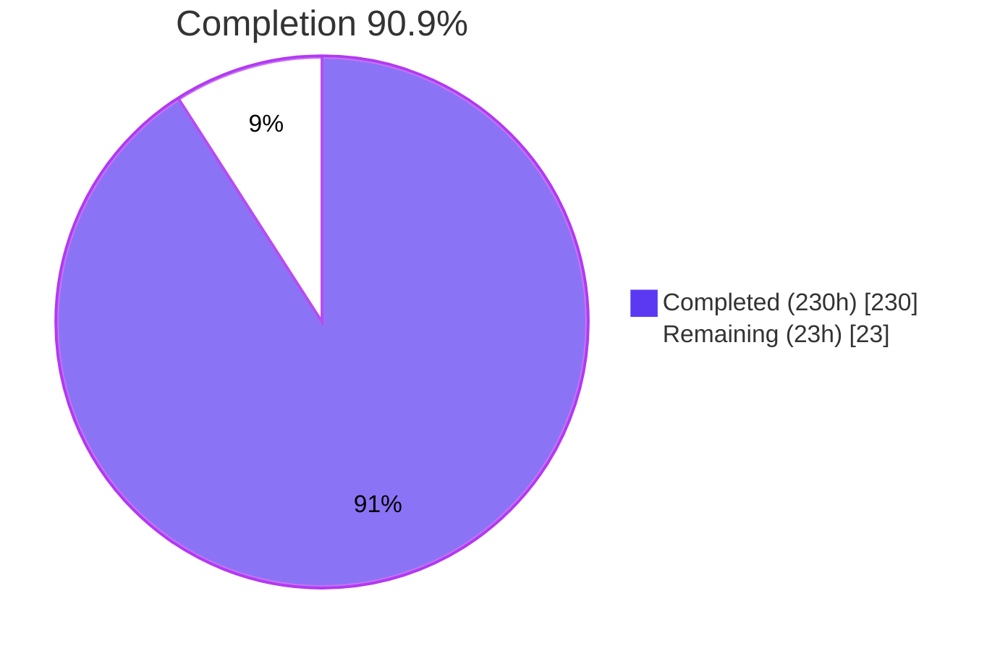
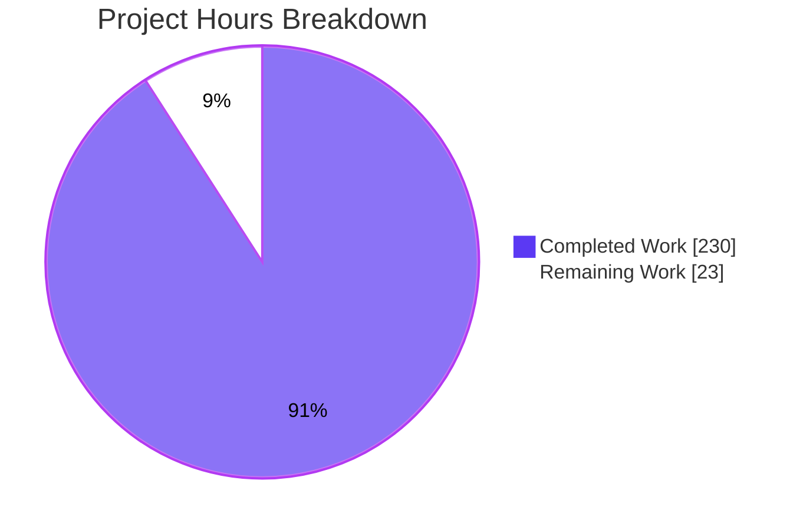
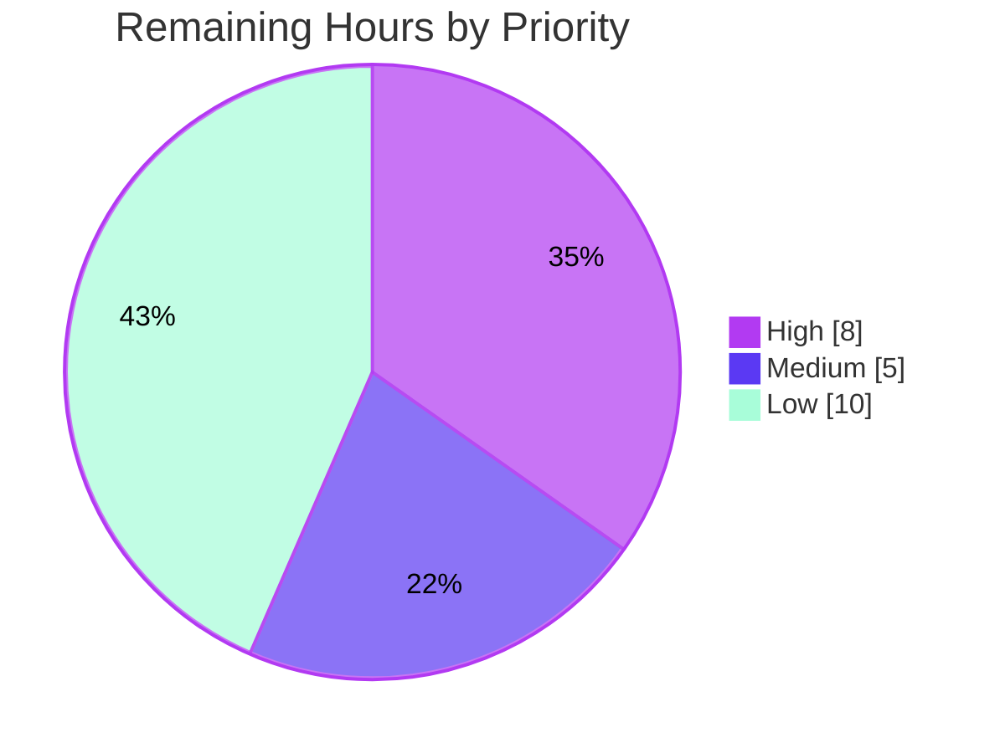

# 1. Executive Summary

## 1.1 Project Overview

This project adds a five-part developer reference for the Openbravo Data Access Layer (DAL) under `docs/orm/`. It covers the architecture, the runtime model, the service API, security and filtering, and a glossary. It serves module developers and maintainers who need the ORM's actual behaviour, with each statement traced to a Java class and method. The Java sources were only read: no code, build file or test changed. The 3,393 lines hold 102 API entries, 139 glossary terms, 9 diagrams and 24 recorded ambiguities.

## 1.2 Completion Status



| Metric | Value |
|---|---|
| Total Hours | 253 |
| Completed Hours (AI + Manual) | 230 (230 AI + 0 manual) |
| Remaining Hours | 23 |
| Percent Complete | 90.9% |

230 completed hours ÷ 253 total hours = 90.9% complete.

## 1.3 Key Accomplishments

- ✅ Five `docs/orm/` files delivered, and nothing else changed (+3,393 / −0).
- ✅ All 102 public members of `OBDal`, `OBCriteria`, `OBQuery` and `OBProvider` are documented and matched to the source in both directions.
- ✅ 52 entries carry a verbatim test excerpt or a reuse link; the other 50 state that no test uses them.
- ✅ A 12-cell admin-mode matrix and the read and write check paths, each cited to the code that decides it.
- ✅ 139 glossary entries, including all 68 seed terms, with every first use in 01–04 linked.
- ✅ 9 of 9 diagrams render, each followed by `Diagram sources:`.
- ✅ Lint is clean, with no inline HTML, no external URL and no placeholder.
- ✅ 24 `**Ambiguity:**` notes disclose where the Javadoc and the code disagree.

## 1.4 Critical Unresolved Issues

None of these blocks release. **5 items are open**: 2 of 29 AAP requirements are only partly met, 1 layout caveat was accepted, and 2 release checks have not been run.

| Issue | Impact | Owner | ETA |
|---|---|---|---|
| Five DOMAIN CONTEXT glossary entries have no `Request definition:` bullet (Section 5.2) | The general meaning of AD, Business object, Client, Organization and Runtime model is not shown next to the code qualification | Product owner + doc maintainer | 2h |
| 75 mentions of members owned by 01 or 02 in `04-security-and-filtering.md` are not linked where they appear (Section 5.2) | Readers find the owning section through the Sources table instead | Doc maintainer | 4h |
| The admin-mode matrix scrolls sideways at 1280 px, and wide diagrams scroll below about 1,820 px | Harder to read on laptops and phones; no content is lost | Doc maintainer | 2h |
| No Openbravo DAL maintainer has signed off on technical accuracy | Accuracy rests on reading the source only | DAL maintainer | 8h |
| Pages not previewed on the publishing host | That host's Mermaid version may render differently | Doc maintainer | 2h |

## 1.5 Access Issues

No access issues identified. No credentials, services or external APIs are needed.

## 1.6 Recommended Next Steps

1. [High] Have a DAL maintainer review 03 and 04 first, then 01, 02 and 05.
2. [Medium] Supply the five verbatim request definitions for `05-glossary.md`.
3. [Medium] Preview on the publishing host, then merge with `git add -f docs/orm`, because `docs` is git-ignored at `.gitignore:11`.
4. [Low] Decide on the 75 unlinked mentions in 04 and on the matrix layout.
5. [Low] Run checks 3, 4, 7 and 8 in CI whenever the DAL sources change.

# 2. Project Hours Breakdown

## 2.1 Completed Work Detail

| Component | Hours | Description |
|---|---|---|
| `docs/orm/01-architecture.md` | 28 | Layers, startup sequence, Hibernate mapping generation, the `generate.entities` table (Inputs / Outputs / Triggers), request lifecycle, sessions and transactions. Versions are stated: Hibernate 5.6.15.Final and Java 11 |
| `docs/orm/02-runtime-model.md` | 30 | How the model is built from the AD, model lookup, help and deprecation loading, `Entity`, `Property`, naming rules, `BaseOBObject` interfaces, dynamic vs typed API, `DalUtil`. Records `SystemInformation` as **Not Found** |
| `docs/orm/03-dal-service-api.md` | 56 | 102 API entries in 22 groups, each with signature, cited behaviour and exceptions. 34 verbatim test excerpts, 18 reuse links, 50 no-usage sentences, the overload audit, the `Inventory rule:` line |
| `docs/orm/04-security-and-filtering.md` | 30 | `OBContext`, readable and writable sets, the admin-mode matrix (4 × 3), client / organization / active filtering, the access-check table, interceptor behaviour |
| `docs/orm/05-glossary.md` | 34 | 139 alphabetical entries (68 seed terms plus collected terms), each with a cited definition and a `Used in:` line |
| Diagrams D1–D9 | 12 | 7 flowcharts, 1 sequence diagram and 1 class diagram, tuned to stay legible and drawn only from in-scope code, each with `Diagram sources:` |
| Cross-file navigation | 10 | Reading guides with previous / next links and Sources tables, owner-section links, glossary first-use links, every anchor resolving |
| Source-accuracy verification and ambiguity register | 20 | Every behavioural sentence checked against its cited method body or Javadoc; 24 `**Ambiguity:**` notes |
| Validation gate and rendered QA | 10 | Pinned toolchain, AAP checks 1–8, rendered-page browser checks at 375, 768 and 1280 px |
| **Total** | **230** | |

## 2.2 Remaining Work Detail

| Category | Hours | Priority |
|---|---|---|
| [Path-to-production] DAL maintainer technical review and sign-off of 01–05 | 8 | High |
| [AAP] `Request definition:` bullets for the five DOMAIN CONTEXT glossary entries | 2 | Medium |
| [Path-to-production] Preview on the publishing host (diagrams, anchors, tables) | 2 | Medium |
| [Path-to-production] Merge and publication path (`docs` ignored at `.gitignore:11`) | 1 | Medium |
| [AAP] Owner links for 75 unlinked mentions in 04 (decide, implement, re-run the gate) | 4 | Low |
| [AAP] Admin-mode matrix layout decision (accept the scroll or reflow it) | 2 | Low |
| [Path-to-production] Documentation-drift guard: run checks 3, 4, 7 and 8 in CI when DAL sources change | 4 | Low |
| **Total** | **23** | |

## 2.3 Hours Calculation and Confidence

- Completed: 230 hours. Remaining: 23 hours. Total: 253 hours. Completion: 230 ÷ 253 = **90.9%**.
- The AAP requirement inventory has 29 checkable requirements: 27 Completed, 2 Partially Completed (the `Request definition:` bullets, at about 80%, and owner-link coverage in 04, at about 90%), 0 Not Started. The unfinished parts of those two items are the [AAP] rows in Section 2.2.
- Confidence is **high** for the [AAP] rows, which have a narrow, known scope. It is **medium** for the maintainer review: the 8 hours assume a spot check of the 102 API entries and the security matrix, not a full re-derivation.

# 3. Test Results

All results below came from one run of the pinned validation gate on the final commit `d6454edf35`. The gate is the AAP 0.6.1 verification plus AAP 0.9.2 checks 1–8, run verbatim except that the confinement snapshot and the render output went to a private scratch directory. It exited 0. The deliverable is documentation, so "coverage" means the share of the governed elements each check inspects.

| Area / Category | Framework | Tests | Passed | Failed | Coverage | What This Proves |
|---|---|---|---|---|---|---|
| Toolchain verification | bash `test` assertions | 8 | 8 | 0 | All 7 pinned tools | Node v22.23.3, npm 10.9.9, markdownlint-cli2 v0.23.3, mmdc 12.0.0, the headless shell, the Python 3.12.3 venv and git 2.43.0 are the pinned builds, so every result can be reproduced |
| Presence and confinement (checks 1, 2) | bash + git | 2 | 2 | 0 | 5 of 5 files; whole tree | Exactly the five files exist, none is empty, none has a placeholder token, and nothing outside `docs/orm/` is changed, staged or untracked |
| API inventory (check 3) | Python 3.12.3 | 1 | 1 | 0 | 102 of 102 members | The 03 headings match the public members rebuilt from the four Java sources, in both directions (OBDal 35, OBCriteria 21, OBQuery 34, OBProvider 12) |
| Structure, examples and links (check 4) | Python 3.12.3 | 1 | 1 | 0 | All 5 files | Every paragraph, bullet and table row carries a citation. Every excerpt is a contiguous copy of its supplying test method. Each entry has exactly one example form. Every local anchor resolves, and every glossary first use is linked |
| Glossary seed and required content (checks 5, 6) | bash | 2 | 2 | 0 | 68 of 68 seed terms | All seed terms are present, with no duplicates. Present too: the `generate.entities` citations and table rows, the `SystemInformation` **Not Found** record, exactly 50 no-usage sentences and the `Inventory rule:` line |
| Diagram rendering (check 7) | mmdc 12.0.0 + headless Chrome 154 | 9 | 9 | 0 | 9 of 9 diagrams | Every Mermaid block parses and renders to SVG, with empty logs and no syntax-error output |
| Markdown lint (check 8) | markdownlint-cli2 0.23.3 | 5 | 5 | 0 | 5 of 5 files | `Summary: 0 issues in 0 files` under the project configuration (MD013 and MD060 off, MD024 siblings only) |
| Content safety probes | grep + Python | 15 | 15 | 0 | 3 probes × 5 files | No external URL, no `.java:N` line-number citation, and no inline HTML outside code spans |

**Not Covered**

- **Runtime behaviour of the documented DAL.** The described behaviour was checked by reading each cited method body and its Javadoc, not by running DAL code. No JDK is installed, and the `src-test` JUnit suite was not run. Before release, a DAL maintainer should spot-check the 03 contracts and the 04 admin-mode matrix. Running the cited `org.openbravo.test.dal` tests on a JDK 11 build would add evidence.
- **Whether each sentence is backed by its own citation.** Check 4 requires a citation in each paragraph and accepts any `Class#member` token. Whether each sentence ends with a citation that supports it was reviewed by hand, not checked mechanically.
- **Which overload each of the 52 examples calls.** Check 4 proves that each example calls a member with the entry's name, not which overload it calls. That was audited by hand.
- **Rendering on the publishing host.** The automated checks use the pinned Mermaid; the publishing host's renderer was never run.
- **Untracked state before the work began.** Check 2 compares against a baseline snapshot of the current clean tree. It cannot show that untracked or ignored files outside `docs/orm/` match the moment before the work began (Section 5.2).

# 4. Runtime Validation & UI Verification

The runtime surface of this deliverable is the five rendered pages. Each was rendered to GitHub-flavoured HTML with GitHub heading ids and served from a local server. Pages were driven in headless Chrome at 375, 768 and 1280 px, with the nine diagrams drawn by Mermaid 12.1.0, the version the pinned `mmdc` 12.0.0 bundles. The final tree was also rendered with the pinned `mmdc` (Section 3).

- ✅ **Page rendering**: all five pages load at all three widths with no console message of any level, and every GFM table keeps every cell.
- ✅ **Reading-guide navigation**: real clicks on the Next links go 01 → 02 → 03 → 04 → 05, Previous goes 05 → 04, and browser Back returns in order.
- ✅ **Link resolution**: 1,489 rendered links, all resolving. 629 cross-file fragment links land on existing ids, and no heading id is duplicated.
- ✅ **Reader journeys**: four cross-page journeys were clicked end to end, among them 04 *Access checks* → 03 `OBDal#save(Object)` → 01 *Sessions and transactions*, with 0 console errors. The 141 mentions of 03 entries in 04 all land on the right heading.
- ✅ **Diagrams in the page**: all 9 render in place. No label crosses an edge and no text falls outside its SVG. D1–D4 and D7 render at natural width with 14 px labels from 768 px up.
- ✅ **Network and markup safety**: every request in every browser session went to the local server, with no external fetch. A DOM scan found 0 elements outside the Markdown tag set.
- ⚠ **Narrow and laptop layout**: the admin-mode matrix in 04 is 1,178 px wide in a 980 px column and scrolls sideways at 1280 px. Pages that carry D1 (1,714 px) or D4 (1,807 px) scroll sideways below about 1,820 px. At 375 px, label text in D5, D9 and D8 shrinks to about 4, 6.2 and 9.1 px.
- ⚠ **Publishing-host rendering — not exercised**: the pages have not been viewed with GitHub's, GitLab's or a documentation portal's own Mermaid renderer.
- ⚠ **Openbravo application and DAL code — not exercised**: no server, ant target, JUnit test or DAL call was run. The documented behaviour was verified against the source text only.

# 5. Compliance & Quality Review

## 5.1 Compliance Matrix

| # | AAP Deliverable / Benchmark | Verified Evidence | Status | Progress |
|---|---|---|---|---|
| 1 | R1 Architecture (`01-architecture.md`) | 7 sections, D1–D4, version statement (01:9), `generate.entities` Inputs / Outputs / Triggers rows, A12 | ✅ PASS | 100% |
| 2 | R2 Runtime model (`02-runtime-model.md`) | 10 sections, D5–D6, A6 / A10 / A11 / A13, a single `java` excerpt | ✅ PASS | 100% |
| 3 | R3 DAL service API (`03-dal-service-api.md`) | 102 of 102 entries in 22 groups that match the planned sizes. Every entry has exactly one example form (52 examples, 50 no-usage) | ✅ PASS | 100% |
| 4 | R4 Security and filtering (`04-security-and-filtering.md`) | 6 required sections, 4 × 3 admin-mode matrix, access-check table, D8–D9, A2 / A3 / A7 / A8 / A9, no `java` block | ✅ PASS | 100% |
| 5 | R5 Glossary (`05-glossary.md`) | 139 entries, all 68 seed terms, no duplicates, 139 `Used in:` lines. The `Request definition:` bullets are missing | ⚠ PARTIAL | 80% |
| 6 | R6 Citation discipline | `Class#member` citations in every paragraph, overloads typed, no line numbers, boundary classes named only | ✅ PASS | 100% |
| 7 | R7 Not Found handling | `SystemInformation` recorded as **Not Found**, with no substitute and no other `src-gen` content | ✅ PASS | 100% |
| 8 | R8 Confinement | 5 files added, 0 other paths changed, `.gitignore` untouched, check 2 silent | ✅ PASS | 100% |
| 9 | Ambiguity register (AAP 0.3.2) | All 13 registered ambiguities plus 11 more Javadoc-vs-body notes, 24 in all, none resolved silently | ✅ PASS | 100% |
| 10 | Diagrams (AAP 0.4.3) | 9 of 9 render, each followed by `Diagram sources:`, boundary nodes labelled | ✅ PASS | 100% |
| 11 | Format (AAP 0.9.1) | Lint 0 issues, ATX headings, no inline HTML, no external URL, no placeholder token | ✅ PASS | 100% |
| 12 | Cross-file ownership links (AAP 0.4.1, 0.6.2) | Every reading guide links previous / next, every anchor resolves, 141 of 141 mentions of 03 entries in 04 linked. 75 mentions in 04 of 01 / 02 members are unlinked | ⚠ PARTIAL | 90% |

## 5.2 AAP & Rule Divergences and Gaps

The user set no separate Rules, so every divergence below is measured against the AAP.

| What the AAP/Rule Required | What Was Delivered Instead | Why It Diverged | Impact | Remediation |
|---|---|---|---|---|
| DV1: DOMAIN CONTEXT entries carry `Request definition:` (verbatim) plus `Code qualification:` (AAP 0.3.2, 0.4.2) | Five entries carry only the cited definition and the `Code qualification:` bullet (05:8) | The verbatim request sentences are not in the AAP or in any file supplied, and a paraphrase would misquote the request | The general meaning is not shown next to the code's narrowing | Supply the five sentences; add the bullets (2h) |
| DV2: D5 draws `Entity` 1..* `Property` (AAP 0.4.3) | `Entity "1" --> "*" Property` (02:347) | Code accuracy outranks plan wording (AAP 0.7.2): a datasource-based entity can have no properties | None; the diagram is more accurate | None required |
| DV3: AAP 0.4.1 wording on the pool loader, auto-commit, the flush limit and audit naming | Text that follows the code (01:339–346, 05:107) | Code outranks plan wording (AAP 0.7.2) | None; the docs match the code | None required |
| DV4: "Each mention of an item owned by another file links to that file's section" (AAP 0.4.1) | 75 mentions in 04 of 01 / 02 members are unlinked. Names that cover several entries are unlinked | The tree-wide convention resolves a class through the Sources table | Slower navigation from 04 into 01 and 02 | Decide, then link or accept (4h) |
| DV5: every diagram and table renders legibly (AAP 0.7.1) | The admin-mode matrix scrolls at 1280 px, wide diagrams scroll below 1,820 px, and labels are small at 375 px | Citations, typed overloads and the no-HTML rule (AAP 0.4.1, 0.4.2, 0.9.1) together fix the widths | Readability on small screens | Accept, or reflow the matrix (2h) |
| DV6: the ambiguity register lists A1–A13 (AAP 0.3.2) | 24 `**Ambiguity:**` notes | The AAP rule that every Javadoc-vs-body disagreement is recorded | Positive: more disagreements are disclosed | None required |
| DV7: a pre-work snapshot at `$TOOLS/baseline.txt` is taken before `docs/orm/` exists (AAP 0.9.1) | Check 2 compares against a snapshot of the current clean tree | The snapshot was moved to a per-checkout file, and no snapshot from before the files were created was kept | Committed and staged confinement is proven; the untracked state before the work is not | Run check 2 on your own checkout (in the 1h merge task) |

**DV1 — Request definitions.** AAP 0.4.2 requires the glossary entries for Application Dictionary (AD), Business object, Client, Organization and Runtime model to quote the request's own definition in a `Request definition:` bullet, ahead of the cited `Code qualification:`. The sentences appear neither in the AAP nor in any provided environment file. A paraphrase would misquote the request, and an empty bullet would be a placeholder, which check 1 forbids. So `05-glossary.md:8` names the five entries without claiming they quote the request, and each entry keeps its cited definition and qualification. The product owner should supply the five sentences. Adding them and re-running the gate takes about 2 hours.

**DV2 — D5 multiplicity.** AAP 0.4.3 plans the D5 association as `Entity` 1..* `Property`. The delivered diagram draws `Entity "1" --> "*" Property` (`02-runtime-model.md:347`). Its `Diagram sources:` paragraph (02:354) explains why: `ModelProvider#removeInvalidTables` requires a primary-key column only for table-based tables, so a datasource-based entity can have no properties at all. AAP 0.7.2 makes the code the authority over plan wording. The diagram is therefore more accurate than the plan, and nothing needs to change. A reviewer comparing the diagram with the AAP should simply know that the mismatch is deliberate.

**DV3 — Plan wording superseded by code.** Several AAP 0.4.1 phrases describe behaviour the code does not have, so the delivered text follows the code, as AAP 0.7.2 directs. The external connection pool loader is an instance initializer that runs each time a `SessionHandler` is created, not once (`01-architecture.md:339`). `getNewConnection` *tries* to disable auto-commit and logs any failure (01:341). `flushRemainingChanges` logs after 100 flushes and stops, without throwing (01:346). Only `creationDate`, `createdBy` and `updatedBy` are renamed to canonical casing (`05-glossary.md:107`). `GenerateEntitiesTask` catches `IOException` only around opening and closing the output file. No action is needed; readers can rely on the text matching the code.

**DV4 — Owner links in 04.** AAP 0.4.1 says each mention of an item owned by another file links to that file's section. In `04-security-and-filtering.md`, every mention of a 03 API entry is linked (141 of 141). Mentions of members owned by 01 and 02, however, are left as plain citations, 75 of them: `SessionHandler` 15, `DalMappingGenerator` 5, `DalRequestFilter` 4, `DalSessionFactoryController` 2, `BaseOBObject` 31, `Entity` 13 and `Property` 5. They resolve through the Sources table (04:15), and the required "links from" each section are present. The other files follow the same convention, and linking every foreign citation tree-wide would change it. Decide whether to link them (about 4 hours, then re-run check 4).

**DV5 — Accepted layout limits.** Every block renders, but some are hard to read on small screens. The admin-mode matrix (04:140–143) is 1,178 px wide in a 980 px column and scrolls at 1280 px. Three AAP rules fix that width together: each cell cites the deciding code, overloads keep their parameter types, and inline HTML such as `<br/>` is forbidden. D1 and D4 render at natural width (1,714 and 1,807 px). At 375 px, the labels in D5, D9 and D8 shrink to about 4, 6.2 and 9.1 px. D8 and D9 use invisible `~~~` links, which only stack their subgraphs. Accept these limits, or move the matrix citations into bullets below it (about 2 hours).

**DV6 — Ambiguity notes beyond the register.** AAP 0.3.2 lists 13 ambiguities, A1–A13. The delivered files carry 24 `**Ambiguity:**` notes: 01 has 3, 02 has 8, 03 has 5 and 04 has 8. Examples of the extra notes: `DalSessionFactory` open order, the `commitAndClose` and `rollback` Javadoc against their bodies, `Property#checkIsValidValue` null handling, `OBProvider#getMostSpecificService` name forms, the `OBQuery#getRowNumber` unaliased path, and `OBContext#getOrganizationList` caching. Each follows the AAP rule that a disagreement between Javadoc and body is recorded, not resolved. The register therefore discloses more than planned. No action is required, but maintainers may want to file source fixes for the Javadoc that contradicts its method.

**DV7 — Confinement baseline.** AAP 0.9.1 requires a snapshot of untracked and ignored paths before `docs/orm/` is created, stored at `$TOOLS/baseline.txt`, for check 2 to compare against later. The snapshot was moved to a per-checkout file, because `$TOOLS` is shared, and no snapshot from before the files were created was kept. Check 2 therefore ran against a snapshot of the current tree, which is clean (0 entries). It still proves that no committed or staged change touches any path outside the five files. It cannot prove that untracked files that existed before the work, such as the plan's expected `metering-inventory.md`, are byte-identical. Confirm by running check 2 against a snapshot of your own checkout.

# 6. Risk Assessment

| Risk | Category | Severity | Probability | Mitigation | Status |
|---|---|---|---|---|---|
| The documentation drifts from the code when `src/org/openbravo/base` or `src/org/openbravo/dal` changes: signatures, behaviour or the 102-member inventory go stale | Technical | Medium | High (over time) | Run checks 3, 4, 7 and 8 in CI on DAL source changes. Check 3 fails on any added or removed public member | Open, Section 2.2 (4h) |
| A documented contract is wrong in a way that reading the source could not reveal, because no DAL code was executed | Technical | Medium | Low | DAL maintainer review; optionally run the cited `org.openbravo.test.dal` tests on JDK 11 | Open, Section 2.2 (8h) |
| A developer misreads which checks admin mode or the filter switches bypass, and relies on a wrong security assumption | Security | Medium | Low | Maintainer review of the 04 admin-mode matrix and access-check table, each cell cited to the code that decides it | Open, part of the 8h review |
| The publishing host's Markdown or Mermaid renderer differs from the pinned Mermaid 12.1.0, so a diagram or anchor misrenders | Integration | Low | Medium | Preview the five pages on the target host before announcing them | Open, Section 2.2 (2h) |
| `docs` is git-ignored (`.gitignore:11`), so later edits to `docs/orm/` are silently left unstaged without `git add -f` | Operational | Medium | Medium | Document `git add -f docs/orm`, or add a `!docs/orm/` exception through a separate change | Open, Section 2.2 (1h) |
| Wide tables and diagrams reduce readability on laptops and phones | Operational | Low | High | Accept, or reflow the admin-mode matrix citations into bullets | Accepted, Section 2.2 (2h optional) |
| Re-validation depends on a toolchain outside the repository, whose setup downloads Node, Python and Chrome from nodejs.org and GitHub | Operational | Low | Medium | Keep the AAP 0.6.1 setup and verification scripts; mirror the pinned archives internally | Monitored |
| Embedded content is unsafe (secrets, scripts, external fetches) | Security | Low | Low | Verified absent: no credentials, no inline HTML, no external URL, no external network request while viewing | Mitigated |

# 7. Visual Project Status



Remaining hours by priority (23h total):



| Remaining Category (Section 2.2) | Hours | Priority |
|---|---|---|
| DAL maintainer technical review | 8 | High |
| Documentation-drift CI guard | 4 | Low |
| Owner links in 04 | 4 | Low |
| `Request definition:` bullets | 2 | Medium |
| Publishing-host preview | 2 | Medium |
| Admin-mode matrix layout | 2 | Low |
| Merge and publication path | 1 | Medium |
| **Total** | **23** | |

# 8. Summary & Recommendations

The project delivered the full Openbravo DAL reference the AAP planned. Five Markdown files under `docs/orm/` cover the architecture, the runtime model, all 102 public members of the service API, the security and filtering model, and a 139-term glossary. The work is **90.9% complete**: 230 of 253 hours. Twenty-seven of the 29 AAP requirements are met in full and two are partly met. Nothing outside `docs/orm/` changed. The final commit passes the whole pinned validation gate. That includes the bidirectional 102-member inventory, verbatim test excerpts, anchor and glossary-link resolution, nine diagram renders and a lint run with 0 issues.

Verification went beyond the mechanical gate. Every behavioural sentence was checked against its cited method body or Javadoc. Every Javadoc-versus-body disagreement is disclosed in 24 `**Ambiguity:**` notes rather than resolved. Where the plan's wording and the code disagree, the documentation follows the code (Section 5.2, DV2 and DV3). The rendered pages were driven in a browser at three widths: all 1,489 links resolve, the reading-guide chain and four cross-page journeys click through, and nothing is fetched from outside.

The remaining 23 hours are mostly release assurance rather than missing content. Two AAP requirements are only partly met. The five `Request definition:` glossary bullets wait on verbatim definitions only the product owner can supply. In 04, 75 mentions of members owned by 01 and 02 resolve through the Sources table rather than linking where they appear. The admin-mode matrix and the widest diagrams scroll sideways on smaller screens, a limit imposed by the AAP's own citation and no-HTML rules.

The critical path to production has four steps, totalling 13 of the 23 remaining hours:

1. A DAL maintainer reviews 03 and 04 (8h). This is the main safeguard, because no DAL code was executed.
2. Add the five request definitions (2h).
3. Preview the pages on the publishing host (2h).
4. Merge with `git add -f docs/orm`, because `docs` is git-ignored (1h).

**Production readiness:** ready for review and merge. Success means the maintainer signs off with no factual corrections, the gate stays green in CI, and the pages render on the publishing host as they do under the pinned toolchain. Adding checks 3, 4, 7 and 8 to CI is the best long-term protection, because check 3 fails as soon as a public DAL member is added or removed.

# 9. Development Guide

The deliverable is static Markdown. Reading it needs only a Markdown viewer with Mermaid support. Editing it safely needs the pinned validation toolchain, because the checks depend on exact tool versions. No JDK, database, Docker, service or port is used.

## 9.1 System Prerequisites

- Linux x86-64 with bash, `curl`, `tar`, `sha256sum` and GNU coreutils.
- Git **2.43.0** for validation, because the AAP verification asserts that version. Any git can be used for fetch and push.
- About 600 MB of free disk for the toolchain, kept outside the checkout.
- A Mermaid-capable Markdown viewer for reading: GitHub, GitLab, or an IDE preview.

## 9.2 Toolchain Setup (one time)

Run the AAP 0.6.1 setup script once from the repository root. It installs Node v22.23.3 with npm 10.9.9, `markdownlint-cli2` 0.23.3, `@mermaid-js/mermaid-cli` 12.0.0, puppeteer 25.12.0, chrome-headless-shell 154.0.8037.57 and a standalone CPython 3.12.3 into `$TOOLS`, which must be outside the checkout. Then run the AAP 0.6.1 verification script. It must print `VERIFY-OK`.

- Never run `npm install` in the repository root: the root `package.json` wires `preinstall`, `install` and `postinstall` lifecycle scripts.
- On a host where several checkouts share one `$TOOLS`, do not rerun the setup script. It deletes and reinstalls the shared headless shell.

## 9.3 Shell Prelude (every validation shell)

```bash
cd /path/to/openbravo-checkout
export TOOLS=/root/.orm-docs-tools
export PATH="$TOOLS/git/bin:$TOOLS/node-v22.23.3-linux-x64/bin:$PATH"
PY="$TOOLS/venv/bin/python"; MMDC="$TOOLS/npm/node_modules/.bin/mmdc"; MDLINT="$TOOLS/npm/node_modules/.bin/markdownlint-cli2"
SCR="$HOME/orm-docs-scratch"; mkdir -p "$SCR"   # private scratch directory for snapshots and renders
node --version; npm --version; "$MMDC" --version; git --version; "$PY" --version
```

Expected output: `v22.23.3`, `10.9.9`, `12.0.0`, `git version 2.43.0`, `Python 3.12.3`.

## 9.4 Confinement Snapshot (before editing)

Take this snapshot on a clean tree before you change anything under `docs/orm/`. Check 2 compares against it afterwards.

```bash
snap() { git status --porcelain --ignored --untracked-files=all | cut -c4- | grep -Ev '^docs/orm/' | LC_ALL=C sort | while IFS= read -r p; do printf '%s  %s\n' "$( (sha256sum -- "$p" 2>/dev/null || echo unreadable) | cut -c1-64)" "$p"; done; }
snap > "$SCR/orm-baseline.txt"; wc -l "$SCR/orm-baseline.txt"
```

## 9.5 Per-File Validation (after editing file F)

```bash
F=docs/orm/04-security-and-filtering.md
grep -nEi 'TODO|TBD|FIXME|lorem ipsum|\[(insert|placeholder|tbd)[^]]*\]' "$F"
"$MDLINT" --config "$TOOLS/.markdownlint.jsonc" "$F"
T=$(mktemp -d -p "$SCR"); env -u PUPPETEER_EXECUTABLE_PATH -u MERMAID_PUPPETEER_CONFIG timeout 300 "$MMDC" -q -p "$TOOLS/puppeteer.json" -i "$F" -o "$T/out.md" || echo "MERMAID FAIL: $F"
```

Expected: the grep prints nothing, lint prints `Summary: 0 issues in 0 files`, and `$T` holds one `out-N.svg` per diagram (two for 04).

## 9.6 Whole-Package Gate

The bodies of checks 3 (method coverage) and 4 (structure, examples, links) are the Python scripts in AAP 0.9.2. Run them as `"$PY" - docs/orm/03-dal-service-api.md << 'EOF' … EOF` and `"$PY" - docs/orm << 'EOF' … EOF`. The shorter checks run as written:

```bash
# Check 2: confinement (prints nothing on success; snap() as defined in 9.4)
{ git diff --name-only 77692f968db97ba61689f53761bf826f3c1591ad; git diff --name-only --cached; LC_ALL=C comm -3 <(LC_ALL=C sort "$SCR/orm-baseline.txt") <(snap | LC_ALL=C sort) | sed -E 's/^\t//; s/^[^ ]+  //'; } | LC_ALL=C sort -u | grep -Ev '^docs/orm/0[1-5]-[a-z-]+\.md$'
# Check 7: every diagram renders (prints nothing on success)
T=$(mktemp -d -p "$SCR"); for f in docs/orm/0[1-4]-*.md; do env -u PUPPETEER_EXECUTABLE_PATH -u MERMAID_PUPPETEER_CONFIG timeout 300 "$MMDC" -q -p "$TOOLS/puppeteer.json" -i "$f" -o "$T/$(basename "$f")" > "$T/$(basename "$f").log" 2>&1 || echo "MERMAID FAIL: $f"; done
# Check 8: lint
"$MDLINT" --config "$TOOLS/.markdownlint.jsonc" "docs/orm/*.md"; echo "exit=$?"
# Quick content counts
test "$(grep -c '^No src-test usage found in org.openbravo.test.dal\.$' docs/orm/03-dal-service-api.md)" -eq 50 && echo "no-usage sentences: 50"
test "$(grep '^### ' docs/orm/05-glossary.md | cut -c5- | LC_ALL=C sort | uniq -d | wc -l)" -eq 0 && echo "no duplicate glossary headings"
```

Pass criteria for the full gate:

- `VERIFY-OK`;
- checks 1, 2, 5 and 6 print nothing;
- check 3 prints `inventory: {'OBDal': 35, 'OBCriteria': 21, 'OBQuery': 34, 'OBProvider': 12} total: 102; 03 entries: 102` and `check 3: PASS`;
- check 4 prints `structure checks: PASS`;
- check 7 prints no `MERMAID FAIL`;
- check 8 prints `Summary: 0 issues in 0 files`.

## 9.7 Reading and Committing

- Start at `docs/orm/01-architecture.md` and follow each reading guide's Next link through to `05-glossary.md`.
- `docs` is git-ignored (`.gitignore:11`), so stage with `git add -f docs/orm`. Do not edit `.gitignore` as part of a documentation change.
- Open each diagram fence with three backticks followed directly by `mermaid`, with no space; check 4 counts that literal form, and 01 needs at least four. Write one paragraph per line, use an em dash (U+2014) in `Source:` lines, and put a `###` group heading between each `##` class and its `####` entries in 03.

## 9.8 Troubleshooting

| Symptom | Cause | Resolution |
|---|---|---|
| `mmdc` uses the wrong browser or fails to launch | The host sets `PUPPETEER_EXECUTABLE_PATH` or `MERMAID_PUPPETEER_CONFIG` | Prefix every `mmdc` command with `env -u PUPPETEER_EXECUTABLE_PATH -u MERMAID_PUPPETEER_CONFIG` and pass `-p "$TOOLS/puppeteer.json"` |
| `git: 'remote-https' is not a git command` | The pinned git 2.43.0 has no HTTPS transport | Use the system git (`/usr/bin/git`) for fetch, pull and push |
| Verification fails on `git version 2.43.0` | Another git is first on `PATH` | Put `$TOOLS/git/bin` first, as in the prelude |
| Checks 3 or 4 raise `FileNotFoundError` | One of the five files is missing | Expected until all five files exist |
| Check 2 prints a bare hash line | Some `comm` builds (uutils) truncate process-substitution input | Write both snapshots to regular files and run `comm -3` on them |
| Check 4 fails on a new term | A 05 heading now matches an unlinked first use in 01–04 | Link the first prose use of the term in each of 01–04 |
| MD001 lint failure in 03 | A `####` entry sits directly under a `##` heading | Insert the `###` group heading |

# 10. Appendices

## A. Command Reference

| Purpose | Command |
|---|---|
| Verify the toolchain | AAP 0.6.1 verification script → `VERIFY-OK` |
| Forbidden-token scan | `grep -nEi 'TODO\|TBD\|FIXME\|lorem ipsum' docs/orm/*.md` |
| Lint all files | `"$MDLINT" --config "$TOOLS/.markdownlint.jsonc" "docs/orm/*.md"` |
| Render one file's diagrams | `env -u PUPPETEER_EXECUTABLE_PATH -u MERMAID_PUPPETEER_CONFIG "$MMDC" -q -p "$TOOLS/puppeteer.json" -i docs/orm/01-architecture.md -o "$SCR/out.md"` |
| Count API entries | `grep -c '^#### ' docs/orm/03-dal-service-api.md` → `102` |
| Count glossary entries | `grep -c '^### ' docs/orm/05-glossary.md` → `139` |
| Show changed paths since base | `git diff --name-status 77692f968db97ba61689f53761bf826f3c1591ad` → five `A docs/orm/…` lines |
| Stage documentation | `git add -f docs/orm` |

## B. Port Reference

No ports are used. The deliverable is static Markdown, and validation renders diagrams through a local headless browser without opening a listening port.

## C. Key File Locations

| Path | Contents |
|---|---|
| `docs/orm/01-architecture.md` | Layers (D1), startup (D2), mapping and entity generation (D3), request lifecycle (D4), sessions and transactions |
| `docs/orm/02-runtime-model.md` | Model build (D6), lookup, help and deprecation, `Entity`, `Property`, naming, `BaseOBObject` (D5), `DalUtil`, `SystemInformation` **Not Found** |
| `docs/orm/03-dal-service-api.md` | Reading guide with the `Inventory rule:` line and D7; `OBDal` (35), `OBCriteria` (21), `OBQuery` (34), `OBProvider` (12) |
| `docs/orm/04-security-and-filtering.md` | `OBContext`, readable / writable sets, admin-mode matrix, filtering (D8), access checks, interceptor (D9) |
| `docs/orm/05-glossary.md` | 139 terms, each with `Used in:` back-links |
| `src/org/openbravo/base/{model,structure,provider,gen}/`, `src/org/openbravo/dal/{core,service,security}/` | The documented Java sources (read-only) |
| `src-test/src/org/openbravo/test/dal/` | Tests that supply the excerpts in 02 and 03 |
| `lib/runtime/hibernate-core-5.6.15.Final.jar` | Pins the Hibernate version stated in 01 |
| `.gitignore` (line 11) | Ignores `docs`, which is why staging needs `-f` |

## D. Technology Versions

| Component | Version |
|---|---|
| Hibernate ORM (documented) | 5.6.15.Final |
| Java (documented minimum) | 11 |
| Node.js / npm (validation) | v22.23.3 / 10.9.9 |
| markdownlint-cli2 / markdownlint | 0.23.3 / 0.41.1 |
| @mermaid-js/mermaid-cli (bundles Mermaid 12.1.0) | 12.0.0 |
| puppeteer / chrome-headless-shell | 25.12.0 / 154.0.8037.57 |
| CPython (validation venv) | 3.12.3 |
| Git (validation) | 2.43.0 |

## E. Environment Variable Reference

| Variable | Purpose | Example |
|---|---|---|
| `TOOLS` | Root of the pinned validation toolchain, outside the checkout | `/root/.orm-docs-tools` |
| `PATH` | Must start with `$TOOLS/git/bin` and `$TOOLS/node-v22.23.3-linux-x64/bin` | See the Section 9.3 prelude |
| `PY`, `MMDC`, `MDLINT` | Shell variables for the venv Python, `mmdc` and `markdownlint-cli2` | `"$TOOLS/venv/bin/python"` |
| `SCR` | Private scratch directory, outside the checkout, for snapshots, renders and logs | `"$HOME/orm-docs-scratch"` |
| `PUPPETEER_EXECUTABLE_PATH`, `MERMAID_PUPPETEER_CONFIG` | Host settings that must be **unset** for `mmdc` | `env -u PUPPETEER_EXECUTABLE_PATH -u MERMAID_PUPPETEER_CONFIG …` |

## F. Developer Tools Guide

- **markdownlint-cli2** enforces the house style: defaults, minus MD013 (line length) and MD060 (table pipe alignment), with MD024 limited to siblings.
- **mmdc** renders every `mermaid` fence to SVG. An empty log and no `MERMAID FAIL` mean the diagram parses.
- **Check 3** rebuilds the public-member inventory of `OBDal`, `OBCriteria`, `OBQuery` and `OBProvider` from source. Adding or removing a public member makes it fail until 03 is updated.
- **Check 4** enforces a citation in each paragraph, verbatim and contiguous excerpts with `Source:` lines, one example form per entry, anchors that resolve under GitHub slug rules, and glossary first-use links.

## G. Glossary

| Term | Meaning in this guide |
|---|---|
| DAL | Openbravo Data Access Layer, the ORM documented in `docs/orm/` |
| AAP | The agreed plan that sets this documentation's scope, structure and checks |
| Boundary class | A class outside the documented scope that is named but never cited as evidence (labelled `(boundary)` in diagrams) |
| No-usage sentence | `No src-test usage found in org.openbravo.test.dal.`, used by the 50 entries in 03 with no test call |
| Reuse link | `Example: see …` — an entry that points to another entry's excerpt calling the same member |
| Ambiguity note | A `**Ambiguity:**` blockquote recording a Javadoc-vs-body disagreement, left unresolved |
| DOMAIN CONTEXT entry | A glossary entry whose general meaning the code narrows: AD, Business object, Client, Organization, Runtime model |
