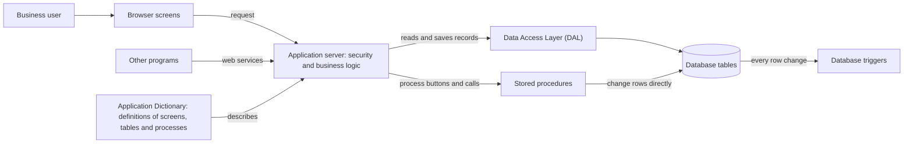

# Openbravo: a plain-language overview

## 1. What Openbravo is

Openbravo is ERP (enterprise resource planning) software: one shared system in which a company records its daily business, such as sales, purchasing, stock, manufacturing and accounting. Its users are the staff who do that work, in screens such as Sales Order and Sales Invoice, and administrators who manage users and permissions. People use it in a web browser, which talks to an application server (the central program that does the work), and every record is kept in a database (an organised store of tables). Think of a house built from one master plan: the [Application Dictionary](orm/05-glossary.md#application-dictionary-ad) describes every room (screen) and cupboard (table), a builder turns the plan into the house, and add-on packages called modules extend the plan.

## 2. How complex it is

Overall rating: **Very High**.

The repository (the project's stored files) holds hundreds of tables, screens and database routines. Business rules are split between the Java code (the server's programming language) and the database, which targets two database engines (database products).

| What we counted | Core | Modules | How we counted it |
| --- | --- | --- | --- |
| Modules | 1 | 20 | the record in `src-db/database/sourcedata/AD_MODULE.xml`; folders in `modules/` |
| Java source files, tests excluded | 1,428 | 502 | .java files outside every `src-test` folder |
| Database tables | 561 | 45 | .xml files in `src-db/database/model/tables` |
| Stored procedures (business steps run inside the database) | 287 | 12 | .xml files in `src-db/database/model/functions` |
| Triggers (rules the database runs when data changes) | 277 | 53 | .xml files in `src-db/database/model/triggers` |
| Screens | 254 | 30 | window records in `src-db/database/sourcedata/AD_WINDOW.xml` |
| Web-service entry points (addresses where other programs exchange data) | 1 | 2 | address records in `src-db/database/sourcedata/AD_MODEL_OBJECT_MAPPING.xml` that lead to web services |
| Other outside connections; lines of code, effort, cost | not measured | not measured | not counted or estimated |

How we measured: read-only counts of tracked files and of records inside them. Each database model file defines one object. Core figures cover everything outside `modules/`, and module figures come from the matching folder or file in each module. Nothing was run.

The [Data Access Layer (DAL)](orm/05-glossary.md#data-access-layer-dal), the Java layer that reads and saves records, has its own documentation. [Its service API page](orm/03-dal-service-api.md) covers 102 public members of 4 service classes. [Its security page](orm/04-security-and-filtering.md#what-admin-mode-skips) has a 4 x 3 matrix showing which of 3 kinds of check [admin mode](orm/05-glossary.md#admin-mode) (code running with administrator privileges) skips in 4 user situations. The bold label "Ambiguity:" appears 24 times in DAL pages 01 to 04 (3 in [architecture](orm/01-architecture.md), 8 in [runtime model](orm/02-runtime-model.md), 5 in service API, 8 in security). One of them only explains the label. The other 23 each mark where a code comment and the code disagree, and none is settled.

## 3. Main components

| Component | What it does in plain English | Where it lives in the repository |
| --- | --- | --- |
| Application Dictionary | Metadata (data that describes other data) for every table, screen, button and process. | `src-db/database/sourcedata` |
| Code generator and build system | Builds the database, generates program code from the Application Dictionary and packages the result. | `build.xml`, `src-wad`, `src-core` |
| Module system and core module | Modules add or change features. The core module, named Core, is the base. | `modules/`; Core's record in `src-db/database/sourcedata/AD_MODULE.xml` |
| Data Access Layer (DAL) | Reads and saves data as business objects (records the program can work with) and applies security checks. See [the DAL architecture page](orm/01-architecture.md). | `src/org/openbravo/dal` |
| Database layer | Stores the records and runs the stored procedures and triggers (section 4). | `src-db/database/model` |
| Security | Checks who a user is. Their [role](orm/05-glossary.md#role) (a group of permissions) has access rules for screens, processes and tables. Data is limited to their [client](orm/05-glossary.md#client) (an independent business) and its [organizations](orm/05-glossary.md#organization) (companies or units). | `src/org/openbravo/authentication`, `src/org/openbravo/role` |
| Browser user-interface framework | Draws the screens in the browser from their definitions and sends user actions to the server. | `modules/org.openbravo.client.application`, `web/` |
| Business processes | Orders, shipments, invoices, payments, stock, costing and accounting, split between Java code and stored procedures. | `src/org/openbravo/erpCommon`, `modules/org.openbravo.advpaymentmngt` |
| Web services and integration points | Let other programs read or send data without the screens. Connector code links to outside systems. | `src/org/openbravo/service`, `modules/org.openbravo.service.json` |
| Reporting, scheduling and background services | Report layouts, a scheduler that runs processes at set times, and a background import service. | `src/org/openbravo/erpReports`, `src/org/openbravo/scheduling`, `src/org/openbravo/service/importprocess` |
| Reference and sample data | Standard settings and two sample data sets. | `referencedata/` |
| Configuration | Settings for each installation, such as the database engine. | `config/` |
| Translation tools | Translate the application into other languages. | `src-trl/` |
| Automated tests | Code that checks that other code works. | `src-test/` |

## 4. Stored procedures

### What a stored procedure is

A stored procedure is a named set of business steps that runs inside the database rather than in the application server. Think of a standing order at a bank: you give one short instruction, and the bank carries out every step itself. A [database trigger](orm/05-glossary.md#database-trigger) is a related stored rule that the database runs by itself whenever rows of a table change.

### What they do, by business area

- **Document completion and posting.** `C_ORDER_POST` processes an order. It checks that the order has lines and an active business partner, works out promotions and discounts, reserves stock and, for some order types, creates the invoice or shipment. `C_INVOICE_POST` completes, voids or reverses an invoice, and blocks a repeated document number in the same organization group and fiscal year.
- **Inventory and costing.** `M_INOUT_POST` completes a goods shipment or receipt. It records stock movements, manages reservations and updates the delivered quantities on the order. `M_INVENTORY_POST` records the differences found by a physical stock count. Costing is split between Java code and procedures.
- **Data integrity checks.** `C_CHK_OPEN_PERIOD` tells whether the accounting period is open for a date and document type, and the shipment and invoice procedures use it. Triggers also do this work: one refuses changes to an order that is already processed.

### How many, and for which database engines

There are 299 stored procedures (287 in core, 12 in modules) and 330 triggers (277 in core, 53 in modules), counted as in section 2. The configuration template names two engines, Oracle and PostgreSQL, with PostgreSQL as the default, and the build has a final step for each. Each procedure is stored once, with separate setup scripts per engine. How one stored definition becomes code for each engine is not verified: the tool that does it ships only in compiled form.

### How they relate to the Java side

The application calls procedures in three ways. Buttons and menu entries run them: 93 of the 227 core process records (actions a user can start) in `src-db/database/sourcedata/AD_PROCESS.xml` name a procedure. Java code calls them through two helper services. Modules can add steps at 22 extension points (named places inside core procedures) in `src-db/database/sourcedata/AD_EXTENSION_POINTS.xml`.

So there are two routes to the same data. On the DAL route, Java code saves records through the DAL, which applies [its access checks](orm/04-security-and-filtering.md#access-checks) and records who changed what. On the procedure route, the procedure changes rows directly inside the database, outside those Java checks, and makes its own checks. Triggers run on both routes.

**What could surprise you:** after a procedure runs, records that Java code loaded earlier may not show its changes. The helper that runs processes re-reads only its own run record; whether other loaded records show old values is not verified. Java code can also switch triggers off, and the DAL then refuses to commit (save permanently) until they are back on.

### Why they raise complexity and risk

- **Logic in two places.** Orders have rules in a Java event handler (code run when an order changes) and in database triggers and procedures, so one change can need two edits.
- **Engine-specific code.** The setup scripts, and the code that calls a procedure, differ between Oracle and PostgreSQL.
- **Harder testing.** Procedures are tested through Java tests in `src-test` that need a running database. No tests sit beside the procedure files in `src-db`.

## 5. How the pieces fit together

Diagram sources: `modules/org.openbravo.client.application`, `modules/org.openbravo.client.kernel`, `src/org/openbravo/authentication`, `src/org/openbravo/service/web`, `src-db/database/sourcedata/AD_MODEL_OBJECT_MAPPING.xml`, `src-db/database/sourcedata/AD_WINDOW.xml`, `src-db/database/sourcedata/AD_PROCESS.xml`, `src/org/openbravo/dal`, `docs/orm/01-architecture.md`, `src/org/openbravo/service/db/CallProcess.java`, `src/org/openbravo/service/db/CallStoredProcedure.java`, `src-wad/src/org/openbravo/wad/ActionButton_Responser.javaxml`, `src-db/database/model/tables`, `src-db/database/model/functions`, `src-db/database/model/triggers`.

## 6. A typical day in the system

A sales clerk takes a customer's order.

1. **Sign in (security).** The system checks the password and sets the clerk's role, client and organization, the [user context](orm/05-glossary.md#user-context).
2. **Open Sales Order (user-interface framework, Application Dictionary).** The browser draws the screen from its definition, if the role has access.
3. **Save the order (DAL, database layer).** The DAL checks that the role may write it and records who saved it. Triggers check the change too.
4. **Process the order (business processes).** The clerk presses the button linked to the process Process Order, whose procedure is `C_ORDER_POST`.
5. **The procedure runs (stored procedures).** The server records the run and the database runs the procedure, which checks the order, works out discounts, reserves stock and completes it. Its message returns to the clerk.
6. **Ship and invoice (business processes, reporting).** Completing the shipment and the invoice later runs `M_INOUT_POST` and `C_INVOICE_POST`. The Orders Awaiting Delivery report lists orders not yet delivered.

## 7. Where to go next

- [Architecture of the Data Access Layer](orm/01-architecture.md): architects and developers wanting the big picture.
- [Runtime model](orm/02-runtime-model.md): developers learning how tables become business objects.
- [DAL service API](orm/03-dal-service-api.md): developers writing code that reads or saves data.
- [Security and filtering](orm/04-security-and-filtering.md): developers, testers and analysts asking why a user sees fewer records or a save fails.
- [Glossary](orm/05-glossary.md): anyone meeting an unfamiliar DAL term.

## 8. What this overview does not cover

- **Sampled, not read in full:** procedure and trigger bodies (a handful were read, including the five named ones), the Java business code, the user-interface modules, web services, reports and the scheduler. Counts cover every file.
- **Nothing was run:** no application code, build, database or stored procedure.
- **No maintainer sign-off:** the project guide records that no Openbravo DAL maintainer has yet signed off on the technical accuracy of the DAL documentation.

Basis:

- `README`
- `legal/Licensing.txt`
- `build.xml`
- `src/build.xml`
- `config/Openbravo.properties.template`
- `config/quartz.properties.template`
- `modules/`
- `src-db/database/sourcedata/AD_MODULE.xml`
- `src-db/database/sourcedata/AD_WINDOW.xml`
- `src-db/database/sourcedata/AD_TABLE.xml`
- `src-db/database/sourcedata/AD_PROCESS.xml`
- `src-db/database/sourcedata/AD_COLUMN.xml`
- `src-db/database/sourcedata/AD_MODEL_OBJECT.xml`
- `src-db/database/sourcedata/AD_MODEL_OBJECT_MAPPING.xml`
- `src-db/database/sourcedata/AD_EXTENSION_POINTS.xml`
- `src-db/database/model/tables`
- `src-db/database/model/functions`
- `src-db/database/model/functions/C_ORDER_POST.xml`
- `src-db/database/model/functions/C_ORDER_POST1.xml`
- `src-db/database/model/functions/C_INVOICE_POST.xml`
- `src-db/database/model/functions/C_INVOICE_POST0.xml`
- `src-db/database/model/functions/M_INOUT_POST.xml`
- `src-db/database/model/functions/M_INOUT_POST0.xml`
- `src-db/database/model/functions/M_INVENTORY_POST.xml`
- `src-db/database/model/functions/C_CHK_OPEN_PERIOD.xml`
- `src-db/database/model/triggers`
- `src-db/database/model/triggers/C_ORDER_CHK_RESTRINCTIONS_TRG.xml`
- `src-db/database/model/prescript-Oracle.sql`
- `src-db/database/model/prescript-PostgreSql.sql`
- `src-db/database/model/postscript-Oracle.sql`
- `src-db/database/model/postscript-PostgreSql.sql`
- `src-db/database/build.xml`
- `src-db/database/lib/dbsourcemanager.jar`
- `src-db/database/sourcedata` and `src-db/database/model` in each folder under `modules/`
- `src-wad/src/org/openbravo/wad/Wad.java`
- `src-wad/src/org/openbravo/wad/WadActionButton.java`
- `src-wad/src/org/openbravo/wad/ActionButton_Responser.javaxml`
- `src-wad/src/org/openbravo/wad/ActionButton_data.xsqlxml`
- `src-core/src/org/openbravo/data/Sqlc.java`
- `src-trl/`
- `src/org/openbravo/erpCommon/modules`
- `src/org/openbravo/erpCommon/ad_process/ConvertQuotationIntoOrder.java`
- `src/org/openbravo/erpReports`
- `src/org/openbravo/materialmgmt`
- `src/org/openbravo/costing`
- `src/org/openbravo/event/OrderEventHandler.java`
- `src/org/openbravo/authentication`
- `src/org/openbravo/role`
- `src/org/openbravo/dal`
- `src/org/openbravo/dal/core/TriggerHandler.java`
- `src/org/openbravo/base`
- `src/org/openbravo/scheduling/OBScheduler.java`
- `src/org/openbravo/service/importprocess/ImportEntryManager.java`
- `src/org/openbravo/service/web/WebServiceServlet.java`
- `src/org/openbravo/service/externalsystem/ExternalSystem.java`
- `src/org/openbravo/service/db/CallProcess.java`
- `src/org/openbravo/service/db/CallStoredProcedure.java`
- `modules/org.openbravo.client.kernel`
- `modules/org.openbravo.client.application/src/org/openbravo/client/application/window/StandardWindowComponent.java`
- `modules/org.openbravo.service.json`
- `modules/org.openbravo.service.datasource`
- `modules/org.openbravo.advpaymentmngt`
- `modules/org.openbravo.reports.ordersawaitingdelivery`
- `web/`
- `referencedata/`
- `src-test/src/org/openbravo/test/base/OBBaseTest.java`
- `src-test/src/org/openbravo/test/dal/DalStoredProcedureTest.java`
- `src-test/src/org/openbravo/test/process/order/OrderProcessTest.java`
- `docs/orm/01-architecture.md`
- `docs/orm/02-runtime-model.md`
- `docs/orm/03-dal-service-api.md`
- `docs/orm/04-security-and-filtering.md`
- `docs/orm/05-glossary.md`
- `blitzy/documentation/Project Guide.md`
