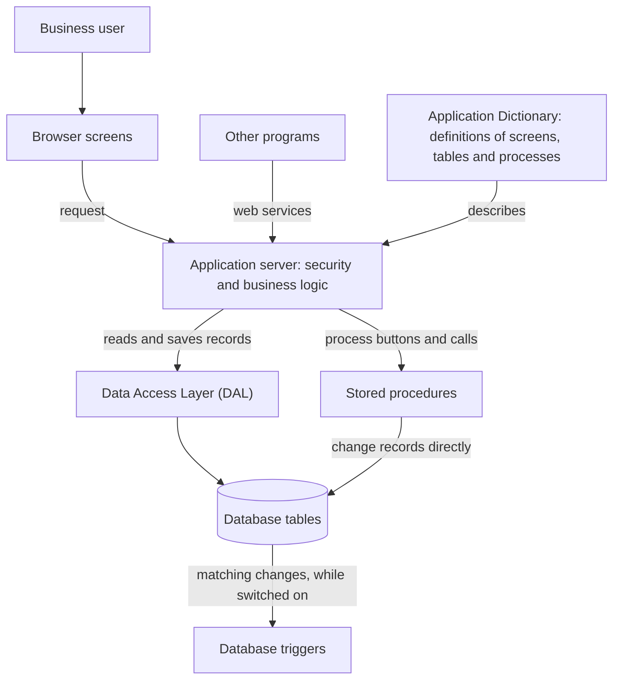

# Openbravo: a plain-language overview

## 1. What Openbravo is

Openbravo is ERP (enterprise resource planning) software: one shared system where a company's staff record sales, purchasing, stock, manufacturing and accounting. They work in a web browser (a program for viewing websites), which talks to an application server (the central program doing the work). The server keeps each record in a database: an organised store of tables (lists of records of one kind). Think of a house built from one master plan, the [Application Dictionary](orm/05-glossary.md#application-dictionary-ad): a builder turns it into rooms (screens), and add-on modules extend it.

## 2. How complex it is

Rating: **Very High**.

The repository (the project's stored files) holds hundreds of tables, screens and stored procedures (business steps run inside the database). Business rules are split between the database and Java code (the server's written instructions).

| What we counted | Core (base module) | Modules (add-ons) | How we counted it |
| --- | --- | --- | --- |
| Modules | 1 | 20 | the record in `src-db/database/sourcedata/AD_MODULE.xml`; folders in `modules/` |
| Java program files, excluding automated tests (code that checks code) | 1,428 | 502 | .java files outside every `src-test` folder |
| Database tables | 561 | 45 | .xml files in `src-db/database/model/tables` |
| Stored procedures | 287 | 12 | .xml files in `src-db/database/model/functions` |
| Triggers (rules the database runs by itself on certain changes) | 277 | 53 | .xml files in `src-db/database/model/triggers` |
| Screens | 254 | 30 | window (screen) records in `src-db/database/sourcedata/AD_WINDOW.xml` |
| Web-service entry points (addresses where other programs exchange data) | 1 | 2 | the web-service address in `src-db/database/sourcedata/AD_MODEL_OBJECT_MAPPING.xml`; one per module with "service" in its name |
| Other outside connections; lines of code, effort, cost | not measured | not measured | not counted |

How we measured: we counted repository files and their records. Each database definition file describes one table, procedure or trigger. Core figures cover everything outside `modules/`; module figures come from each module's matching folder or file.

The [Data Access Layer (DAL)](orm/05-glossary.md#data-access-layer-dal) is the Java code that reads and saves records. Its API is what other code can ask of it. [Its service API page](orm/03-dal-service-api.md) lists 102 public members (operations and named values) in 4 service classes (code units). [Its security page](orm/04-security-and-filtering.md#what-admin-mode-skips) has a 4 x 3 admin-mode matrix (a table). It shows, for 4 user situations, which of 3 kinds of check [admin mode](orm/05-glossary.md#admin-mode) (code running with administrator privileges) skips. Comments are programmers' notes in the code. The DAL pages use the bold label "Ambiguity:" 24 times: 3 in [architecture](orm/01-architecture.md), 8 in [runtime model](orm/02-runtime-model.md) (how data is described), 5 in service API and 8 in security. One runtime-model use defines the label; 23 mark code-versus-comment disagreements or open questions, none settled.

## 3. Main components

| Component | What it does in plain English | Where it lives in the repository |
| --- | --- | --- |
| Application Dictionary | Metadata (data that describes other data) for every table, screen, button and process (a business task a user can start). | `src-db/database/sourcedata` |
| Code generator and build system | Prepares the application: creates the database, writes code from the Dictionary, bundles the result. | `build.xml`, `src-wad`, `src-core` |
| Installation and upgrade checks | Checks an installation can be upgraded, and adjusts data during upgrades. | `src-util/buildvalidation`, `src-util/modulescript` |
| Module system and core module | Modules add or change features on top of Core. | `modules/`, `src-db/database/sourcedata/AD_MODULE.xml` |
| Data Access Layer (DAL) | Reads and saves records as business objects (data the program can work with), with security checks. See [the DAL pages](orm/01-architecture.md). | `src/org/openbravo/dal` |
| Database layer | Stores records and runs stored procedures and triggers (section 4). | `src-db/database/model` |
| Security | Checks who a user is. Their [role](orm/05-glossary.md#role) (a group of permissions) has access rules for screens, processes and tables. DAL searches keep to the user's [client](orm/05-glossary.md#client) (an independent business), the [organizations](orm/05-glossary.md#organization) (companies or units) their role may read and shared system data. This applies only to records with a client or organization, while the search's filter is on, and not to single-record fetches ([filtering limits](orm/04-security-and-filtering.md#client-organization-and-active-filtering)). | `src/org/openbravo/authentication`, `src/org/openbravo/role` |
| Browser user-interface framework | Draws screens in the browser from their definitions. The part that moves screen data checks access and saves through the DAL. | `modules/org.openbravo.client.application`, `modules/org.openbravo.service.datasource`, `web/` |
| Business processes | Orders, shipments, invoices, payments, stock, costing (working out what stock costs) and accounting. | `src/org/openbravo/erpCommon`, `src/org/openbravo/materialmgmt`, `src/org/openbravo/costing`, `modules/org.openbravo.advpaymentmngt` |
| Web services and integration points | Let other programs exchange data without screens, and connect to outside systems. | `src/org/openbravo/service`, `modules/org.openbravo.service.json` |
| Reporting, scheduling and background services | Report layouts, a scheduler for timed processes, and an import service that loads data unattended. | `src/org/openbravo/erpReports`, `src/org/openbravo/erpCommon/ad_reports`, `src/org/openbravo/scheduling`, `src/org/openbravo/service/importprocess` |
| Reference and sample data | Standard settings and two sample data sets. | `referencedata/` |
| Configuration | Settings for each installation, such as the database engine (database product). | `config/` |
| Shared libraries | Ready-made building blocks for database access, reports and timed tasks. | `lib/runtime` |
| Translation tools | Collect screen and report text for translation, and prepare screen styles for right-to-left languages. | `src-trl/` |
| Automated tests | Checks that other code works. | `src-test/` |

## 4. Stored procedures

### What a stored procedure is

A stored procedure is a named set of business steps that runs inside the database rather than in the application server. Think of a standing order at a bank: you give one instruction, and the bank carries out every step itself. A [database trigger](orm/05-glossary.md#database-trigger) is a related automatic rule in the database; most can be switched off.

**Why they are used:** not verified; the repository states no design reason. It shows history: `legal/CompiereAddendum.txt` lists 136 procedures and triggers that Compiere Inc. first wrote and Openbravo later modified.

### Business areas

- **Completing documents.** `C_ORDER_POST` processes an order. It checks the order, works out promotions and discounts, and reserves stock. For some order types it also creates the invoice or shipment. `C_INVOICE_POST` completes, voids or reverses an invoice.
- **Stock.** `M_INOUT_POST` completes a goods shipment or receipt. It updates stock, reservations and the order's delivered quantities. `M_INVENTORY_POST` records differences found by a physical stock count.
- **Checks that keep data correct.** `C_CHK_OPEN_PERIOD` tells whether a date's accounting period (a span of dates in the books) still accepts entries for a document type. One trigger blocks certain changes to processed orders.

### Counts and engines

Section 2 counts 299 stored procedures (287 core, 12 modules), each stored once, and 330 triggers (277 core, 53 modules). The sample settings file `config/Openbravo.properties.template` names two engines, Oracle and PostgreSQL. The main build file refuses Oracle, unsupported since the 23Q4 release. The .sql preparation scripts (files of database instructions) in `src-db/database/model` hold 45 more procedures, counted once per name; 14 have one version per engine. How one definition becomes code for each engine is not verified.

### The Java side

Buttons and menu entries can call procedures: 93 of the 227 core process records in `src-db/database/sourcedata/AD_PROCESS.xml` name one. Java code can use two helper services (server tools that start a procedure) or call procedures directly. Modules can add steps at 22 extension points (named places inside core procedures) in `src-db/database/sourcedata/AD_EXTENSION_POINTS.xml`.

So there are two routes to the same data. On the DAL route, Java code saves through the DAL and [its access checks](orm/04-security-and-filtering.md#access-checks) (admin mode skips some). If a record has fields for this, the DAL also notes who created or last changed it, and when. On the procedure route, the procedure changes records directly, outside those Java checks, with its own checks. On both routes, switched-on triggers act on the changes they cover.

**What could surprise you:** records that Java code loaded before a procedure ran may not show its changes. The process helper re-reads only its record of that run; what other records show is not verified. If Java code switches triggers off, the usual DAL commit (permanent save) refuses to run. That check reads the DAL's own trigger-off marker, not the database, and one tidy-up step saving remaining work skips it.

### Complexity and risk

- **Logic in two places.** Order rules sit in a Java event handler (code run when an order changes) and in database triggers and procedures. One change can need two edits.
- **Engine-specific code.** Oracle-specific scripts and procedure calls remain, although the build refuses Oracle.
- **Harder testing.** Procedure tests are Java tests in `src-test` that need a running database; `src-db` holds none.

## 5. How the pieces fit together

Diagram sources: `modules/org.openbravo.client.application`, `modules/org.openbravo.client.kernel`, `src/org/openbravo/authentication`, `src/org/openbravo/service/web`, `src-db/database/sourcedata/AD_MODEL_OBJECT_MAPPING.xml`, `src-db/database/sourcedata/AD_WINDOW.xml`, `src-db/database/sourcedata/AD_PROCESS.xml`, `src/org/openbravo/dal`, `docs/orm/01-architecture.md`, `src/org/openbravo/service/db/CallProcess.java`, `src/org/openbravo/service/db/CallStoredProcedure.java`, `src-wad/src/org/openbravo/wad/ActionButton_Responser.javaxml`, `src-db/database/model/tables`, `src-db/database/model/functions`, `src-db/database/model/triggers`, `src-db/database/model/triggers/C_ORDER_CHK_RESTRINCTIONS_TRG.xml`, `src/org/openbravo/dal/core/TriggerHandler.java`.

## 6. A typical day in the system

A sales clerk takes a customer's order.

1. **Sign in (security).** The system checks the password and sets the clerk's role, client and organization: the [user context](orm/05-glossary.md#user-context).
2. **Open Sales Order (user-interface framework, Application Dictionary).** The browser draws the screen from its definition, if the role has access.
3. **Save the order (user-interface framework, security, DAL, database layer).** Server services check the role may edit this screen. The DAL then saves in [admin mode](orm/04-security-and-filtering.md#what-admin-mode-skips), skipping its role check but still checking the record's client and organization. Order triggers also check the change.
4. **Process the order (business processes, stored procedures).** The clerk presses Process Order. The server records the run, then the database runs `C_ORDER_POST` to complete the order.
5. **Ship and invoice (business processes, stored procedures).** Completing the shipment and invoice later runs `M_INOUT_POST` and `C_INVOICE_POST`.

## 7. Where to go next

- [Architecture of the Data Access Layer](orm/01-architecture.md): architects and developers wanting an overview.
- [Runtime model](orm/02-runtime-model.md): developers learning how tables become business objects.
- [DAL service API](orm/03-dal-service-api.md): developers writing code that reads or saves data.
- [Security and filtering](orm/04-security-and-filtering.md): developers, testers and analysts asking why records are hidden or a save fails.
- [Glossary](orm/05-glossary.md): anyone meeting an unfamiliar DAL term.

## 8. What this overview does not cover

- **Sampled, not read in full:** every component in section 3, and procedure and trigger contents (a handful read, including the five named). Counts cover every file.
- **Nothing was run:** no application code, build, database or stored procedure.
- **No maintainer sign-off:** the project guide records that no DAL maintainer has signed off on the DAL documentation's accuracy.

Basis:

- `README`
- `legal/Licensing.txt`
- `legal/CompiereAddendum.txt`
- `build.xml`
- `src/build.xml`
- `config/`
- `config/Openbravo.properties.template`
- `config/quartz.properties.template`
- `lib/runtime`
- `modules/`
- `modules/*/src-db/database/sourcedata`
- `modules/*/src-db/database/model`
- `src/`
- `src-core/`
- `src-util/`
- `src-util/buildvalidation`
- `src-util/buildvalidation/src/org/openbravo/buildvalidation/CostingMigrationCheck.java`
- `src-util/buildvalidation/src/org/openbravo/buildvalidation/DatabaseVersionCheck.java`
- `src-util/modulescript`
- `src-util/modulescript/src/org/openbravo/modulescript/UpdateIsCompletelyInvoiced.java`
- `src-wad/`
- `src-test/`
- `src-db`
- `src-db/database/sourcedata`
- `src-db/database/model`
- `src-db/database/sourcedata/AD_MODULE.xml`
- `src-db/database/sourcedata/AD_WINDOW.xml`
- `src-db/database/sourcedata/AD_TABLE.xml`
- `src-db/database/sourcedata/AD_PROCESS.xml`
- `src-db/database/sourcedata/AD_COLUMN.xml`
- `src-db/database/sourcedata/AD_MODEL_OBJECT.xml`
- `src-db/database/sourcedata/AD_MODEL_OBJECT_MAPPING.xml`
- `src-db/database/sourcedata/AD_EXTENSION_POINTS.xml`
- `src-db/database/model/tables`
- `src-db/database/model/functions`
- `src-db/database/model/functions/C_ORDER_POST.xml`
- `src-db/database/model/functions/C_ORDER_POST1.xml`
- `src-db/database/model/functions/C_INVOICE_POST.xml`
- `src-db/database/model/functions/C_INVOICE_POST0.xml`
- `src-db/database/model/functions/M_INOUT_POST.xml`
- `src-db/database/model/functions/M_INOUT_POST0.xml`
- `src-db/database/model/functions/M_INVENTORY_POST.xml`
- `src-db/database/model/functions/C_CHK_OPEN_PERIOD.xml`
- `src-db/database/model/triggers`
- `src-db/database/model/triggers/C_ORDER_CHK_RESTRINCTIONS_TRG.xml`
- `src-db/database/model/prescript-Oracle.sql`
- `src-db/database/model/prescript-PostgreSql.sql`
- `src-db/database/model/postscript-Oracle.sql`
- `src-db/database/model/postscript-PostgreSql.sql`
- `src-db/database/build.xml`
- `src-db/database/lib/dbsourcemanager.jar`
- `src-wad/src/org/openbravo/wad/Wad.java`
- `src-wad/src/org/openbravo/wad/WadActionButton.java`
- `src-wad/src/org/openbravo/wad/ActionButton_Responser.javaxml`
- `src-wad/src/org/openbravo/wad/ActionButton_data.xsqlxml`
- `src-core/src/org/openbravo/data/Sqlc.java`
- `src-trl/`
- `src-trl/src/org/openbravo/translate/Translate.java`
- `src-trl/src/org/openbravo/translate/RTLSkin.java`
- `src/org/openbravo/erpCommon`
- `src/org/openbravo/erpCommon/modules`
- `src/org/openbravo/erpCommon/modules/ApplyModule.java`
- `src/org/openbravo/erpCommon/ad_process/ConvertQuotationIntoOrder.java`
- `src/org/openbravo/erpCommon/businessUtility/ReplaceOrderExecutor.java`
- `src/org/openbravo/erpCommon/ad_reports`
- `src/org/openbravo/erpReports`
- `src/org/openbravo/materialmgmt`
- `src/org/openbravo/materialmgmt/InventoryCountProcess.java`
- `src/org/openbravo/costing`
- `src/org/openbravo/event/OrderEventHandler.java`
- `src/org/openbravo/authentication`
- `src/org/openbravo/role`
- `src/org/openbravo/dal`
- `src/org/openbravo/dal/core/OBContext.java`
- `src/org/openbravo/dal/core/OBInterceptor.java`
- `src/org/openbravo/dal/core/SessionHandler.java`
- `src/org/openbravo/dal/core/TriggerHandler.java`
- `src/org/openbravo/dal/service/OBCriteria.java`
- `src/org/openbravo/dal/service/OBQuery.java`
- `src/org/openbravo/dal/service/OBDal.java`
- `src/org/openbravo/dal/security/SecurityChecker.java`
- `src/org/openbravo/base`
- `src/org/openbravo/scheduling`
- `src/org/openbravo/scheduling/OBScheduler.java`
- `src/org/openbravo/service`
- `src/org/openbravo/service/importprocess`
- `src/org/openbravo/service/importprocess/ImportEntryManager.java`
- `src/org/openbravo/service/web`
- `src/org/openbravo/service/web/WebServiceServlet.java`
- `src/org/openbravo/service/externalsystem/ExternalSystem.java`
- `src/org/openbravo/service/db/CallProcess.java`
- `src/org/openbravo/service/db/CallStoredProcedure.java`
- `src/org/openbravo/service/db/DalConnectionProvider.java`
- `modules/org.openbravo.client.kernel`
- `modules/org.openbravo.client.application`
- `modules/org.openbravo.client.application/src/org/openbravo/client/application/window/StandardWindowComponent.java`
- `modules/org.openbravo.service.json`
- `modules/org.openbravo.service.json/src/org/openbravo/service/json/DefaultJsonDataService.java`
- `modules/org.openbravo.service.datasource`
- `modules/org.openbravo.service.datasource/src/org/openbravo/service/datasource/DataSourceServlet.java`
- `modules/org.openbravo.service.datasource/src/org/openbravo/service/datasource/DefaultDataSourceService.java`
- `modules/org.openbravo.advpaymentmngt`
- `web/`
- `referencedata/`
- `src-test/src/org/openbravo/test/base/OBBaseTest.java`
- `src-test/src/org/openbravo/test/dal/DalStoredProcedureTest.java`
- `src-test/src/org/openbravo/test/process/order/OrderProcessTest.java`
- `docs/orm/01-architecture.md`
- `docs/orm/02-runtime-model.md`
- `docs/orm/03-dal-service-api.md`
- `docs/orm/04-security-and-filtering.md`
- `docs/orm/05-glossary.md`
- `blitzy/documentation/Project Guide.md`
