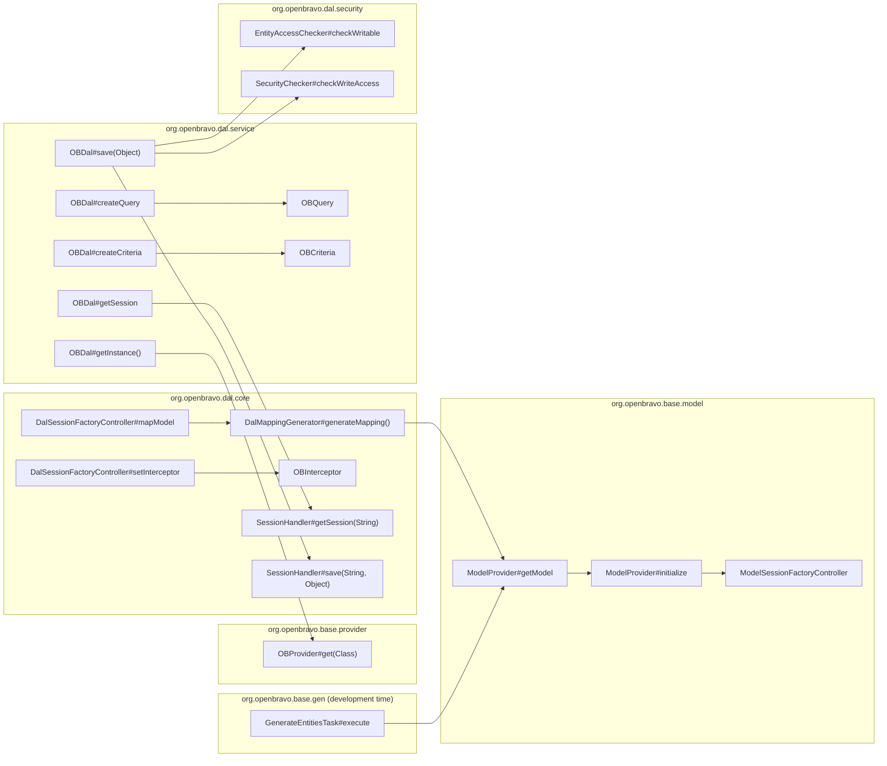
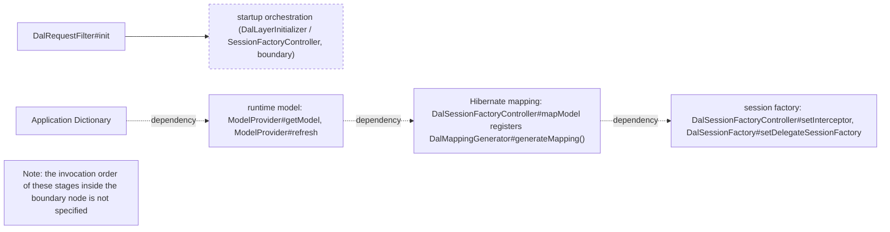
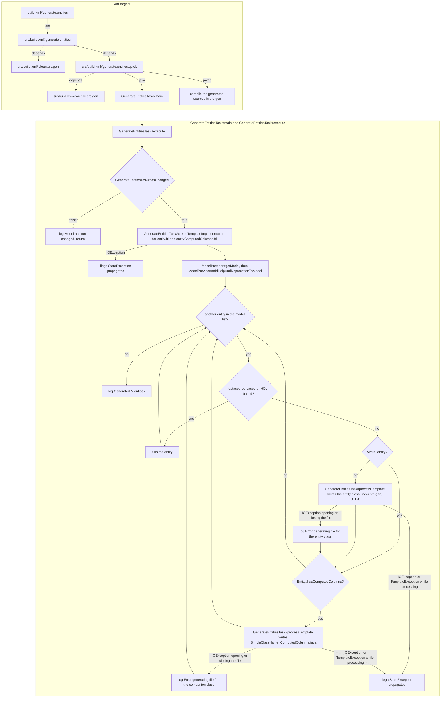
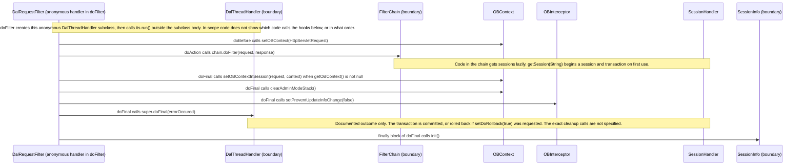

# 01 Architecture of the Data Access Layer

## Reading guide

- Audience: Java developers who extend Openbravo modules and need to know what the [Data Access Layer (DAL)](./05-glossary.md#data-access-layer-dal) does at build time, at startup and on every request.
- Covers: the DAL layers and the split between [development time](./05-glossary.md#development-time) and runtime; the startup sequence that turns the [Application Dictionary](./05-glossary.md#application-dictionary-ad) into the [runtime model](./05-glossary.md#runtime-model), the [Hibernate mapping](./05-glossary.md#hibernate-mapping) and the [session factory](./05-glossary.md#session-factory); the [generate.entities](./05-glossary.md#generateentities) build flow, which writes a Java class for each [entity](./05-glossary.md#entity) that is not datasource-based, HQL-based or virtual and a companion class for each entity with [computed columns](./05-glossary.md#computed-column), and runs only when the generated sources are missing or older than the last Application Dictionary update or the last edit of the model, generator and structure source packages; the request lifecycle; and how [sessions](./05-glossary.md#session) and [transactions](./05-glossary.md#transaction) are managed per thread.
- Reading order: 01 (this file, the first of the set) → [02-runtime-model.md](./02-runtime-model.md) → [03-dal-service-api.md](./03-dal-service-api.md) → [04-security-and-filtering.md](./04-security-and-filtering.md) → [05-glossary.md](./05-glossary.md). There is no previous file. Next file: [02-runtime-model.md](./02-runtime-model.md).
- Conventions: every behavioural statement ends with a citation in the form `Class#method` or `build.xml#target`; classes outside the documented scope appear by name only, marked "(boundary)", and nothing is stated about their internals; every diagram is followed by a `Diagram sources:` paragraph that names the kind of each edge and its citation.
- Versions: Hibernate ORM 5.6.15.Final, pinned by the jar `lib/runtime/hibernate-core-5.6.15.Final.jar` (next to `lib/runtime/hibernate-commons-annotations-5.1.2.Final.jar`). Java 11 is the minimum: `build.xml#init` fails on Java 1.6 to 10 with the message "Unsupported Java version ... Minimum required is 11.", and `.settings/org.eclipse.jdt.core.prefs` sets compliance and source level 11.

Sources cited in this file:

| Class | Repository path |
| --- | --- |
| `BaseOBObject` | `src/org/openbravo/base/structure/BaseOBObject.java` |
| `DalMappingGenerator` | `src/org/openbravo/dal/core/DalMappingGenerator.java` |
| `DalRequestFilter` | `src/org/openbravo/dal/core/DalRequestFilter.java` |
| `DalSessionFactory` | `src/org/openbravo/dal/core/DalSessionFactory.java` |
| `DalSessionFactoryController` | `src/org/openbravo/dal/core/DalSessionFactoryController.java` |
| `DalUtil` | `src/org/openbravo/dal/core/DalUtil.java` |
| `Entity` | `src/org/openbravo/base/model/Entity.java` |
| `EntityAccessChecker` | `src/org/openbravo/dal/security/EntityAccessChecker.java` |
| `GenerateEntitiesTask` | `src/org/openbravo/base/gen/GenerateEntitiesTask.java` |
| `MappingGenerationTest` | `src-test/src/org/openbravo/test/dal/MappingGenerationTest.java` |
| `ModelProvider` | `src/org/openbravo/base/model/ModelProvider.java` |
| `ModelSessionFactoryController` | `src/org/openbravo/base/model/ModelSessionFactoryController.java` |
| `OBContext` | `src/org/openbravo/dal/core/OBContext.java` |
| `OBCriteria` | `src/org/openbravo/dal/service/OBCriteria.java` |
| `OBDal` | `src/org/openbravo/dal/service/OBDal.java` |
| `OBInterceptor` | `src/org/openbravo/dal/core/OBInterceptor.java` |
| `OBProvider` | `src/org/openbravo/base/provider/OBProvider.java` |
| `OBQuery` | `src/org/openbravo/dal/service/OBQuery.java` |
| `Property` | `src/org/openbravo/base/model/Property.java` |
| `SecurityChecker` | `src/org/openbravo/dal/security/SecurityChecker.java` |
| `SessionHandler` | `src/org/openbravo/dal/core/SessionHandler.java` |

Build targets are cited from the root `build.xml` and from `src/build.xml`; `src-test/build.xml` is named, and cited, only for the one trigger it declares. `Entity` always means the runtime-model class above, never the annotation in `src/org/openbravo/base/Entity.java`.

## Layers

Generation of Java sources runs at development time, while the remaining DAL classes run inside the application: the build starts `GenerateEntitiesTask#main` to write the [generated classes](./05-glossary.md#generated-class), and `GenerateEntitiesTask#execute` reads the same runtime model that the running application uses by calling `ModelProvider#getModel` (`src/build.xml#generate.entities.quick`, `GenerateEntitiesTask#execute`). The flow is described in [Entity generation (generate.entities)](#entity-generation-generateentities).

The runtime packages form these layers, grouped by the package in each class declaration (for example `ModelProvider#getModel` in `org.openbravo.base.model` and `OBDal#getInstance()` in `org.openbravo.dal.service`):

- Model, package `org.openbravo.base.model`: `ModelProvider#getModel` returns the runtime model as a list of `Entity` objects, one per [entity](./05-glossary.md#entity), and each `Entity` lists its [properties](./05-glossary.md#property) through `Entity#getProperties`; each such `Property` describes one property: `Property#getEntity` returns the entity it belongs to, and `Property#isPrimitive` and `Property#isOneToMany` report whether it holds a primitive value or a one-to-many list; and `ModelProvider#initialize` reads the Application Dictionary through its own `ModelSessionFactoryController`, whose `ModelSessionFactoryController#mapModel` maps the Application Dictionary classes and every class added through `ModelSessionFactoryController#addAdditionalClasses` (`ModelProvider#getModel`, `Entity#getProperties`, `Property#getEntity`, `Property#isPrimitive`, `Property#isOneToMany`, `ModelProvider#initialize`, `ModelSessionFactoryController#mapModel`, `ModelSessionFactoryController#addAdditionalClasses`). Owner: [02-runtime-model.md, How the runtime model is built](./02-runtime-model.md#how-the-runtime-model-is-built) and [02-runtime-model.md, Property](./02-runtime-model.md#property).
- Structure, package `org.openbravo.base.structure`: `BaseOBObject` is, per its class Javadoc, the root of the inheritance tree of all [business objects](./05-glossary.md#business-object), and `BaseOBObject#getEntity` resolves an object's `Entity` through `ModelProvider#getEntity(String)` (`BaseOBObject#getEntity`, class Javadoc). Owner: [02-runtime-model.md, BaseOBObject and its interfaces](./02-runtime-model.md#baseobobject-and-its-interfaces).
- Provider, package `org.openbravo.base.provider`: `OBProvider#get(Class)` returns the instance registered for a class and registers the class itself when no registration exists; `OBDal#getInstance()` and `SessionHandler#getInstance` obtain their instances through it (`OBProvider#get(Class)`, `OBDal#getInstance()`, `SessionHandler#getInstance`). Owner: [03-dal-service-api.md, OBProvider](./03-dal-service-api.md#obprovider).
- Core, package `org.openbravo.dal.core`: `DalMappingGenerator`, `DalSessionFactoryController` and `DalSessionFactory` build the Hibernate side, and `DalRequestFilter` and `SessionHandler` bind sessions and transactions to requests and threads (`DalSessionFactoryController#mapModel`, `DalSessionFactory#setDelegateSessionFactory`, `DalRequestFilter#doFilter`, `SessionHandler#getInstance`). This file owns these five classes; see [Startup sequence](#startup-sequence), [Hibernate mapping generation](#hibernate-mapping-generation), [Request lifecycle](#request-lifecycle) and [Sessions and transactions](#sessions-and-transactions). The other core classes are owned elsewhere:
  - `OBContext` holds the [user context](./05-glossary.md#user-context) of the current thread, which `DalRequestFilter#doFilter` sets through `OBContext#setOBContext(HttpServletRequest)` (`OBContext#getOBContext`, `DalRequestFilter#doFilter`). Owner: [04-security-and-filtering.md, OBContext](./04-security-and-filtering.md#obcontext).
  - `OBInterceptor` is the Hibernate [interceptor](./05-glossary.md#interceptor) that `DalSessionFactoryController#setInterceptor` installs (`DalSessionFactoryController#setInterceptor`). Owner: [04-security-and-filtering.md, Interceptor behavior](./04-security-and-filtering.md#interceptor-behavior).
  - `DalUtil` holds helpers such as `DalUtil#getEntityName(Class)`, which `SessionHandler#find(String, Class, Object)` uses to translate a class into its [entity name](./05-glossary.md#entity-name) (`SessionHandler#find(String, Class, Object)`). Owner: [02-runtime-model.md, DalUtil](./02-runtime-model.md#dalutil).
- Service, package `org.openbravo.dal.service`: the `OBDal` class Javadoc describes it as the main external access to the DAL; the `OBDal#createQuery` overloads, such as `OBDal#createQuery(Class, String, Map)`, create `OBQuery` objects, the `OBDal#createCriteria` overloads, such as `OBDal#createCriteria(Class)`, create `OBCriteria` objects, and `OBDal#getSession` returns the current Hibernate session from `SessionHandler#getSession(String)`; and `OBCriteria#initialize` and `OBQuery#createQueryString` add the read check and the row filters that [04-security-and-filtering.md, filtering section](./04-security-and-filtering.md#client-organization-and-active-filtering) describes, under the conditions given there (`OBDal#createQuery(Class, String, Map)`, `OBDal#createCriteria(Class)`, `OBDal#getSession`, `OBCriteria#initialize`, `OBQuery#createQueryString`). Owner: [03-dal-service-api.md, OBDal](./03-dal-service-api.md#obdal).
- Security, package `org.openbravo.dal.security`: the DAL calls these checks from its own methods; for example, outside [admin mode](./05-glossary.md#admin-mode) `OBDal#save(Object)` calls `EntityAccessChecker#checkWritable` and `SecurityChecker#checkWriteAccess(Object)` before `SessionHandler#save(String, Object)` (`OBDal#save(Object)`). Owner: [04-security-and-filtering.md, Access checks](./04-security-and-filtering.md#access-checks).

Diagram sources: every edge is an observed call made in the body of its source node's method, starting with the call from `GenerateEntitiesTask#execute` to `ModelProvider#getModel` (`GenerateEntitiesTask#execute`). `ModelProvider#getModel` calls the private `ModelProvider#initialize` when no model exists (`ModelProvider#getModel`). `ModelProvider#initialize` instantiates `ModelSessionFactoryController` (`ModelProvider#initialize`). `DalSessionFactoryController#mapModel` calls `DalMappingGenerator#generateMapping()` (`DalSessionFactoryController#mapModel`). `DalMappingGenerator#generateMapping()` iterates `ModelProvider#getModel` (`DalMappingGenerator#generateMapping()`). `DalSessionFactoryController#setInterceptor` instantiates `OBInterceptor` (`DalSessionFactoryController#setInterceptor`). `OBDal#getInstance()` calls `OBProvider#get(Class)` (`OBDal#getInstance()`). `OBDal#getSession` calls `SessionHandler#getSession(String)` (`OBDal#getSession`). The `OBDal#createQuery(Class, String, Map)` and `OBDal#createCriteria(Class)` overloads instantiate `OBQuery` and `OBCriteria` (`OBDal#createQuery(Class, String, Map)`, `OBDal#createCriteria(Class)`). `OBDal#save(Object)` calls `EntityAccessChecker#checkWritable` and `SecurityChecker#checkWriteAccess` outside admin mode, then `SessionHandler#save(String, Object)` (`OBDal#save(Object)`). Subgraphs group the nodes by the package each class declares, `org.openbravo.base.gen`, `org.openbravo.base.model`, `org.openbravo.base.provider`, `org.openbravo.dal.core`, `org.openbravo.dal.service` and `org.openbravo.dal.security` (`GenerateEntitiesTask#execute`, `ModelProvider#getModel`, `OBProvider#get(Class)`, `SessionHandler#getSession(String)`, `OBDal#getInstance()`, `SecurityChecker#checkWriteAccess`).

## Startup sequence

The DAL becomes usable in three stages, each of which needs the output of the previous one: the Application Dictionary is read into the runtime model, the runtime model is turned into the Hibernate mapping, and the mapping is configured into a session factory (`ModelProvider#getModel`, `DalMappingGenerator#generateMapping()`, `DalSessionFactoryController#mapModel`). This section states what each stage needs from the previous one; it does not establish the call chain that runs the stages.

- Observed call: `DalRequestFilter#init` calls `DalLayerInitializer.getInstance().initialize(true)` on the boundary class `DalLayerInitializer` (`DalRequestFilter#init`). The `DalRequestFilter` class Javadoc adds that this initialization is not required, because session factory initialization happens automatically at the first database access, and that doing it in the filter is better for test and debug purposes (`DalRequestFilter#init`, class Javadoc).
- Stage 1, Application Dictionary to runtime model: `ModelProvider#getModel` builds the model on its first call and returns the same list afterwards (`ModelProvider#getModel`). `ModelProvider#refresh` rebuilds it; how it does so, and how the Application Dictionary is read, are owned by [02-runtime-model.md, How the runtime model is built](./02-runtime-model.md#how-the-runtime-model-is-built) (`ModelProvider#refresh`, `ModelProvider#initialize`).
- Stage 2, runtime model to Hibernate mapping: `DalSessionFactoryController#mapModel` registers the mapping produced by `DalMappingGenerator#generateMapping()`, and `DalMappingGenerator#generateMapping()` iterates the entities returned by `ModelProvider#getModel` (`DalSessionFactoryController#mapModel`, `DalMappingGenerator#generateMapping()`). The `DalSessionFactoryController` class Javadoc states that the controller is initialized after the model has been read into memory (`DalSessionFactoryController#mapModel`, class Javadoc).
- Stage 3, Hibernate mapping to session factory: the `DalSessionFactoryController` class Javadoc describes the controller as the class that initializes and provides the session factory of the runtime DAL (`DalSessionFactoryController#mapModel`, class Javadoc). `DalSessionFactoryController#setInterceptor` installs a new `OBInterceptor` on the Hibernate `Configuration` it receives (`DalSessionFactoryController#setInterceptor`). `DalSessionFactory` delegates to the Hibernate session factory passed to `DalSessionFactory#setDelegateSessionFactory` (`DalSessionFactory#setDelegateSessionFactory`, class Javadoc). `DalSessionFactory#openSession()` initializes the database [session info](./05-glossary.md#session-info) on the connection of the session that the delegate opens (`DalSessionFactory#openSession()`).
- Left unspecified: `DalSessionFactoryController` overrides `mapModel`, `setInterceptor` and `getSQLFunctions` of its boundary superclass `SessionFactoryController` (`DalSessionFactoryController#mapModel`, `DalSessionFactoryController#setInterceptor`, `DalSessionFactoryController#getSQLFunctions`). Which code invokes these methods, which code builds the Hibernate session factory and passes it to `DalSessionFactory#setDelegateSessionFactory`, and in what order, is therefore decided inside the boundary classes `DalLayerInitializer` and `SessionFactoryController`, whose internals this documentation does not cover (`DalSessionFactoryController#mapModel`, `DalSessionFactory#setDelegateSessionFactory`).

Why the model has its own session factory: a comment in `ModelProvider#initialize` explains that the DAL layer uses `ModelProvider`, so reading the Application Dictionary through the DAL would create a cyclic relation (`ModelProvider#initialize`). The comment speaks of using the `SessionHandler` directly, while the code that follows opens its session from a dedicated `ModelSessionFactoryController`, the [model session factory](./05-glossary.md#model-session-factory) described in [02-runtime-model.md, How the runtime model is built](./02-runtime-model.md#how-the-runtime-model-is-built) (`ModelProvider#initialize`).

Why `DalSessionFactory` wraps the Hibernate factory: its class Javadoc states that it delegates every call to the real session factory except the calls that open a session, for which an extra action sets session information in the database (`DalSessionFactory#openSession()`, class Javadoc). The Javadoc of `DalSessionFactory#getDelegateSessionFactory` adds that normal application code must use `DalSessionFactory` and not the underlying Hibernate session factory (`DalSessionFactory#getDelegateSessionFactory`).

> **Ambiguity:** `DalSessionFactory#openSession()` calls `DalSessionFactory#initConnection`, which initializes session info and then executes the statement configured in the `bbdd.sessionConfig` setting, wrapping a failure of that statement in `IllegalStateException` (`DalSessionFactory#openSession()`, `DalSessionFactory#initConnection`). `DalSessionFactory#openStatelessSession()` and `DalSessionFactory#openStatelessSession(Connection)` carry the same Javadoc sentence ("sets user session information in the database") but, for the [stateless sessions](./05-glossary.md#stateless-session) they open, only initialize session info and do not run `bbdd.sessionConfig` (`DalSessionFactory#openStatelessSession()`, `DalSessionFactory#openStatelessSession(Connection)`). No source states whether the difference is intended, and this documentation does not resolve it.

In the method bodies the delegate opens the session before any session information is set: `DalSessionFactory#openSession()` calls `openSession()` on the delegate factory, takes the connection of the returned session and then passes it to `DalSessionFactory#initConnection` (`DalSessionFactory#openSession()`). `DalSessionFactory#openStatelessSession()` and `DalSessionFactory#openStatelessSession(Connection)` likewise open the stateless session on the delegate first and then initialize session info on its connection (`DalSessionFactory#openStatelessSession()`, `DalSessionFactory#openStatelessSession(Connection)`).

> **Ambiguity:** The `DalSessionFactory` class Javadoc says that, for the calls that open a session, an extra action sets session information in the database and then the call is forwarded to the real session factory (`DalSessionFactory#openSession()`, class Javadoc). The bodies of `DalSessionFactory#openSession()`, `DalSessionFactory#openStatelessSession()` and `DalSessionFactory#openStatelessSession(Connection)` forward the call first and set session information afterwards, on the connection of the session the delegate returned (`DalSessionFactory#openSession()`, `DalSessionFactory#openStatelessSession()`, `DalSessionFactory#openStatelessSession(Connection)`). No source states which order is intended, and this documentation does not resolve it.

Diagram sources: the solid edge is an observed call, `DalRequestFilter#init` calling `DalLayerInitializer.getInstance().initialize(true)` (`DalRequestFilter#init`). The node "startup orchestration" is a boundary orchestration node for `DalLayerInitializer`, which `DalRequestFilter#init` calls, and `SessionFactoryController`, whose `mapModel`, `setInterceptor` and `getSQLFunctions` `DalSessionFactoryController` overrides; it has no internal edges and claims no order (`DalRequestFilter#init`, `DalSessionFactoryController#mapModel`). The dotted edges labelled "dependency" are conceptual dependencies, not calls (`ModelProvider#getModel`, `DalMappingGenerator#generateMapping()`, `DalSessionFactoryController#mapModel`). The runtime model is built from the Application Dictionary by `ModelProvider#getModel` and `ModelProvider#refresh` (`ModelProvider#getModel`, `ModelProvider#refresh`). The mapping needs the runtime model because `DalMappingGenerator#generateMapping()` iterates `ModelProvider#getModel`, and the `DalSessionFactoryController` class Javadoc states that the controller is initialized after the model has been read into memory (`DalMappingGenerator#generateMapping()`, `DalSessionFactoryController#mapModel`). The session factory needs the mapping because the `DalSessionFactoryController` class Javadoc describes the controller as the class that initializes and provides the session factory of the runtime DAL, and states that `DalMappingGenerator` generates the Hibernate mapping for the runtime model (`DalSessionFactoryController#mapModel`). The session factory stage node names `DalSessionFactoryController#setInterceptor`, which installs a new `OBInterceptor` on the Hibernate `Configuration` it receives, and `DalSessionFactory#setDelegateSessionFactory`, which receives the Hibernate factory that `DalSessionFactory` delegates to (`DalSessionFactoryController#setInterceptor`, `DalSessionFactory#setDelegateSessionFactory`). The unconnected note node records that the invocation order inside the boundary is not specified (`DalRequestFilter#init`, `DalSessionFactoryController#mapModel`).

## Hibernate mapping generation

Besides the runtime model itself, two `Openbravo.properties` settings, `hibernate.hbm.file` and `hibernate.hbm.readFile`, change how the mapping is produced; the rules below derive the rest from each `Entity` and its properties (`DalMappingGenerator#generateMapping()`).

### Registering the mapping

- `DalSessionFactoryController#mapModel` always calls `DalMappingGenerator#generateMapping()` (`DalSessionFactoryController#mapModel`). When the `hibernate.hbm.file` setting is present, which `DalMappingGenerator#getHibernateFileLocation` returns, it adds that file path to the Hibernate `Configuration` directly (`DalSessionFactoryController#mapModel`, `DalMappingGenerator#getHibernateFileLocation`). Otherwise it writes the generated mapping string to a temporary [hbm file](./05-glossary.md#hbm-file) with the suffix `.hbm`, adds that file and deletes it in a `finally` block (`DalSessionFactoryController#mapModel`).
- A failure to write the temporary file raises `OBException` with the message "Error writing temporary .hbm file for configuration", while a failure to delete it is only logged (`DalSessionFactoryController#mapModel`).
- `DalSessionFactoryController#getSQLFunctions` merges the [SQL functions](./05-glossary.md#sql-function) returned by every injected `SQLFunctionRegister` (boundary), skips registers that return null, and caches the merged map for later calls (`DalSessionFactoryController#getSQLFunctions`).

### The static mapping file

- `DalMappingGenerator#generateMapping()` reads the existing file instead of generating a mapping when `hibernate.hbm.file` names a file that exists and `hibernate.hbm.readFile` is `true`; if reading fails, it logs "Error reading mapping file, generating it instead" and generates the mapping (`DalMappingGenerator#generateMapping()`).
- Why: the source comment in `DalMappingGenerator#generateMapping()` says reading the file is useful while developing changes in the mapping, because the file can be edited before the mapping is generated (`DalMappingGenerator#generateMapping()`).
- When `hibernate.hbm.file` is set and the mapping is generated, `DalMappingGenerator#generateMapping()` also writes the result to that file, replacing an existing file; a failure to write it is logged and the generated mapping is still returned (`DalMappingGenerator#generateMapping()`).

### Which entities are mapped

- `DalMappingGenerator#generateMapping()` iterates `ModelProvider#getModel` and maps every entity except [datasource-based entities](./05-glossary.md#datasource-based-entity), [virtual entities](./05-glossary.md#virtual-entity) and entities whose `Entity#getMappingClass()` returns null, then inserts the concatenated class mappings into the `template_main.hbm.xml` template (`DalMappingGenerator#generateMapping()`).
- `DalMappingGenerator#generateMapping(Entity)` fills the `template.hbm.xml` class template with the entity name, table name and mutability, and adds the class name when the entity has a [mapping class](./05-glossary.md#mapping-class); the id, property, reference and collection mappings it emits name the [access strategy](./05-glossary.md#access-strategy) `DalPropertyAccessStrategy` (boundary) through `DalMappingGenerator#getAccessorAttribute` (`DalMappingGenerator#generateMapping(Entity)`, `DalMappingGenerator#getAccessorAttribute`).
- Within an entity, `DalMappingGenerator#generateMapping(Entity)` does not emit id properties or parts of a [composite id](./05-glossary.md#composite-id) as ordinary properties, and skips properties whose reference is the [search-vector reference](./05-glossary.md#search-vector-reference) `Entity.SEARCH_VECTOR_REF_ID` (`DalMappingGenerator#generateMapping(Entity)`).

### Per-entity rules

- Id: `DalMappingGenerator#generateMapping(Entity)` emits a `<composite-id>` from `DalMappingGenerator#generateCompositeID` when the entity has a composite id, and an `<id>` from `DalMappingGenerator#generateStandardID` otherwise (`DalMappingGenerator#generateMapping(Entity)`).
- `DalMappingGenerator#generateStandardID` accepts exactly one id property and maps it with type `string` and `unsaved-value="null"` (`DalMappingGenerator#generateStandardID`). When the id is based on another property it adds a `foreign` generator whose `property` parameter names that property; otherwise, for a [UUID](./05-glossary.md#uuid) id, it adds the generator `DalUUIDGenerator` (boundary); any other id gets no generator element (`DalMappingGenerator#generateStandardID`).
- `DalMappingGenerator#generateCompositeID` emits `<composite-id name="id">` with the class `<ClassName>$Id`, a `<key-property>` for each primitive id part (type `yes_no` when the part's Hibernate type is `Boolean`) and a `<key-many-to-one>` for each reference id part (`DalMappingGenerator#generateCompositeID`).
- [Primitive properties](./05-glossary.md#primitive-property): `DalMappingGenerator#generatePrimitiveMapping` emits nothing for a property whose Hibernate type is `Object`, maps booleans with Hibernate's `YesNoType`, uses a `formula` built from the property's [SQL logic](./05-glossary.md#sql-logic) instead of a `column` when SQL logic is set, adds `not-null="true"` for [mandatory](./05-glossary.md#mandatory-flag) properties, and sets `update="false"` and `insert="false"` for [inactive properties](./05-glossary.md#inactive-property), for properties of [view entities](./05-glossary.md#view-entity) and for properties with SQL logic (`DalMappingGenerator#generatePrimitiveMapping`).
- [Reference properties](./05-glossary.md#reference-property): `DalMappingGenerator#generateReferenceMapping` emits nothing for a property without a target entity whose `isProxy()` flag is set, and an XML comment "Unsupported reference type" for any other property without a target entity (`DalMappingGenerator#generateReferenceMapping`).
  - A [one-to-one](./05-glossary.md#one-to-one) property becomes `<one-to-one constrained="true">`, named after the simple name of its type with a lower-case first letter (`DalMappingGenerator#generateReferenceMapping`).
  - Any other reference becomes a [many-to-one](./05-glossary.md#many-to-one) with a `column`, or a `formula` when SQL logic is set, `not-null="true"` when mandatory, and `update="false"` and `insert="false"` when the property is inactive or belongs to a view entity (`DalMappingGenerator#generateReferenceMapping`).
  - Both forms carry the target `entity-name`, and a [property-ref](./05-glossary.md#property-ref) when the referenced property is not the target's id (`DalMappingGenerator#generateReferenceMapping`).
- Parent references: `DalMappingGenerator#generateReferenceMapping` adds `cascade="persist"` to every mandatory parent reference (`DalMappingGenerator#generateReferenceMapping`). Why: the source comment in `DalMappingGenerator#generateReferenceMapping` says this prevents [cascade](./05-glossary.md#cascade) errors in which the parent would be saved after the child (`DalMappingGenerator#generateReferenceMapping`).
- [One-to-many properties](./05-glossary.md#one-to-many-property): `DalMappingGenerator#generateOneToMany` maps each as an inverse [bag](./05-glossary.md#bag) (`inverse="true"`) keyed on the column of the referenced property, with `not-null="true"` on the key when that property is mandatory, and ordered by the [order-by properties](./05-glossary.md#order-by-property) of the target entity (`DalMappingGenerator#generateOneToMany`).
  - A one-to-many property that is a [child property](./05-glossary.md#child-property) gets `cascade="all,delete-orphan"`; when either the owning or the target entity is a view entity, the bag is `mutable="false"` and has no cascade (`DalMappingGenerator#generateOneToMany`).
  - When the target entity is [active-enabled](./05-glossary.md#active-enabled-entity), the bag carries the `activeFilter` filter (`DalMappingGenerator#generateOneToMany`).
- [Computed columns](./05-glossary.md#computed-column): `DalMappingGenerator#generateMapping(Entity)` collects every property that is not one-to-many and has SQL logic, instead of mapping it in the entity's class (`DalMappingGenerator#generateMapping(Entity)`).
  - `DalMappingGenerator#generateComputedColumnsMapping` requires a single id property and adds the many-to-one `_computedColumns` on the id column, with `update="false"` and `insert="false"`, pointing to the entity named `<EntityName>_ComputedColumns` (`DalMappingGenerator#generateComputedColumnsMapping`).
  - `DalMappingGenerator#generateComputedColumnsClassMapping` appends a separate class mapping `<package>.<SimpleClassName>_ComputedColumns` with `mutable="false"`, the same table and a standard id, read-only many-to-one properties for the [client](./05-glossary.md#client) and the [organization](./05-glossary.md#organization) when the entity is [client-enabled](./05-glossary.md#client-enabled-entity) or [organization-enabled](./05-glossary.md#organization-enabled-entity), and the SQL-logic properties mapped by the primitive and reference rules above (`DalMappingGenerator#generateComputedColumnsClassMapping`).
- Filter definition: for an [active-enabled entity](./05-glossary.md#active-enabled-entity), `DalMappingGenerator#generateMapping(Entity)` adds the [active filter](./05-glossary.md#active-filter) definition `<filter name="activeFilter" condition=":activeParam = isActive"/>` returned by `DalMappingGenerator#getActiveFilter` (`DalMappingGenerator#generateMapping(Entity)`, `DalMappingGenerator#getActiveFilter`). How the filter is enabled and how it relates to the per-query switches is owned by [04-security-and-filtering.md, Client, organization and active filtering](./04-security-and-filtering.md#client-organization-and-active-filtering).

`DalMappingGenerator#generateMapping()` is public and can be called outside session factory setup (`DalMappingGenerator#generateMapping()`). This is illustrated by `MappingGenerationTest#testMappingGeneration`, which calls `DalMappingGenerator.getInstance().generateMapping()` (`MappingGenerationTest#testMappingGeneration`).

## Entity generation (generate.entities)

At development time `GenerateEntitiesTask#execute` writes a Java source file under [src-gen](./05-glossary.md#src-gen) for each entity that is neither datasource-based, HQL-based nor virtual, and these generated classes make up the [typed API](./05-glossary.md#typed-api) (`GenerateEntitiesTask#execute`). For each entity that is neither datasource-based nor HQL-based and has computed columns, it also writes a `<SimpleClassName>_ComputedColumns.java` companion class (`GenerateEntitiesTask#execute`). Nothing is written when `GenerateEntitiesTask#hasChanged` returns false, and the Outputs and Skip logic rows below give the details (`GenerateEntitiesTask#execute`, `GenerateEntitiesTask#hasChanged`). The contract of the generated classes is owned by [02-runtime-model.md, section on the generated typed API](./02-runtime-model.md#dynamic-api-and-generated-typed-api), and the `SystemInformation` record by [02-runtime-model.md, Worked example: SystemInformation](./02-runtime-model.md#worked-example-systeminformation) (`GenerateEntitiesTask#execute`).

| Aspect | Behaviour |
| --- | --- |
| Target location | `build.xml#generate.entities` runs `<ant dir="${base.src}" target="generate.entities">`, which reaches `src/build.xml#generate.entities`; that target has no body and declares `depends="clean.src.gen,generate.entities.quick"` (`build.xml#generate.entities`, `src/build.xml#generate.entities`). The root `build.xml#generate.entities.quick` delegates to `src/build.xml#generate.entities.quick` the same way (`build.xml#generate.entities.quick`). |
| Clean step | `src/build.xml#clean.src.gen` deletes the contents of `${base.src.gen}` except files matching `**/.keep`, with `failonerror="false"` (`src/build.xml#clean.src.gen`). Once the deletion has removed `src-gen/org/openbravo/model/ad`, `GenerateEntitiesTask#hasChanged` returns true, so the full target does not skip generation (`src/build.xml#generate.entities`, `GenerateEntitiesTask#hasChanged`). |
| Task invocation | `src/build.xml#generate.entities.quick` depends on `src/build.xml#compile.src.gen`, which compiles the generator packages (among them `org/openbravo/base/gen/**` and `org/openbravo/base/model/**`) and the [domain types](./05-glossary.md#domain-type) of modules (`src/build.xml#generate.entities.quick`, `src/build.xml#compile.src.gen`). Its body runs `<java classname="org.openbravo.base.gen.GenerateEntitiesTask" fork="yes" ... failonerror="true">` with the argument line `'${base.src}' ${base.src.gen} ${base.config}/Openbravo.properties` (`src/build.xml#generate.entities.quick`). The project-level properties of `build.xml` set `base.src`, `base.src.gen` and `base.config` to the locations `src`, `src-gen` and `config`, and `build.xml#generate.entities` passes them on with `inheritAll="true"` (`build.xml#generate.entities`). Two `javac` tasks then compile the generated sources: the first compiles `org/openbravo/model/**`, `org/openbravo/base/structure/**`, `org/openbravo/dal/**` and related paths from `src`, `src-gen` and the module source folders, and the second compiles the rest of `src-gen` (`src/build.xml#generate.entities.quick`). |
| Task class | `GenerateEntitiesTask` is a plain class with a `main` method, not an Ant `Task`: `GenerateEntitiesTask#main` takes `basePath`, `srcGenPath` and `propertiesFile` from its three arguments and calls the private `GenerateEntitiesTask#execute` (`GenerateEntitiesTask#main`). |
| Inputs | `GenerateEntitiesTask#execute` loads `propertiesFile` into `OBPropertiesProvider` (boundary); reads the setting `hb.generate.all.parent.child.properties` into the field `generateAllChildProperties`, which no other `GenerateEntitiesTask` method reads, while `ModelProvider#initialize` reads the same setting when it builds the model; loads the [FreeMarker templates](./05-glossary.md#freemarker-template) `entity.ftl` and `entityComputedColumns.ftl` from `org/openbravo/base/gen` under `basePath` through `GenerateEntitiesTask#createTemplateImplementation`; and takes the entity list from `ModelProvider#getModel`, then calls `ModelProvider#addHelpAndDeprecationToModel`, described in [02-runtime-model.md, Help and deprecation loading](./02-runtime-model.md#help-and-deprecation-loading) (`GenerateEntitiesTask#execute`, `GenerateEntitiesTask#createTemplateImplementation`, `ModelProvider#initialize`). |
| Outputs | For each entity that is neither a datasource-based entity nor an [HQL-based entity](./05-glossary.md#hql-based-entity), `GenerateEntitiesTask#execute` writes, unless the entity is a virtual entity, the UTF-8 file `src-gen/<package path>/<Class>.java`, whose path is `Entity#getClassName()` with dots replaced by slashes (`GenerateEntitiesTask#execute`). For an entity whose `Entity#hasComputedColumns()` is true, it also writes `<SimpleClassName>_ComputedColumns.java` in the same package directory (`GenerateEntitiesTask#execute`). At the end it logs the number of entities in the model (`GenerateEntitiesTask#execute`). |
| Triggers | Direct run: `ant generate.entities` (`build.xml#generate.entities`). Root targets: `build.xml#smartbuild` (calls the quick target), `build.xml#compile.war` (calls the full target), `build.xml#update.database` (calls the quick target), `build.xml#export.database` (depends on the quick target) and `build.xml#db.apply.modules.sampledata` (calls the full target) (`build.xml#smartbuild`, `build.xml#compile.war`, `build.xml#update.database`, `build.xml#export.database`, `build.xml#db.apply.modules.sampledata`). In `src/build.xml`, `src/build.xml#compile.complete` and `src/build.xml#compile.development` depend on the full target (`src/build.xml#compile.complete`, `src/build.xml#compile.development`). The test build's `compile.test` target in `src-test/build.xml` depends on the quick target (`src-test/build.xml#compile.test`). |
| Skip logic | `GenerateEntitiesTask#execute` logs "Model has not changed since last run, not re-generating entities" and returns unless `GenerateEntitiesTask#hasChanged` is true (`GenerateEntitiesTask#execute`). `GenerateEntitiesTask#hasChanged` is true when `src-gen/org/openbravo/model/ad` does not exist, or when any file under that directory is older than a reference time (`GenerateEntitiesTask#hasChanged`, `GenerateEntitiesTask#isSourceFileUpdatedBeforeModelChange`). The reference time is the later of `ModelProvider#computeLastUpdateModelTime()` and the newest modification time found recursively in the source packages `org.openbravo.base.model`, `org.openbravo.base.gen` and `org.openbravo.base.structure` under `basePath` (`GenerateEntitiesTask#hasChanged`, `GenerateEntitiesTask#getLastModifiedPackage`). Edits to those packages therefore trigger regeneration, as does a later model update time (`GenerateEntitiesTask#hasChanged`). |
| Failure handling | An `IOException` raised while opening an output file or closing its writer is caught in `GenerateEntitiesTask#execute`, logged as "Error generating file", and generation continues with the next file (`GenerateEntitiesTask#execute`). Template failures propagate instead: `GenerateEntitiesTask#createTemplateImplementation` wraps an `IOException` while loading a template, and `GenerateEntitiesTask#processTemplate` wraps an `IOException` or `TemplateException` while processing one, in `IllegalStateException` (`GenerateEntitiesTask#createTemplateImplementation`, `GenerateEntitiesTask#processTemplate`). The `<java>` element of `src/build.xml#generate.entities.quick` sets `failonerror="true"` (`src/build.xml#generate.entities.quick`). |

Why the task checks for changes itself: the comment on `src/build.xml#generate.entities.quick` explains that the quick target, unlike the full one, does not clean `src-gen`, and that `GenerateEntitiesTask` always checks whether the Application Dictionary changed before regenerating, by comparing the modification time of the generated sources with the last update time of the Application Dictionary (`src/build.xml#generate.entities.quick`, `GenerateEntitiesTask#hasChanged`).

Diagram sources: the build part uses Ant edges only, each labelled with its kind (`build.xml#generate.entities`, `src/build.xml#generate.entities`, `src/build.xml#generate.entities.quick`). The edge labelled "ant" is the `<ant dir="${base.src}" target="generate.entities">` delegation in the root target (`build.xml#generate.entities`). The edges labelled "depends" come from the `depends` attributes of the full target (`clean.src.gen`, `generate.entities.quick`) and of the quick target (`compile.src.gen`), which Ant runs before the target body (`src/build.xml#generate.entities`, `src/build.xml#generate.entities.quick`). The edges labelled "java" and "javac" are the task elements in the body of the quick target, the `<java>` element first and the two `javac` elements after it (`src/build.xml#generate.entities.quick`). The task part is control flow, starting with the call from `GenerateEntitiesTask#main` to `GenerateEntitiesTask#execute` (`GenerateEntitiesTask#main`). `GenerateEntitiesTask#execute` calls `GenerateEntitiesTask#hasChanged` and logs and returns when it is false, loads both templates through `GenerateEntitiesTask#createTemplateImplementation`, and calls `ModelProvider#getModel` and `ModelProvider#addHelpAndDeprecationToModel` (`GenerateEntitiesTask#execute`). It then loops over the returned entity list: it skips entities for which `Entity#isDataSourceBased()` or `Entity#isHQLBased()` is true, writes the main class only when `Entity#isVirtualEntity()` is false, and writes the companion class when `Entity#hasComputedColumns()` is true, both through `GenerateEntitiesTask#processTemplate` (`GenerateEntitiesTask#execute`). An `IOException` while opening or closing the main class file is caught and logged, and the same entity's `Entity#hasComputedColumns()` check follows (`GenerateEntitiesTask#execute`). The same failure for the companion class file is caught and logged, and the loop moves on to the next entity (`GenerateEntitiesTask#execute`). After the loop it logs the number of entities in the model list (`GenerateEntitiesTask#execute`). The `IllegalStateException` edges are the wrapping `catch` blocks of `GenerateEntitiesTask#createTemplateImplementation` and `GenerateEntitiesTask#processTemplate`, which `GenerateEntitiesTask#execute` does not catch (`GenerateEntitiesTask#createTemplateImplementation`, `GenerateEntitiesTask#processTemplate`, `GenerateEntitiesTask#execute`).

## Request lifecycle

For every request the filter is mapped to, servlet code that a module adds runs inside the filter chain that the filter wraps (`DalRequestFilter#doFilter`). The `DalRequestFilter` class Javadoc shows the filter registered in `web.xml` for the URL pattern `/*`, and notes that the pattern can be narrowed to the pages that need a session or transaction (`DalRequestFilter#doFilter`).

- Why a [thread handler](./05-glossary.md#thread-handler): the `DalRequestFilter` class Javadoc states that handling the request thread inside a `DalThreadHandler` ensures that every request is handled within a transaction that is committed or rolled back at the end of the request (`DalRequestFilter#doFilter`).
- Entry: `DalRequestFilter#doFilter` creates an anonymous subclass of the boundary class `DalThreadHandler` that overrides the hooks `doBefore`, `doAction` and `doFinal`, and then calls `run()` on it (`DalRequestFilter#doFilter`). No in-scope code shows which code invokes these hooks or in what order, so the bullets below follow the hook names (`DalRequestFilter#doFilter`).
- Before the chain: the `doBefore` hook calls `OBContext#setOBContext(HttpServletRequest)`; an `IllegalStateException`, which the source comment attributes to an already invalidated [HTTP session](./05-glossary.md#http-session), is logged and not rethrown (`DalRequestFilter#doFilter`). How the context is built is owned by [04-security-and-filtering.md, OBContext](./04-security-and-filtering.md#obcontext) (`OBContext#setOBContext(HttpServletRequest)`).
- During the chain: the `doAction` hook calls `chain.doFilter(request, response)` (`DalRequestFilter#doFilter`). Code in the chain obtains Hibernate sessions lazily: `SessionHandler#getSession(String)` begins a session and transaction for a [pool](./05-glossary.md#pool) on first use, with the [flush mode](./05-glossary.md#flush-mode) `FlushMode.COMMIT` (`SessionHandler#getSession(String)`, `SessionHandler#begin(String)`).
- After the chain: when `OBContext#getOBContext` returns a context, the `doFinal` hook calls `OBContext#setOBContextInSession(HttpServletRequest, OBContext)` with the request and that context (`DalRequestFilter#doFilter`). Whether that call stores the context in the HTTP session depends on conditions owned by [04-security-and-filtering.md, Creating and installing a context](./04-security-and-filtering.md#creating-and-installing-a-context) (`OBContext#setOBContextInSession(HttpServletRequest, OBContext)`). The hook then clears the [admin mode stack](./05-glossary.md#admin-mode-stack) with `OBContext#clearAdminModeStack`, calls `OBInterceptor#setPreventUpdateInfoChange(boolean)` with `false`, and delegates to the boundary `super.doFinal(errorOccured)` (`DalRequestFilter#doFilter`). Its `finally` block calls `SessionInfo.init()` (boundary), which the source comment describes as setting all session info to null (`DalRequestFilter#doFilter`).
  - The Javadoc of the setter states that, while the flag is true in admin mode, the update [audit properties](./05-glossary.md#audit-properties) (`updated`, `updatedBy`) are not changed when an object is updated (`OBInterceptor#setPreventUpdateInfoChange(boolean)`). How the interceptor applies the flag is owned by [04-security-and-filtering.md, Interceptor behavior](./04-security-and-filtering.md#interceptor-behavior) (`OBInterceptor#onUpdate`).
- Documented outcome, not a call sequence: the transaction ends with the request, committed or rolled back, as the class Javadoc states (`DalRequestFilter#doFilter`). `SessionHandler#setDoRollback(boolean)` records that the transaction should be rolled back at the end of the thread, and its Javadoc says the `DalThreadHandler` uses it (`SessionHandler#setDoRollback(boolean)`). A source comment says the `OBContext` is set to null in `DalThreadHandler` (`DalRequestFilter#doFilter`).
- Left unspecified: which `SessionHandler` methods the boundary handler calls during cleanup, and in what order, is not shown by any in-scope code (`DalRequestFilter#doFilter`, `SessionHandler#setDoRollback(boolean)`).

Diagram sources: `DalRequestFilter#doFilter` creates the anonymous `DalThreadHandler` subclass and, after the subclass body, calls `run()` on it itself, so the first note records that entry call and no message is drawn for it (`DalRequestFilter#doFilter`). Every solid message is a call made in one of the subclass's overrides: `OBContext#setOBContext(HttpServletRequest)` in `doBefore`, `chain.doFilter` in `doAction`, and `OBContext#setOBContextInSession(HttpServletRequest, OBContext)`, `OBContext#clearAdminModeStack`, `OBInterceptor#setPreventUpdateInfoChange(boolean)`, `super.doFinal(errorOccured)` and `SessionInfo.init()` in `doFinal` (`DalRequestFilter#doFilter`). `DalThreadHandler`, the filter chain and `SessionInfo` are boundary participants with no internal messages (`DalRequestFilter#doFilter`). The first note also records that no in-scope code shows which code calls the hooks or in what order, so the messages follow the hook names (`DalRequestFilter#doFilter`). The second note states the lazy session start (`SessionHandler#getSession(String)`, `SessionHandler#begin(String)`). The third note is a documented outcome taken from the `DalRequestFilter` class Javadoc and the Javadoc of `SessionHandler#setDoRollback(boolean)` (`DalRequestFilter#doFilter`, `SessionHandler#setDoRollback(boolean)`). No commit, rollback or [session handler](./05-glossary.md#session-handler) removal message is drawn, because in-scope code documents only that outcome and not the calls that produce it (`DalRequestFilter#doFilter`, `SessionHandler#setDoRollback(boolean)`).

## Sessions and transactions

`SessionHandler` is the class a module developer reaches, directly or through `OBDal`, to get the current Hibernate session and to end its transaction: `OBDal#getSession` calls `SessionHandler#getSession(String)`, and `OBDal#commitAndClose()` and `OBDal#rollbackAndClose()` call `SessionHandler#commitAndClose(String)` and `SessionHandler#rollback(String)` when `SessionHandler#isSessionHandlerPresent(String)` is true for their pool (`OBDal#getSession`, `OBDal#commitAndClose()`, `OBDal#rollbackAndClose()`). The `OBDal` entries that delegate here are owned by [03-dal-service-api.md, OBDal#commitAndClose()](./03-dal-service-api.md#obdalcommitandclose) and [03-dal-service-api.md, OBDal#rollbackAndClose()](./03-dal-service-api.md#obdalrollbackandclose) (`OBDal#commitAndClose()`, `OBDal#rollbackAndClose()`).

### One handler per thread

- `SessionHandler#getInstance` returns the [session handler](./05-glossary.md#session-handler) stored in a thread-local and, when the thread has none, creates one through `OBProvider#get(Class)`, registering `SessionHandler` first when no registration exists (`SessionHandler#getInstance`).
- `SessionHandler#deleteSessionHandler` removes the handler from the thread-local, so the next `SessionHandler#getInstance` creates a new one (`SessionHandler#deleteSessionHandler`, `SessionHandler#getInstance`). `SessionHandler#isSessionHandlerPresent()` checks whether the thread has a handler that is available for the default pool, and `SessionHandler#isSessionHandlerPresent(String)` does the same for a named pool (`SessionHandler#isSessionHandlerPresent()`, `SessionHandler#isSessionHandlerPresent(String)`).

### One session and transaction per pool

- A handler keeps one Hibernate session, one transaction and an optional connection per pool name; `SessionHandler#getSession(String)` treats a null pool name as the default pool (`ExternalConnectionPool.DEFAULT_POOL`, boundary) and calls the private `SessionHandler#begin(String)` when the pool has no session yet (`SessionHandler#getSession(String)`, `SessionHandler#begin(String)`).
- `SessionHandler#begin(String)` creates the session, sets its flush mode to `FlushMode.COMMIT`, begins a transaction and marks the pool as available (`SessionHandler#begin(String)`).
- `SessionHandler#createSession(String)` takes the session factory from `SessionFactoryController` (boundary) and opens the session with the pool's connection through the factory's `withOptions()` builder when the pool has a connection, and through `openSession()` otherwise (`SessionHandler#createSession(String)`).

### External connection pool

- `SessionHandler#createSession(String)` and `SessionHandler#getNewConnection(String)` use the static `externalConnectionPool` field (`SessionHandler#createSession(String)`, `SessionHandler#getNewConnection(String)`). An instance initializer of `SessionHandler`, a non-static block that therefore runs each time a handler is created, reads the `db.externalPoolClassName` setting and assigns that field from `ExternalConnectionPool.getInstance` (boundary) only when the setting is present and not empty (instance initializer read by `SessionHandler#createSession(String)`). When loading fails, the initializer sets the field to null and, when debug logging is disabled, logs at info level that the [external connection pool](./05-glossary.md#external-connection-pool) could not be loaded and the old pool is used; when debug logging is enabled, it logs the warning "External connection pool class not found" with the exception instead (instance initializer read by `SessionHandler#createSession(String)`).
- When the field is set and the pool has no connection yet, `SessionHandler#createSession(String)` obtains one from `SessionHandler#getNewConnection(String)`, stores it for the pool, and wraps an `SQLException` in `OBException` with the message "Could not get connection to create DAL session" (`SessionHandler#createSession(String)`).
- With an external connection pool, `SessionHandler#getNewConnection(String)` takes a connection from it and tries to disable auto-commit on that connection; an `SQLException` from that attempt is logged with the message "Error setting connection to auto-commit mode", and the connection is still returned (`SessionHandler#getNewConnection(String)`). Without an external connection pool, it casts the factory returned by `SessionFactoryController` to `DalSessionFactory`, obtains a connection from the factory's JDBC connection access and initializes it with `DalSessionFactory#initConnection` (`SessionHandler#getNewConnection(String)`).

### Commit, rollback and flush

- `SessionHandler#commitAndClose(String)` refuses to commit while [database triggers](./05-glossary.md#database-trigger) are disabled through `TriggerHandler` (boundary), checks that the pool's session and an active transaction exist, and calls `SessionHandler#flushRemainingChanges` (`SessionHandler#commitAndClose(String)`). If any of these steps fails, it attempts a rollback, ignoring any error from that attempt, and the failure propagates once the connection and the session have been closed as described below (`SessionHandler#commitAndClose(String)`). Otherwise, only when the pool has no stored connection or that connection is still open, it disables auto-commit on the stored connection when there is one and commits the active transaction, logging an error first when Hibernate has marked it for rollback; when the stored connection is already closed, the commit is skipped without an error (`SessionHandler#commitAndClose(String)`). An `SQLException` from checking or configuring the stored connection is logged with the message "Error while closing the connection in pool" and the pool name, and a rollback is attempted instead, so the method returns normally without committing; an exception thrown by the commit also leads to a rollback attempt and then propagates (`SessionHandler#commitAndClose(String)`). On every path it closes the pool's connection if it is still open, logging an `SQLException` from that close, and closes the session (`SessionHandler#commitAndClose(String)`).
- `SessionHandler#flushRemainingChanges` calls `OBDal#flush()` on the pool's `OBDal` instance while `SessionHandler#isSessionDirty(String)` reports changes, so each [flush](./05-glossary.md#flush) is followed by another check (`SessionHandler#flushRemainingChanges`). After more than 100 flushes it logs the error "Infinite loop in flushing session, tried more than 100 flushes" and stops looping without throwing (`SessionHandler#flushRemainingChanges`). Why: the source comment in `SessionHandler#flushRemainingChanges` says business [event handlers](./05-glossary.md#event-handler) can change data during a flush, so the session is flushed several times until it is really clean (`SessionHandler#flushRemainingChanges`).
- `SessionHandler#commitAndStart()` performs the same trigger and transaction checks and the same flush loop, commits, and begins a new transaction on the same session (`SessionHandler#commitAndStart()`). `SessionHandler#beginNewTransaction()` begins a transaction on the default pool's session and throws `OBException` when a transaction is still active (`SessionHandler#beginNewTransaction()`).
- `SessionHandler#rollback(String)` checks that the session and an active transaction exist and rolls the transaction back only when the pool has no stored connection or that connection is still open; when the stored connection is already closed, the rollback is skipped without an error, and an `SQLException` from checking the connection is logged (`SessionHandler#rollback(String)`). Whatever the outcome of those steps, it then removes the pool's transaction and connection from the handler, marks the pool unavailable, closes the connection if it is still open and closes the session, and an exception from the check or from the rollback itself propagates after this cleanup (`SessionHandler#rollback(String)`). An `SQLException` from checking or closing the connection in that cleanup is logged and skips the session close, so the session is neither closed nor removed from the handler (`SessionHandler#rollback(String)`).
- `SessionHandler#setDoRollback(boolean)` only records the request to roll back at the end of the thread, and `SessionHandler#getDoRollback` returns it; see [Request lifecycle](#request-lifecycle) for the handler that uses it (`SessionHandler#setDoRollback(boolean)`, `SessionHandler#getDoRollback`).

> **Ambiguity:** The Javadoc of `SessionHandler#commitAndClose(String)` says that it commits the transaction and closes the session, and the Javadoc of `SessionHandler#rollback(String)` says that it rolls back the transaction and closes the session (`SessionHandler#commitAndClose(String)`, `SessionHandler#rollback(String)`). The bodies skip the commit or the rollback without an error when the pool's stored connection is already closed, `SessionHandler#commitAndClose(String)` returns without committing after an `SQLException` from the stored connection, and `SessionHandler#rollback(String)` leaves the session unclosed when checking or closing the connection during its cleanup throws an `SQLException` (`SessionHandler#commitAndClose(String)`, `SessionHandler#rollback(String)`). These docs do not resolve whether those paths are intended.

### Dirty check

- `SessionHandler#isSessionDirty(String)` asks Hibernate whether the pool's session is dirty while a thread-local flag is set, and `OBInterceptor#onFlushDirty` returns early while `SessionHandler#isCheckingDirtySession` reports that flag (`SessionHandler#isSessionDirty(String)`, `OBInterceptor#onFlushDirty`). The interceptor side is owned by [04-security-and-filtering.md, Interceptor behavior](./04-security-and-filtering.md#interceptor-behavior) (`OBInterceptor#onFlushDirty`).
- Why a [dirty check](./05-glossary.md#dirty-check) method exists: the Javadoc of `SessionHandler#isSessionDirty(String)` states that calling Hibernate's `Session#isDirty()` directly triggers the [entity persistence observers](./05-glossary.md#entity-persistence-observer) of modified entities, and that this method handles the check so that they are not called (`SessionHandler#isSessionDirty(String)`).

### Session-in-view

- `SessionHandler#doSessionInViewPatter` always returns true; its Javadoc defines the [session-in-view](./05-glossary.md#session-in-view) pattern as closing and committing the session at the end of the request (`SessionHandler#doSessionInViewPatter`).
