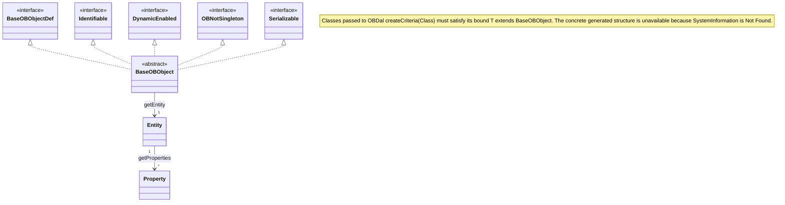

# 02 Runtime model: Entity, Property and BaseOBObject

## Reading guide

This file is for Java developers who extend Openbravo modules and need to know how the [Data Access Layer](./05-glossary.md#data-access-layer-dal) represents tables and columns in memory. It explains how the [runtime model](./05-glossary.md#runtime-model) is built from the [Application Dictionary](./05-glossary.md#application-dictionary-ad), how code looks the model up, what an [entity](./05-glossary.md#entity) and a [property](./05-glossary.md#property) hold, the naming rules, `BaseOBObject` and the interfaces it implements, the [dynamic API](./05-glossary.md#dynamic-api) compared with the [typed API](./05-glossary.md#typed-api) of a [generated class](./05-glossary.md#generated-class), the `SystemInformation` worked example, and the `DalUtil` helpers.

Read the five files in this order: [01-architecture.md](./01-architecture.md), then this file, then [03-dal-service-api.md](./03-dal-service-api.md), [04-security-and-filtering.md](./04-security-and-filtering.md) and [05-glossary.md](./05-glossary.md). Previous: [01-architecture.md](./01-architecture.md). Next: [03-dal-service-api.md](./03-dal-service-api.md).

Every behavioural statement ends with a `Class#method` citation; class names resolve through the table below. A note that opens with **Ambiguity:** records a place where the Javadoc or a comment and the method body disagree; this documentation states both readings and does not resolve them. Classes that appear only as names, such as the AD model classes `Table` and `Column`, `NamingUtil`, `OBClassLoader`, `IdentifierProvider` and the [domain type](./05-glossary.md#domain-type) classes, are boundary classes whose internals are not documented.

| Class | Repository path |
|-------|-----------------|
| `ModelProvider` | `src/org/openbravo/base/model/ModelProvider.java` |
| `ModelSessionFactoryController` | `src/org/openbravo/base/model/ModelSessionFactoryController.java` |
| `Entity` | `src/org/openbravo/base/model/Entity.java` |
| `Property` | `src/org/openbravo/base/model/Property.java` |
| `BaseOBObjectDef` | `src/org/openbravo/base/model/BaseOBObjectDef.java` |
| `BaseOBObject` | `src/org/openbravo/base/structure/BaseOBObject.java` |
| `Identifiable` | `src/org/openbravo/base/structure/Identifiable.java` |
| `DynamicEnabled` | `src/org/openbravo/base/structure/DynamicEnabled.java` |
| `OBNotSingleton` | `src/org/openbravo/base/provider/OBNotSingleton.java` |
| `OBProvider` | `src/org/openbravo/base/provider/OBProvider.java` |
| `GenerateEntitiesTask` | `src/org/openbravo/base/gen/GenerateEntitiesTask.java` |
| `DalUtil` | `src/org/openbravo/dal/core/DalUtil.java` |
| `OBInterceptor` | `src/org/openbravo/dal/core/OBInterceptor.java` |
| `OBContext` | `src/org/openbravo/dal/core/OBContext.java` |
| `OBDal` | `src/org/openbravo/dal/service/OBDal.java` |
| `OBCriteria` | `src/org/openbravo/dal/service/OBCriteria.java` |
| `OBQuery` | `src/org/openbravo/dal/service/OBQuery.java` |
| `EntityAccessChecker` | `src/org/openbravo/dal/security/EntityAccessChecker.java` |
| `SecurityChecker` | `src/org/openbravo/dal/security/SecurityChecker.java` |
| `DalTest` | `src-test/src/org/openbravo/test/dal/DalTest.java` |
| `HiddenUpdateTest` | `src-test/src/org/openbravo/test/dal/HiddenUpdateTest.java` |
| `DalUtilTest` | `src-test/src/org/openbravo/test/dal/DalUtilTest.java` |
| `DalCopyTest` | `src-test/src/org/openbravo/test/dal/DalCopyTest.java` |

## How the runtime model is built

`ModelProvider#getModel` builds the model the first time it is called, by calling the private `ModelProvider#initialize`, and returns the cached list of entities on later calls (`ModelProvider#getModel`). `ModelProvider#refresh` forces a rebuild: it removes the registered instance with `OBProvider#removeInstance(Class)` ([its entry in 03-dal-service-api.md](./03-dal-service-api.md#obproviderremoveinstanceclass)), obtains a new one with `OBProvider#get(Class)` ([its entry in 03-dal-service-api.md](./03-dal-service-api.md#obprovidergetclass)), installs it with `ModelProvider#setInstance` and calls `getModel` on it, wrapping any exception in `OBException` (`ModelProvider#refresh`). The startup context is described in [the startup section of 01-architecture.md](./01-architecture.md#startup-sequence).

`ModelProvider#initialize` performs these steps in this order (`ModelProvider#initialize`):

- It creates its own `ModelSessionFactoryController` instead of using the DAL [session factory](./05-glossary.md#session-factory) (`ModelProvider#initialize`). The source comment gives the reason: the DAL layer uses the `ModelProvider`, so otherwise there would be a cyclic relation; the same comment speaks of using `SessionHandler` directly, while the code creates a `ModelSessionFactoryController` (`ModelProvider#initialize`).
  - This [model session factory](./05-glossary.md#model-session-factory) maps the eight AD model classes `Column`, `Module`, `Package`, `Reference`, `RefList`, `RefSearch`, `RefTable` and `Table`, plus every class added through `ModelSessionFactoryController#addAdditionalClasses` (`ModelSessionFactoryController#mapModel`).
  - `ModelSessionFactoryController#setInterceptor` installs a private `LocalInterceptor` [interceptor](./05-glossary.md#interceptor) that fails with `Check.fail` on every save, delete, dirty [flush](./05-glossary.md#flush) and collection remove, recreate or update, so the model [session](./05-glossary.md#session) is read-only (`ModelSessionFactoryController#setInterceptor`).
- `ModelProvider#initializeReferenceClasses` reads the distinct [reference implementation class](./05-glossary.md#reference-implementation-class) names through a plain JDBC connection and loads each class (`ModelProvider#initializeReferenceClasses`). For each class assignable to `BaseDomainType`, it creates an instance and passes every class returned by that instance's `getClasses()` to `ModelSessionFactoryController#addAdditionalClasses`; the implementation class itself is not necessarily registered (`ModelProvider#initializeReferenceClasses`). An exception while obtaining the connection, reading the class names, loading, instantiating or registering the classes, or closing the statement is rethrown as `OBException` with the message "Failed to load reference classes" (`ModelProvider#initializeReferenceClasses`). Whether or not loading succeeds, its `finally` block closes the connection and, when `ConnectionProviderContextListener` supplied no connection provider and the method created its own `ConnectionProviderImpl`, destroys that provider; an exception from either of these two steps is caught and ignored (`ModelProvider#initializeReferenceClasses`). `BaseDomainType` and the other [domain type](./05-glossary.md#domain-type) classes are boundary classes (`ModelProvider#initializeReferenceClasses`).
- It opens a session and a [transaction](./05-glossary.md#transaction) on the model session factory and reads, in this order (`ModelProvider#initialize`):
  - all `Table` records, sorted by name (`ModelProvider#initialize`);
  - all `Reference` records, setting the model provider on each reference's domain type and initializing it (`ModelProvider#initialize`);
  - all `Column` records ordered by position and name, each added to its table (`ModelProvider#readColumns`, `ModelProvider#assignColumnsToTable`);
  - the `RefTable`, `RefSearch` and `RefList` records (`ModelProvider#initialize`);
  - the active `Module` records, ordered by sequence number (`ModelProvider#retrieveModules`).
- `ModelProvider#removeInvalidTables` drops every table whose [data origin](./05-glossary.md#data-origin) is `Table` and that has no [primary key](./05-glossary.md#primary-key) column, logging a warning; tables with any other data origin are kept (`ModelProvider#removeInvalidTables`). `ModelProvider#initialize` then indexes the [table-based](./05-glossary.md#table-based-entity) tables by lower-cased table name and the remaining tables by lower-cased name (`ModelProvider#initialize`).
- It creates one `Entity` per remaining table and calls `Entity#initialize(Table)` on it, which creates the entity's properties ([Entity](#entity) describes this step) (`ModelProvider#initialize`).
  - For an entity with a [computed column](./05-glossary.md#computed-column), it adds a second, [virtual entity](./05-glossary.md#virtual-entity) initialized from the same table; its name and class name end in `_ComputedColumns` and its table id ends in `_CC` (`ModelProvider#initialize`, `Entity#initializeComputedColumns`).
- It wires references (`ModelProvider#setReferenceProperties`). For each non-primitive column, `ModelProvider#setReferencedPropertiesForTable` links the column's property to the property of the referenced column through `Property#setReferencedProperty` (`ModelProvider#setReferencedPropertiesForTable`). It removes a property whose column has no referenced column, and fails with `Check.fail` when that property is an id (`ModelProvider#setReferencedPropertiesForTable`). The same pass sets the referenced properties of the virtual computed-column entities and collects the columns marked as translated (`ModelProvider#setReferenceProperties`).
- `ModelProvider#setVirtualPropertiesForReferenceId` handles entities whose id is not a single [primitive property](./05-glossary.md#primitive-property) (`ModelProvider#setVirtualPropertiesForReferenceId`):
  - An entity with one non-primitive id property gets an extra [one-to-one](./05-glossary.md#one-to-one) [reference property](./05-glossary.md#reference-property) to the target entity, and the original id property is turned into a primitive property whose `Property#getIdBasedOnProperty` is the new property (`ModelProvider#createIdReferenceProperty`).
  - An entity with several id properties gets a [composite id](./05-glossary.md#composite-id) ([Naming rules](#naming-rules) describes it) (`ModelProvider#createCompositeId`).
  - The source comment gives the reason for the extra property: when the id property is also a reference (a [foreign key](./05-glossary.md#foreign-key)), Hibernate requires two mappings, one for the id and one for the reference, and the comment names `foreign` as the id generation strategy for this case (`ModelProvider#initialize`).
- It reads every [unique constraint](./05-glossary.md#unique-constraint) and the column not-null metadata from the database through [native queries](./05-glossary.md#native-query); a unique constraint whose table has no [table-based entity](./05-glossary.md#table-based-entity) is skipped (`ModelProvider#buildUniqueConstraints`, `ModelProvider#getColumnMandatories`).
- It names every property that is not one-to-many with `Property#initializeName` and sets its [mandatory flag](./05-glossary.md#mandatory-flag) from the database not-null value (`ModelProvider#initialize`).
  - The mandatory flag is not taken from the database for [view entities](./05-glossary.md#view-entity), for properties without a column name, or for datasource-based, HQL-based and virtual entities; a missing database value is logged unless the property is a computed column or a [proxy](./05-glossary.md#proxy) (`ModelProvider#initialize`).
  - The comments give the reason: the mandatory value is set "on the basis of the real not-null in the database", because the AD mandatory flag is used in the UI and is often true where the database column allows null (`ModelProvider#initialize`, `Property#initializeFromColumn(Column, boolean)`).
- It creates properties that come from no AD column: the [child property](./05-glossary.md#child-property) on each parent entity (`ModelProvider#initialize`).
  - It reads the `hb.generate.all.parent.child.properties` setting and, when it is true, logs warnings that all children properties are generated and that properties created from columns flagged as not generating a child property in the parent entity are deprecated (`ModelProvider#initialize`).
  - It calls `ModelProvider#createPropertyInParentEntity` for every entity that is not a [datasource-based entity](./05-glossary.md#datasource-based-entity) or an [HQL-based entity](./05-glossary.md#hql-based-entity) (`ModelProvider#initialize`).
  - For each property that passes `ModelProvider#shouldGenerateChildPropertyInParent`, `ModelProvider#createChildProperty` adds a new [one-to-many property](./05-glossary.md#one-to-many-property) to the referenced (parent) entity (`ModelProvider#createPropertyInParentEntity`, `ModelProvider#createChildProperty`). The new property uses `OneToManyDomainType`, targets the child entity, references the child-side property, is not mandatory, and is marked as a child when the child-side property is a [parent link](./05-glossary.md#parent-link) (`ModelProvider#createChildProperty`).
  - `ModelProvider#shouldGenerateChildPropertyInParent` accepts a property that is flagged as child property in parent (or any property when the "all" setting is true), is not one-to-many, not an id, not one of the [audit properties](./05-glossary.md#audit-properties) and has no [SQL logic](./05-glossary.md#sql-logic), has a referenced property, and does not reference `Client`, `Organization`, `Module` or `Language` unless it is a parent link (`ModelProvider#shouldGenerateChildPropertyInParent`).
  - When the "all" setting is false, an existing property of the child entity that `ModelProvider#shouldGenerateChildPropertyInParent` rejects, but would accept under the "all" setting, gets no one-to-many property in its parent entity, yet `ModelProvider#createPropertyInParentEntity` still sets its being-referenced flag with `Property#setBeingReferenced` (`ModelProvider#createPropertyInParentEntity`). When the one-to-many property is generated, `Property#setReferencedProperty` sets the same flag on the child-side property (`ModelProvider#createChildProperty`, `Property#setReferencedProperty`). The source comment gives the reason for keeping the flag when no one-to-many property is generated: it affects `BaseOBObject#checkDerivedReadable` (`ModelProvider#createPropertyInParentEntity`).
  - An exception while creating the properties for one entity is logged, the remaining properties of that entity are not processed, and the build continues with the next entity (`ModelProvider#createPropertyInParentEntity`, `ModelProvider#initialize`). A property without a referenced property is skipped before the method's branch that logs a null referenced property, because `ModelProvider#shouldGenerateChildPropertyInParent` already requires one (`ModelProvider#createPropertyInParentEntity`, `ModelProvider#shouldGenerateChildPropertyInParent`).
- It names the new one-to-many properties with `Property#initializeName`, and records the entities that have properties referencing the `ADImage` entity (computed columns excluded) or the `OBPRF_FILE` entity (`ModelProvider#initialize`).
- It marks translatable columns: `ModelProvider#setTranslatableColumns` looks up the entity of the table named after the column's table plus `_Trl` and passes its property for the same column to `Property#setTranslatable` ([Property](#property) gives the conditions) (`ModelProvider#setTranslatableColumns`).
- In a `finally` block it commits the transaction, closes the session and closes the model session factory (`ModelProvider#initialize`).

For module developers: `ModelProvider#initialize` lists every AD `Table` record before it builds entities, drops only table-based tables without primary-key columns and applies no module filter, so a table a module adds to the AD reaches the runtime model by the same path as a core table (`ModelProvider#initialize`, `ModelProvider#removeInvalidTables`). `ModelProvider#getModules` returns the module list read in the same pass (`ModelProvider#getModules`).

The AD model classes named above are boundary names: this documentation does not describe AD tables, their columns or the database schema (`ModelSessionFactoryController#mapModel`).

```mermaid
flowchart TD
  s1["ModelProvider#initialize()"] --> s2["new ModelSessionFactoryController"]
  s2 --> s3["initializeReferenceClasses: load each reference implementation class"]
  s3 --> d1{"class is a BaseDomainType (boundary)?"}
  d1 -->|"yes"| s4["addAdditionalClasses for every class from getClasses()"]
  d1 -->|"no"| s5
  s4 --> s5["openSession and beginTransaction"]
  s5 --> s6["read Table (boundary) sorted by name, Reference (boundary), Column (boundary), RefTable (boundary), RefSearch (boundary), RefList (boundary), active Module (boundary)"]
  s6 --> s7["removeInvalidTables: drop table-based tables without primary-key columns"]
  s7 --> d2{"data origin is Table?"}
  d2 -->|"yes"| s8["index by table name"]
  d2 -->|"no"| s9["index by name"]
  s8 --> s10["Entity#initialize(Table) for each table"]
  s9 --> s10
  s10 --> d3{"entity has computed columns?"}
  d3 -->|"yes"| s11["add virtual _ComputedColumns entity"]
  d3 -->|"no"| s12
  s11 --> s12["setReferenceProperties"]
  s12 --> s13["setVirtualPropertiesForReferenceId"]
  s13 --> s14["buildUniqueConstraints"]
  s14 --> s15["getColumnMandatories"]
  s15 --> s16["Property#initializeName for every property that is not one-to-many"]
  s16 --> d6{"entity is not a view, datasource-based, HQL-based or virtual, and the property has a column name?"}
  d6 -->|"yes"| d7{"database not-null value found for the column?"}
  d6 -->|"no"| s25
  d7 -->|"yes"| s23["Property#setMandatory with the database not-null value"]
  d7 -->|"no"| d8{"property is a computed column or a proxy?"}
  d8 -->|"no"| s24["log a warning that the mandatory setting is not in the database metadata"]
  d8 -->|"yes"| s25
  s23 --> s25["read hb.generate.all.parent.child.properties through OBPropertiesProvider (boundary)"]
  s24 --> s25
  s25 --> d9{"setting is true?"}
  d9 -->|"yes"| s26["log warnings: all children properties are generated, and properties from columns flagged as not generating a child property in the parent entity are deprecated"]
  d9 -->|"no"| d4{"entity is datasource-based or HQL-based?"}
  s26 --> d4
  d4 -->|"no"| s17["createPropertyInParentEntity"]
  d4 -->|"yes"| s20
  s17 --> d5{"shouldGenerateChildPropertyInParent?"}
  d5 -->|"yes"| s18["createChildProperty on the parent entity"]
  d5 -->|"no"| d10{"all setting is false and shouldGenerateChildPropertyInParent under the all setting?"}
  d10 -->|"yes"| s19["setBeingReferenced(true)"]
  d10 -->|"no: skip the property (continue)"| s20
  s18 --> s20["Property#initializeName for one-to-many properties; record image and file entities"]
  s19 --> s20
  s20 --> s21["setTranslatableColumns"]
  s21 --> s22["finally: commit, close session, close model session factory"]
```



Diagram sources: every node is a control-flow step and every edge is execution order inside `ModelProvider#initialize`, except the nodes and edges that the following sentences assign to another method's body (`ModelProvider#initialize`). Decision `d1` and step `s4` are the loop body of `ModelProvider#initializeReferenceClasses` (`ModelProvider#initializeReferenceClasses`). Step `s7` is `ModelProvider#removeInvalidTables` (`ModelProvider#removeInvalidTables`). Decisions `d5` and `d10` and step `s19` are the loop body of `ModelProvider#createPropertyInParentEntity`, where both decisions evaluate `ModelProvider#shouldGenerateChildPropertyInParent` (`ModelProvider#createPropertyInParentEntity`, `ModelProvider#shouldGenerateChildPropertyInParent`). Step `s19` and the `d10` "no" edge both skip to the next property, and every exit of the `ModelProvider#createPropertyInParentEntity` loop body leads to `s20` (`ModelProvider#createPropertyInParentEntity`, `ModelProvider#initialize`). Step `s18` is `ModelProvider#createChildProperty` (`ModelProvider#createChildProperty`). Decisions `d6`, `d7` and `d8` and steps `s23` and `s24` follow `s16` in the same per-property loop body of `ModelProvider#initialize`, where `s23` is the call to `Property#setMandatory` and every exit of that body leads to `s25` (`ModelProvider#initialize`). Steps `s25` and `s26` and decision `d9` are the read of the "all" setting and its warnings in `ModelProvider#initialize`, which runs before the per-entity `ModelProvider#createPropertyInParentEntity` calls (`ModelProvider#initialize`). The per-table, per-entity and per-property loops are each drawn once (`ModelProvider#initialize`, `ModelProvider#createPropertyInParentEntity`). Step `s10` cites `Entity#initialize(Table)` and step `s11` cites `Entity#initializeComputedColumns`, the entity initializers that `ModelProvider#initialize` calls at those points (`ModelProvider#initialize`, `Entity#initialize(Table)`, `Entity#initializeComputedColumns`). `BaseDomainType` in `d1` is a boundary name only, cited through `ModelProvider#initializeReferenceClasses`, which checks each loaded class against it (`ModelProvider#initializeReferenceClasses`). The AD model classes in `s6` are boundary names only, cited through `ModelProvider#initialize`, which reads them, and `ModelSessionFactoryController#mapModel`, which maps them (`ModelProvider#initialize`, `ModelSessionFactoryController#mapModel`). `OBPropertiesProvider` in `s25` is a boundary name only, cited through `ModelProvider#initialize`, which reads the "all" setting through it (`ModelProvider#initialize`).

### Help and deprecation loading

`ModelProvider#addHelpAndDeprecationToModel` adds help text and a deprecation flag to the entities and properties of the model in a pass separate from `ModelProvider#initialize`: it calls the private `ModelProvider#addHelpAndDeprecationToEntities` and then the private `ModelProvider#addHelpAndDeprecationToProperties` (`ModelProvider#addHelpAndDeprecationToModel`).

- The pass needs a model that is already built: both helpers read the table-id index that `ModelProvider#initialize` fills and do not call `ModelProvider#getModel` (`ModelProvider#addHelpAndDeprecationToEntities`, `ModelProvider#addHelpAndDeprecationToProperties`).
- `ModelProvider#initialize`, `ModelProvider#getModel` and `ModelProvider#refresh` do not call the pass, and the help and deprecation fields of `Entity` and `Property` start as null, so until the pass runs `Entity#getHelp`, `Entity#isDeprecated`, `Property#getHelp` and `Property#isDeprecated` return null (`ModelProvider#initialize`, `Entity#isDeprecated`, `Property#isDeprecated`).
- `GenerateEntitiesTask#execute` calls `ModelProvider#addHelpAndDeprecationToModel` right after `ModelProvider#getModel` and before writing any entity class; [the entity generation section of 01-architecture.md](./01-architecture.md#entity-generation-generateentities) owns that flow (`GenerateEntitiesTask#execute`).
- `ModelProvider#addHelpAndDeprecationToEntities` reads the id, help and `developmentStatus` of every AD table record through a plain JDBC connection from `ModelProvider#getConnection`, takes the entity for each id from that index without checking that one exists, and passes the values to `Entity#setHelp` and `Entity#setDeprecated` (`ModelProvider#addHelpAndDeprecationToEntities`).
- `ModelProvider#addHelpAndDeprecationToProperties` reads the table id, column name, help and `developmentStatus` of every AD column record through `ModelProvider#getConnection` as well, skips a record whose table id has no entity, and finds the property with `Entity#getPropertyByColumnName(String)`, which throws `CheckException` when the entity has no property for that column (`ModelProvider#addHelpAndDeprecationToProperties`, `Entity#getPropertyByColumnName(String)`).
- Both helpers turn an empty help text into null, and set the deprecation flag to true exactly when `developmentStatus` is `DP` and to false otherwise (`ModelProvider#addHelpAndDeprecationToEntities`, `ModelProvider#addHelpAndDeprecationToProperties`).
- `Entity#setHelp` and `Property#setHelp` store null as is; any other text has each `*/` replaced with a space, is enclosed in `{@literal ...}` when it contains no `@` and otherwise has each `@` replaced with `&#64;`, and is then wrapped at 100 characters with each continuation line starting with an indented `*` (`Entity#setHelp`, `Property#setHelp`).
- Each helper catches every exception, including a failure to obtain the connection, the missing entity for a table id in the entity helper and the `CheckException` above, logs an error and throws `OBException` with the message "Couldn't add help to entity, failed database query." (entities) or "Couldn't add help to column, failed database query." (properties) (`ModelProvider#addHelpAndDeprecationToEntities`, `ModelProvider#addHelpAndDeprecationToProperties`).

## Looking up the model

Module code chooses the lookup by the key it holds: `ModelProvider#getEntity(String)` takes an [entity name](./05-glossary.md#entity-name), `ModelProvider#getEntity(Class)` a Java class such as a generated class, `ModelProvider#getEntityByTableName` a table name and `ModelProvider#getEntityByTableId` a table id, and `ModelProvider#getEntity(String, boolean)` lets the caller choose whether an unknown entity name throws `CheckException` or returns null (`ModelProvider#getEntity(String)`, `ModelProvider#getEntity(Class)`, `ModelProvider#getEntityByTableName`, `ModelProvider#getEntityByTableId`, `ModelProvider#getEntity(String, boolean)`). Each lookup reads indexes that `ModelProvider#initialize` fills; the table states what each one does when the key is unknown (`ModelProvider#initialize`).

| Method | Key | Result for an unknown key | Citation |
|--------|-----|---------------------------|----------|
| `ModelProvider#getModel()` | none | Not applicable: builds the model on the first call and returns the cached list afterwards | `ModelProvider#getModel` |
| `ModelProvider#getEntity(String)` | [entity name](./05-glossary.md#entity-name) | Throws `CheckException` with "not found in runtime model" | `ModelProvider#getEntity(String)` |
| `ModelProvider#getEntity(String, boolean)` | entity name and `checkIfNotExists` | Throws `CheckException` when `checkIfNotExists` is true; returns null when it is false | `ModelProvider#getEntity(String, boolean)` |
| `ModelProvider#getEntity(Class)` | Java class, matched by its fully qualified name against `Entity#getClassName` | Throws `CheckException`; a source comment in the method records that subclasses are not looked up | `ModelProvider#getEntity(Class)` |
| `ModelProvider#getEntityByTableName(String)` | table name, case-insensitive; the Javadoc asks for `AD_Table.tablename`, not `AD_Table.name` | Returns null; only entities of table-based tables are indexed by table name | `ModelProvider#getEntityByTableName` |
| `ModelProvider#getEntityByTableId(String)` | table id | Returns null and logs a warning | `ModelProvider#getEntityByTableId` |
| `ModelProvider#getTable(String)` | table name, case-insensitive | Throws `CheckException`; `ModelProvider#getTableWithoutCheck` returns null instead; only table-based tables are indexed | `ModelProvider#getTable` |
| `ModelProvider#getReference(String)` | reference id | Returns null once the model is built; before `ModelProvider#initialize` has run, throws `NullPointerException` because the reference index is still null | `ModelProvider#getReference` |
| `ModelProvider#getModules()` | none | Not applicable: returns the active modules read by `ModelProvider#initialize`, ordered by sequence number; returns null before the model is built | `ModelProvider#getModules` |
| `ModelProvider#computeLastUpdateModelTime()` | none | Not applicable: throws `OBException` when one of the AD classes it reads has no rows | `ModelProvider#computeLastUpdateModelTime` |

- The entity lookups and `ModelProvider#getTableWithoutCheck` call `ModelProvider#getModel` when the model is not built yet; `ModelProvider#getReference` and `ModelProvider#getModules` return fields that `ModelProvider#initialize` fills and do not call `getModel` themselves, so on a `ModelProvider` whose model is not built yet `ModelProvider#getReference` throws `NullPointerException` and `ModelProvider#getModules` returns null (`ModelProvider#getReference`, `ModelProvider#getModules`).
- `ModelProvider#computeLastUpdateModelTime` opens a session on a new `ModelSessionFactoryController`, returns the latest `updated` time of the `Table`, `Column`, `RefTable`, `RefSearch`, `RefList`, `Module`, `Package` and `Reference` records, and closes the session and its session factory (`ModelProvider#computeLastUpdateModelTime`).
- `GenerateEntitiesTask#hasChanged` uses that time, together with the modification time of the generator sources, to decide whether [generate.entities](./05-glossary.md#generateentities) regenerates the classes; [the entity generation section of 01-architecture.md](./01-architecture.md#entity-generation-generateentities) owns that flow (`GenerateEntitiesTask#hasChanged`).

## Entity

Module code reads the metadata of an entity from the `Entity` object that the entity lookups in [Looking up the model](#looking-up-the-model), `BaseOBObject#getEntity`, `OBCriteria#getEntity()` ([its entry in 03-dal-service-api.md](./03-dal-service-api.md#obcriteriagetentity)) and `OBQuery#getEntity()` ([its entry in 03-dal-service-api.md](./03-dal-service-api.md#obquerygetentity)) return: its properties through `Entity#getProperties`, `Entity#getProperty(String)` and `Entity#getPropertyByColumnName(String)`, and its kind and flags through getters such as `Entity#isView`, `Entity#isClientEnabled` and `Entity#isTraceable` (`BaseOBObject#getEntity`, `OBCriteria#getEntity()`, `OBQuery#getEntity()`, `Entity#getProperties`, `Entity#getProperty(String)`, `Entity#getPropertyByColumnName(String)`, `Entity#isView`, `Entity#isClientEnabled`, `Entity#isTraceable`). `Entity` models one table of the runtime model; its Javadoc calls it the main concept of the in-memory model and says its properties are primitive typed, references or lists of child entities (`Entity#getProperties`).

### Identity and properties

- `Entity#initialize(Table)` sets the table name and table id, sets the class name to the table's package name, a dot and its class name, and sets the entity name from the name of the AD table record, which it keeps separate from the table name, through `Entity#setName` (`Entity#initialize(Table)`).
- It sets the deletable, mutable (false for views), inactive, view, tree type, datasource-based (data origin `Datasource`) and HQL-based (data origin `HQL`) flags, and the module of the table's package (`Entity#initialize(Table)`).
- For every column it creates a `Property`, initializes it with `Property#initializeFromColumn(Column)`, records its position with `Property#setIndexInEntity`, and adds it to the id, [identifier](./05-glossary.md#identifier), parent, order-by and computed-column lists; identifier properties are sorted by sequence number, with properties that have none placed last (`Entity#initialize(Table)`).
- When the entity has computed columns, it adds a proxy property named `_computedColumns` (`Entity#initialize(Table)`, `Entity#hasComputedColumns`).
- `Entity#addProperty(Property)` appends a property created later, such as a child property or a composite id, sets its index, and registers it as id or identifier where it is flagged; an identifier with the same column name as an existing one replaces it (`Entity#addProperty`).
- `Entity#getProperty(String)` and `Entity#getPropertyByColumnName(String)` throw `CheckException` for an unknown name, the overloads with a `boolean` argument return null when it is false, column names are matched case-insensitively, and `Entity#hasProperty` only tests a name (`Entity#getProperty(String, boolean)`, `Entity#getPropertyByColumnName(String, boolean)`).

### Entity kinds

| Kind | How the model marks it | Citation |
|------|------------------------|----------|
| Table-based entity | Data origin `Table`; the only kind indexed by table name, and dropped when its table has no primary-key column | `ModelProvider#initialize`, `ModelProvider#removeInvalidTables` |
| View entity | `Entity#isView` is copied from the AD table, and `Entity#isMutable` is false | `Entity#initialize(Table)` |
| Datasource-based entity | Data origin `Datasource`; `GenerateEntitiesTask#execute` writes no class for it | `Entity#initialize(Table)`, `GenerateEntitiesTask#execute` |
| HQL-based entity | Data origin `HQL`; `GenerateEntitiesTask#execute` writes no class for it | `Entity#initialize(Table)`, `GenerateEntitiesTask#execute` |
| Virtual entity | `Entity#isVirtualEntity`; created for each entity with computed columns, not deletable, not mutable and inactive, holding the key columns, the computed columns and the `AD_Client_ID` and `AD_Org_ID` columns; its Javadoc says it is mapped to the same database table as the main entity | `Entity#initializeComputedColumns`, `Entity#isVirtualEntity` |
| Entity with computed columns | `Entity#hasComputedColumns` is true when at least one property has SQL logic (`Property#isComputedColumn`) | `Entity#hasComputedColumns` |

### Flags

- `Property#initializeName` sets the [client-enabled](./05-glossary.md#client-enabled-entity), [organization-enabled](./05-glossary.md#organization-enabled-entity) and [active-enabled](./05-glossary.md#active-enabled-entity) flags, and the [inherited access](./05-glossary.md#inherited-access) flag, when it finds the properties listed in [Naming rules](#naming-rules) (`Property#initializeName`).
- `Entity#isTraceable` is true when exactly four properties are [audit properties](./05-glossary.md#audit-properties); it is computed once (`Entity#isTraceable`).
- `OBCriteria#initialize` and `OBQuery#addOrgClientActiveFilter` read `Entity#isOrganizationEnabled`, `Entity#isClientEnabled` and `Entity#isActiveEnabled` to add their filters; [the filtering section of 04-security-and-filtering.md](./04-security-and-filtering.md#client-organization-and-active-filtering) owns that behaviour (`OBCriteria#initialize`, `OBQuery#addOrgClientActiveFilter`).

### Access level

`Entity#initialize(Table)` maps the AD table's [access level](./05-glossary.md#access-level) code to an `AccessLevel` value and an `AccessLevelChecker` of the same name, and fails with `Check.fail` for any other code (`Entity#initialize(Table)`):

| Code | `AccessLevel` and `AccessLevelChecker` constant | Citation |
|------|-------------------------------------------------|----------|
| `1` | `ORGANIZATION` | `Entity#initialize(Table)` |
| `3` | `CLIENT_ORGANIZATION` | `Entity#initialize(Table)` |
| `4` | `SYSTEM` | `Entity#initialize(Table)` |
| `6` | `SYSTEM_CLIENT` | `Entity#initialize(Table)` |
| `7` | `ALL` | `Entity#initialize(Table)` |

`Entity#checkAccessLevel(String, String)` passes the entity name and the ids of a [client](./05-glossary.md#client) and an [organization](./05-glossary.md#organization) to that checker; its Javadoc states that it throws `OBSecurityException` when they are not valid for the access level (`Entity#checkAccessLevel`). Its call sites are in [the access checks section of 04-security-and-filtering.md](./04-security-and-filtering.md#access-checks).

### Mapping class and generated interfaces

- `Entity#getMappingClass` loads the [mapping class](./05-glossary.md#mapping-class), the class named by `Entity#getClassName`, through `OBClassLoader` on the first call and caches the result; when the class is not found it returns null, and its Javadoc states that the system then uses a [DynamicOBObject](./05-glossary.md#dynamicobobject) as the runtime class (`Entity#getMappingClass`). `DynamicOBObject` is a boundary class, and this documentation states nothing about its type hierarchy (`Entity#getMappingClass`).
- `Entity#getImplementsStatement` returns `implements` followed by `Traceable`, `ClientEnabled`, `OrganizationEnabled`, `ActiveEnabled` and `InheritedAccessEnabled`, each only when the matching flag is set, or an empty string when none is set (`Entity#getImplementsStatement`). The source comment gives the reason the names are written as strings instead of class references: to prevent a binary dependency (`Entity#getImplementsStatement`). `Entity#getJavaImports()` passes every property of the entity to `Entity#getJavaImports(List)`, which emits the matching `org.openbravo.base.structure` imports (`Entity#getJavaImports()`, `Entity#getJavaImports(List)`).
- The DAL classes cited here test for these interfaces as follows (`OBInterceptor#doEvent`):

| Interface | Effect | Citation |
|-----------|--------|----------|
| `Traceable` | `OBInterceptor#doEvent` sets audit values only on `Traceable` objects, and any other object gets only the write-access check ([the interceptor section of 04-security-and-filtering.md](./04-security-and-filtering.md#interceptor-behavior)) | `OBInterceptor#doEvent` |
| `ClientEnabled` | `OBDal#setClientOrganization` replaces a null client with a proxy of the current client of `OBContext`; `OBInterceptor#onNew`, which `OBInterceptor#doEvent` reaches only for `Traceable` objects, sets a client whose state is null to a proxy of the current client of `OBContext` obtained through `OBDal#getProxy(Class, String)` ([its entry in 03-dal-service-api.md](./03-dal-service-api.md#obdalgetproxyclass-string)), and `OBInterceptor#onSave` returns true for an object with the interface, as `OBInterceptor#onFlushDirty` does unless one of its early returns has already returned false ([the interceptor section of 04-security-and-filtering.md](./04-security-and-filtering.md#interceptor-behavior)) | `OBDal#setClientOrganization`, `OBInterceptor#onNew`, `OBInterceptor#onSave`, `OBInterceptor#onFlushDirty` |
| `OrganizationEnabled` | `OBDal#setClientOrganization` replaces a null organization with a proxy of the current organization of `OBContext`, and `OBInterceptor#checkReferencedOrganizations` returns at once for objects without the interface ([its section in 04-security-and-filtering.md](./04-security-and-filtering.md#cross-organization-reference-check)); `OBInterceptor#onNew`, which `OBInterceptor#doEvent` reaches only for `Traceable` objects, sets an organization whose state is null to a proxy of the current organization of `OBContext` obtained through `OBDal#getProxy(Class, String)` ([its entry in 03-dal-service-api.md](./03-dal-service-api.md#obdalgetproxyclass-string)), and `OBInterceptor#onSave` returns true for an object with the interface, as `OBInterceptor#onFlushDirty` does unless one of its early returns has already returned false ([the interceptor section of 04-security-and-filtering.md](./04-security-and-filtering.md#interceptor-behavior)) | `OBDal#setClientOrganization`, `OBInterceptor#checkReferencedOrganizations`, `OBInterceptor#onNew`, `OBInterceptor#onSave`, `OBInterceptor#onFlushDirty` |
| `ActiveEnabled` | None of the cited classes tests for the interface; the query classes read `Entity#isActiveEnabled` instead | `OBCriteria#initialize`, `OBQuery#addOrgClientActiveFilter` |
| `InheritedAccessEnabled` | None of the cited classes tests for the interface; it is emitted when `Entity#isInheritedAccessEnabled` is true | `Entity#getImplementsStatement` |

### Validation and real properties

- `Entity#validate(Object)` passes the object to the `EntityValidator` that `Entity#initialize(Table)` creates (`Entity#validate`).
- `Entity#getRealProperties(boolean)` returns the [real properties](./05-glossary.md#real-property): the properties without the `_computedColumns` proxy property and without properties whose reference id is `Entity#SEARCH_VECTOR_REF_ID`, and leaves out computed columns unless the argument is `true` (`Entity#getRealProperties`).

> **Ambiguity:** The Javadoc of `Entity#getRealProperties(boolean)` says that when `includeComputed` is `true` "all computed columns are also excluded", and its parameter text reads "should properties for computed columns be excluded from the list"; the body keeps computed columns when the flag is `true` and drops them when it is `false` (`Entity#getRealProperties`). This documentation does not resolve the difference.

## Property

Module code names a property when it calls the dynamic API: `BaseOBObject#get(String)` and `BaseOBObject#set(String, Object)` resolve the name to a `Property` through `Entity#getProperty(String)`, and `BaseOBObject#set(String, Object)` runs `Property#checkIsValidValue` on the value and `Property#checkIsWritable` on the property before it stores the value (`BaseOBObject#get(String)`, `BaseOBObject#get(String, Language, String)`, `BaseOBObject#set(String, Object)`). `Property` models one attribute of an entity; its Javadoc says a property "can be a primitive type, a reference or a list (one-to-many) property" (`Property#isPrimitive`, `Property#isOneToMany`).

### Property kinds

- `Property#isPrimitive` is true when the domain type is a `PrimitiveDomainType`, and `Property#getPrimitiveType` then gives the Java type (`Property#isPrimitive`, `Property#getPrimitiveType`).
- A reference property gets its referenced property through `Property#setReferencedProperty`, which also sets the target entity to the referenced property's entity and flags the referenced property as being referenced (`Property#setReferencedProperty`).
- `Property#isOneToMany` marks a one-to-many property, whose value is a list; in the model that `ModelProvider#initialize` builds, these properties are created by `ModelProvider#createChildProperty`, not from a column (`ModelProvider#createChildProperty`).
- `Property#isComputedColumn` is true when the property has SQL logic, and `Property#isProxy` marks the `_computedColumns` property (`Property#isComputedColumn`, `Property#isProxy`).

### Values copied from the column

- The public `Property#initializeFromColumn(Column)` calls `Property#initializeFromColumn(Column, boolean)` with `true`, so the property is also set on the column; `Property#initializeFromColumn(Column, boolean)` copies from the AD column the key flag (as id), the identifier and parent flags, column name and id, sequence number, domain type, default value, mandatory flag, minimum and maximum value, updatable flag, field length, allowed values, SQL logic, transient flag and condition, the active flag (inverted into `Property#isInactive`), module, the allowed cross-organization reference flag and the child-property-in-parent flag (`Property#initializeFromColumn(Column)`, `Property#initializeFromColumn(Column, boolean)`).
- For an encrypted or decryptable string column it replaces the domain type with `HashedStringDomainType` or, when the column is decryptable, `EncryptedStringDomainType` (`Property#initializeFromColumn(Column, boolean)`).
- It marks a column named `line`, `seqno` or `lineno` as an [order-by property](./05-glossary.md#order-by-property) (`Property#initializeFromColumn(Column, boolean)`).
- `Property#initializeName` later sets the audit marker and the client-or-organization marker, as [Naming rules](#naming-rules) describes (`Property#initializeName`).

### Mandatory flag

The flag is set in two stages: `Property#initializeFromColumn(Column, boolean)` copies the AD column's mandatory flag, and `ModelProvider#initialize` then overwrites it with the database not-null value read by `ModelProvider#getColumnMandatories`, except for the entities and properties listed in [How the runtime model is built](#how-the-runtime-model-is-built), which also gives the reason (`Property#initializeFromColumn(Column, boolean)`, `ModelProvider#initialize`).

### Validation

- `Property#checkIsValidValue(Object)` returns at once for null and for a `List` given to a one-to-many property; otherwise it lets the domain type check the value, except for a `String` given to the `changeprojectstatus` column (`Property#checkIsValidValue`). It then runs the property's `PropertyValidator` only when `Property#getValidator` returns one, and throws `ValidationException` with the validator's message only when that message is not null (`Property#checkIsValidValue`, `Property#getValidator`).
- `Property#checkIsWritable` throws `ValidationException` when the property is [inactive](./05-glossary.md#inactive-property) (`Property#checkIsWritable`).

> **Ambiguity:** The Javadoc of `Property#checkIsValidValue(Object)` says the method checks that the value "is not null if the property is mandatory", but the body returns for every null value and a source comment marks the mandatory check as disabled (`Property#checkIsValidValue`). This documentation does not resolve the difference.

### Derived read

`Property#allowDerivedRead` is true for the active column, audit properties, id and identifier properties, client and organization properties, and properties that another property references; it is computed once (`Property#allowDerivedRead`). `BaseOBObject#checkDerivedReadable` uses it for entities that are only [derived readable](./05-glossary.md#derived-readable), as [the access checks section of 04-security-and-filtering.md](./04-security-and-filtering.md#access-checks) describes (`BaseOBObject#checkDerivedReadable`).

### Translatable properties

`Property#setTranslatable` makes a candidate column's property a [translatable property](./05-glossary.md#translatable-property) only when the [translation entity](./05-glossary.md#translation-entity) has an `ad_language` column, the entity has a one-to-many property whose target is the translation entity, and a [parent property](./05-glossary.md#parent-property) of the translation entity references the entity's first id property; otherwise it logs a warning and `Property#isTranslatable` stays false (`Property#setTranslatable`). `ModelProvider#setTranslatableColumns` supplies the candidate columns and their [translation properties](./05-glossary.md#translation-property) (`ModelProvider#setTranslatableColumns`). `BaseOBObject#get(String, Language, String)` uses the result, as [Dynamic API and generated typed API](#dynamic-api-and-generated-typed-api) describes (`BaseOBObject#get(String, Language, String)`).

### Position in the entity

`Property#getIndexInEntity` returns the property's position in `Entity#getProperties`, set by `Entity#initialize(Table)` and `Entity#addProperty`; the field comment gives the reason: it "gives a lot of performance/memory improvements when getting property values" (`Property#getIndexInEntity`). `BaseOBObject` stores its values in an array indexed by this position, as [BaseOBObject and its interfaces](#baseobobject-and-its-interfaces) describes (`BaseOBObject#getValue`).

## Naming rules

- Entity names: `Entity#setName` passes the name of the AD table record through `Entity#removeIllegalChars`, which drops every character listed in `NamingUtil.ILLEGAL_ENTITY_NAME_CHARS` and logs that the name was repaired; when nothing was dropped, it returns the name unchanged and logs a warning for each character of the trimmed name outside `a`–`z`, `A`–`Z`, `0`–`9` and `_`, so a leading or trailing character that trimming removes, such as a tab, is kept in the name without a warning (`Entity#removeIllegalChars`).
- Virtual computed-column entities: the entity name and the class name are those of the main entity plus `_ComputedColumns` (`Entity#initializeComputedColumns`).
- Property names: when a property has no name yet, `Property#initializeName` takes one from `NamingUtil`; it then corrects the name against the static [property-name constant](./05-glossary.md#property-name-constant) of the generated class that `Entity#getMappingClass` returns, and registers the property under that name with `Entity#addPropertyByName` (`Property#initializeName`).
- Audit names: `Property#initializeName` marks a primitive `Date` property named `creationDate` or `updated`, and a reference property named `createdBy` or `updatedBy`, as audit info; it compares case-insensitively and normalizes the casing of `creationDate`, `createdBy` and `updatedBy` (`Property#initializeName`).
- Entity flags from property names (`Property#initializeName`):
  - `client` sets client-enabled on the entity and marks the property as a client-or-organization property (`Property#initializeName`);
  - `organization` does the same for organization-enabled, and also sets [organization-part-of-key](./05-glossary.md#organization-part-of-key) when the property is an id or part of a composite id (`Property#initializeName`);
  - `active`, compared case-insensitively on a primitive property, sets active-enabled and marks the property as the active column (`Property#initializeName`);
  - `inheritedFrom`, on a reference to the `ADRole` entity, sets the inherited access flag (`Property#initializeName`).
- Composite ids: `ModelProvider#createCompositeId` creates a property named `id` whose id parts are the former id properties, each marked as part of the composite id (`ModelProvider#createCompositeId`); its type name is the entity class name plus `.Id`, and its formatted default value is `new Id()` (`Property#getTypeName`, `Property#getFormattedDefaultValue`).
- [Id-reference properties](./05-glossary.md#id-reference-property): the extra property for an id that is a reference is named after the target class without its package, with the first character lower-cased (`ModelProvider#createIdReferenceProperty`).
- Getter and setter names: for a boolean property whose name starts with `is`, `Property#getGetterSetterName` drops that prefix; otherwise it returns the property name (`Property#getGetterSetterName`).
- Java-safe names: `Property#getJavaName` returns the name made safe by `NamingUtil` (`Property#getJavaName`).

## BaseOBObject and its interfaces

`BaseOBObject` is the abstract class that its Javadoc calls the root of the inheritance tree for all [business objects](./05-glossary.md#business-object); the same Javadoc says the interfaces tag an implementation with the functionality it provides and directs code outside the class to them to determine whether an object supports specific functionality (`BaseOBObject#getEntityName`, class Javadoc). A concrete subclass has to provide an implementation of the abstract `BaseOBObject#getEntityName`, either its own or an inherited one (`BaseOBObject#getEntityName`).

### Implemented interfaces

`BaseOBObject` implements the interfaces below; two of the four Openbravo interfaces are declared outside `org.openbravo.base.structure`, so the table names the package of each (`BaseOBObject#get(String)`, `BaseOBObject#getEntity`).

| Interface | Repository path | Declared members | Purpose |
|-----------|-----------------|------------------|---------|
| `BaseOBObjectDef` (package `org.openbravo.base.model`) | `src/org/openbravo/base/model/BaseOBObjectDef.java` | `get(String)`, `set(String, Object)`, `getEntity()`, `getId()`, `getIdentifier()` | Its Javadoc states that it was introduced to prevent cyclic references between generated code and the model code that the generator uses, and that it holds only the minimally required methods (`BaseOBObjectDef#getEntity`) |
| `Identifiable` (package `org.openbravo.base.structure`) | `src/org/openbravo/base/structure/Identifiable.java` | `getId()`, `setId(Object)`, `getEntityName()`, `getIdentifier()` | Its Javadoc says an identifiable object has a unique id, an entity name and a user-readable identifier (`Identifiable#getIdentifier`) |
| `DynamicEnabled` (package `org.openbravo.base.structure`) | `src/org/openbravo/base/structure/DynamicEnabled.java` | `get(String)`, `set(String, Object)` | Its Javadoc says implementing classes have a get and a set method giving access to all properties (`DynamicEnabled#get`) |
| `OBNotSingleton` (package `org.openbravo.base.provider`) | `src/org/openbravo/base/provider/OBNotSingleton.java` | none; it extends `OBProvidable` | A tag interface that its Javadoc says `OBProvider` uses; the ambiguity note below applies (`OBProvider#register(String, Class, boolean)`) |
| `java.io.Serializable` (JDK) | not in the repository | none | Named only; the `implements` clause of `BaseOBObject` lists it, and `BaseOBObject#serialVersionUID` is declared for it (`BaseOBObject#get(String)`, `BaseOBObject#getEntity`) |

Whether a class tagged with `OBNotSingleton` is a [singleton](./05-glossary.md#singleton) is ambiguous in the code; [the OBDal#getInstance() entry in 03-dal-service-api.md](./03-dal-service-api.md#obdalgetinstance) documents the method itself (`OBDal#getInstance()`).

> **Ambiguity:** The Javadoc of `OBNotSingleton` reads "Tags a class as being a singleton", while `OBProvider#register(String, Class, boolean)` ([its entry in 03-dal-service-api.md](./03-dal-service-api.md#obproviderregisterstring-class-boolean)) decides whether a registration is a singleton only from whether the class implements `OBSingleton`; `OBDal` implements `OBNotSingleton`, yet `OBDal#getInstance()` ([its entry in 03-dal-service-api.md](./03-dal-service-api.md#obdalgetinstance)) caches a static instance, keeping the instance it obtains from `OBProvider#get(Class)` ([its entry in 03-dal-service-api.md](./03-dal-service-api.md#obprovidergetclass)) in a static field whenever that field is null (`OBProvider#register(String, Class, boolean)`, `OBDal#getInstance()`). This documentation does not resolve the difference.

### Values, identity and the new-object flag

- `BaseOBObject` keeps every value in one array indexed by `Property#getIndexInEntity`, as its field comment states; the first write creates the array with one slot per property of the entity, and a read before any write returns null (`BaseOBObject#setValue`, `BaseOBObject#getValue`).
- `BaseOBObject#getEntity` looks the entity up once through `ModelProvider#getEntity(String)` with the object's `BaseOBObject#getEntityName`, and caches it (`BaseOBObject#getEntity`).
- `BaseOBObject#getId` and `BaseOBObject#setId` read and write the `id` property through `get` and `set`, so the checks of the dynamic API apply to them (`BaseOBObject#getId`, `BaseOBObject#setId`).
- `BaseOBObject#getIdentifier` returns the identifier that `IdentifierProvider` computes for the object (`BaseOBObject#getIdentifier`). `BaseOBObject#toString` returns the entity name, the id in parentheses, and the non-null values of the identifier properties, which it reads with `get`, writing the id for a referenced object (`BaseOBObject#toString`).
- A [new object](./05-glossary.md#new-object): `BaseOBObject#isNewOBObject` is true when the id is null or the flag set by `BaseOBObject#setNewOBObject` is true (`BaseOBObject#isNewOBObject`). The field comment gives the reason for the flag: it forces an insert of the object, which the comment calls useful for keeping the id of an imported object (`BaseOBObject#setNewOBObject`). `OBInterceptor#postFlush` sets the flag back to false for every flushed object, as [the interceptor section of 04-security-and-filtering.md](./04-security-and-filtering.md#interceptor-behavior) describes (`OBInterceptor#postFlush`).
- `BaseOBObject#setAllowRead(boolean)` lets an object skip the derived-read check, and throws `OBSecurityException` when it is called outside [admin mode](./05-glossary.md#admin-mode) (`BaseOBObject#setAllowRead`).
- `BaseOBObject#setAccessChecks(boolean, boolean)` stores a write-access flag and an org/client flag, which `BaseOBObject#isWriteAccessCheckEnabled()` and `BaseOBObject#isOrgClientAccessCheckEnabled()` return; all three methods are marked "For internal use only" (`BaseOBObject#setAccessChecks(boolean, boolean)`, `BaseOBObject#isWriteAccessCheckEnabled()`, `BaseOBObject#isOrgClientAccessCheckEnabled()`). `SecurityChecker#checkWriteAccess(Object)`, through the private `SecurityChecker#checkWriteAccess(Object, boolean)` to which it delegates, reads the flags only inside the tests it runs for an object that has a client when the context is outside admin mode or `OBContext#doOrgClientAccessCheck()` is true: a false write-access flag skips the entity write test against `EntityAccessChecker#isWritable(Entity)`, a false org/client flag skips the writable-organization test of the [org/client access check](./05-glossary.md#orgclient-access-check), and neither flag affects the comparison of the object's client with `OBContext#getCurrentClient()`, as [the write access check section of 04-security-and-filtering.md](./04-security-and-filtering.md#write-access-check) describes (`SecurityChecker#checkWriteAccess(Object)`, `SecurityChecker#checkWriteAccess(Object, boolean)`).

> **Ambiguity:** The Javadoc of `BaseOBObject#setAccessChecks(boolean, boolean)` says the method is "Used to enable or disable the access checks that are done when invoking" `SecurityChecker#checkWriteAccess(Object)`, and describes its second argument as `true` "to enable the org/client check" and `false` "to disable it"; the Javadoc of `BaseOBObject#isOrgClientAccessCheckEnabled()` likewise says `false` is "to disable the org/client check", wording that names the client as well as the organization (`BaseOBObject#setAccessChecks(boolean, boolean)`, `BaseOBObject#isOrgClientAccessCheckEnabled()`). The body of the private `SecurityChecker#checkWriteAccess(Object, boolean)`, to which `SecurityChecker#checkWriteAccess(Object)` delegates, compares the object's client with `OBContext#getCurrentClient()` without reading either flag, and reads `BaseOBObject#isOrgClientAccessCheckEnabled()` only to decide whether the writable-organization test applies (`SecurityChecker#checkWriteAccess(Object)`, `SecurityChecker#checkWriteAccess(Object, boolean)`). This documentation does not resolve the difference.



Diagram sources: the five realization edges are declared supertypes from the `implements` clause of `BaseOBObject`, whose `BaseOBObject#get(String)`, `BaseOBObject#set(String, Object)`, `BaseOBObject#getEntity`, `BaseOBObject#getId`, `BaseOBObject#setId`, `BaseOBObject#getIdentifier` and `BaseOBObject#getEntityName` provide the interface members (`BaseOBObject#get(String)`, `BaseOBObject#set(String, Object)`, `BaseOBObject#getEntity`, `BaseOBObject#getId`, `BaseOBObject#setId`, `BaseOBObject#getIdentifier`, `BaseOBObject#getEntityName`). The association to `Entity` is `BaseOBObject#getEntity`, one entity per object (`BaseOBObject#getEntity`). The association to `Property` is `Entity#getProperties`, drawn as `*` because `ModelProvider#removeInvalidTables` requires a primary-key column only for table-based tables (`Entity#getProperties`, `ModelProvider#removeInvalidTables`). The note cites the bound on `OBDal#createCriteria(Class)` ([its entry in 03-dal-service-api.md](./03-dal-service-api.md#obdalcreatecriteriaclass)) and the Not Found record in [Worked example: SystemInformation](#worked-example-systeminformation) (`OBDal#createCriteria(Class)`, `GenerateEntitiesTask#execute`). No edge is drawn for generated classes or `DynamicOBObject` (`GenerateEntitiesTask#execute`, `Entity#getMappingClass`).

## Dynamic API and generated typed API

Code can read and write the values of a business object by property name through the dynamic API that `BaseOBObject` implements, or through the getters and setters of the generated class (`BaseOBObject#get(String)`, `Property#getGetterSetterName`).

### Dynamic API

- `BaseOBObject#get(String)` calls `BaseOBObject#get(String, Language)` with no language, which calls `BaseOBObject#get(String, Language, String)` with no id (`BaseOBObject#get(String)`, `BaseOBObject#get(String, Language)`).
- `BaseOBObject#get(String, Language, String)` resolves the property with `Entity#getProperty(String)`, which throws `CheckException` for an unknown name, runs `BaseOBObject#checkDerivedReadable`, and returns the stored value (`BaseOBObject#get(String, Language, String)`).
- With a language, it returns null at once while the object's value array does not exist yet, that is before any value has been stored, so such a call records no translation attempt (`BaseOBObject#get(String, Language, String)`). Once the array exists, for a translatable property and while `OBContext#hasTranslationInstalled` is true, it looks for the [translation record](./05-glossary.md#translation-record) at most once per object, and it records that attempt before it checks the id and the [translation parent property](./05-glossary.md#translation-parent-property), so a call without an id still uses up the one attempt (`BaseOBObject#get(String, Language, String)`). It queries only when an id is passed and the property has a translation parent property, using an `OBCriteria` with the client and organization filters switched off and at most one result; any `Throwable` from the lookup is logged at debug level and the base value is used (`BaseOBObject#get(String, Language, String)`). When a translation was found, it returns the value of the translation property (`BaseOBObject#get(String, Language, String)`).
- `BaseOBObject#set(String, Object)` runs `Property#checkIsValidValue`, `BaseOBObject#checkDerivedReadable` and `Property#checkIsWritable`, in that order, and then stores the value with `BaseOBObject#setValue` (`BaseOBObject#set`).
- `BaseOBObject#get(String, Language, String)`, to which the other `get` overloads delegate, and `BaseOBObject#set(String, Object)` enforce derived read on the resolved property through `BaseOBObject#checkDerivedReadable`, which uses the property eligibility that `Property#allowDerivedRead` computes, as [Derived read](#derived-read) describes (`BaseOBObject#get(String, Language, String)`, `BaseOBObject#set(String, Object)`, `BaseOBObject#checkDerivedReadable`). When that check applies and how it fails are described in [the access checks section of 04-security-and-filtering.md](./04-security-and-filtering.md#access-checks), which owns them (`BaseOBObject#checkDerivedReadable`).

### Unchecked access

- `BaseOBObject#getValue(String)` and `BaseOBObject#setValue(String, Object)` skip the security and validation checks; the Javadoc of `setValue` cautions callers to use it with care and says it is used by subclasses and system classes (`BaseOBObject#getValue`, `BaseOBObject#setValue`).
- Both still resolve the property by name, so an unknown name throws `CheckException`, and `setValue` throws `IllegalArgumentException` when the property's index is not smaller than the size of the value array (`BaseOBObject#setValue`).

### Typed API

The generated sources are not in the repository ([Worked example: SystemInformation](#worked-example-systeminformation) records this), so this section states the generated-class contract only through the methods that produce or read the generated code (`GenerateEntitiesTask#execute`). The classes are written by the `generate.entities` build target, which [the entity generation section of 01-architecture.md](./01-architecture.md#entity-generation-generateentities) describes (`GenerateEntitiesTask#execute`).

- Class and file: `Entity#getClassName` gives the fully qualified class name, and `GenerateEntitiesTask#execute` writes `src-gen/<class name with dots as slashes>.java` for every entity that is not datasource-based, HQL-based or virtual (`GenerateEntitiesTask#execute`).
- Interfaces and imports: `Entity#getImplementsStatement` and `Entity#getJavaImports()` provide the `implements` clause and the import statements ([Entity](#entity) lists them) (`Entity#getImplementsStatement`, `Entity#getJavaImports()`).
- Accessor names and types: `Property#getGetterSetterName` gives the getter and setter name; `Property#getTypeName` gives the entity class name plus `.Id` for a composite id, the primitive type name for a primitive property (the component type name plus `[]` for an array type), the owning entity's simple class name plus `_ComputedColumns` for the `_computedColumns` proxy property that `Entity#initialize(Table)` adds, and the target entity's class name for any other property; it tests the `_computedColumns` column name before it looks for a target entity, so it returns `java.lang.Object` with a logged warning only for a property other than that proxy that has no target entity; `Property#getObjectTypeName` gives the object type for a primitive type such as `int`; `Property#allowNullValues` is true for non-primitive properties and for primitive properties whose type name is fully qualified (`Property#getGetterSetterName`, `Property#getTypeName`, `Property#getObjectTypeName`, `Property#allowNullValues`, `Entity#initialize(Table)`).
- Default values: `Property#getFormattedDefaultValue` returns Java source text for a default: `new Id()` for a composite id, `new ArrayList<Object>()` for a one-to-many property, `true` or `false` for a boolean (a missing boolean default becomes `Y` for a property named `active` and `N` otherwise), `new Date()` for `sysdate`, null for other date defaults and for defaults starting with `@`, and typed literals for `BigDecimal`, `Float`, `Long` and `String` values (`Property#getFormattedDefaultValue`).
- `BaseOBObject#setDefaultValue(String, Object)` is the protected method that, per its comment, sets default data in a constructor of the generated class without a security check; it ignores unknown property names, validates the value with `Entity#checkValidPropertyAndValue`, rejects null, and logs a `ValidationException` or `CheckException` instead of throwing it; the source comment gives the reason: "do not fail here so that build tasks can still continue" (`BaseOBObject#setDefaultValue`).
- Entity name: a concrete subclass of `BaseOBObject` has to provide an implementation of the abstract `BaseOBObject#getEntityName`, either its own or an inherited one, and `DalUtil#getEntityName(Class)` reads a public static `ENTITY_NAME` field of the class through reflection, wrapping each `Exception` it catches in `OBException`; an `Error` is not caught there (`BaseOBObject#getEntityName`, `DalUtil#getEntityName(Class)`).
- Property-name constants: `Property#initializeName` corrects each property name against the static property-name constant of the generated class ([Naming rules](#naming-rules)) (`Property#initializeName`).

| Aspect | Dynamic API | Typed API | Citation |
|--------|-------------|-----------|----------|
| Load by id | `OBDal#get(String, Object)` with an entity name, returning `BaseOBObject` ([its entry in 03-dal-service-api.md](./03-dal-service-api.md#obdalgetstring-object)) | `OBDal#get(Class, Object)` with the generated class ([its entry in 03-dal-service-api.md](./03-dal-service-api.md#obdalgetclass-object)), as `DalTest#testASaveBooleanValue1` calls it for `SystemInformation.class` | `OBDal#get(String, Object)`, `OBDal#get(Class, Object)`, `DalTest#testASaveBooleanValue1` |
| Read a value | `BaseOBObject#get(String)` by property name, returning `Object` | A generated getter named from `Property#getGetterSetterName`; `DalTest#testASaveBooleanValue1` calls `isEnableHeartbeat()` | `BaseOBObject#get(String)`, `Property#getGetterSetterName`, `DalTest#testASaveBooleanValue1` |
| Write a value | `BaseOBObject#set(String, Object)` by property name | A generated setter; `DalTest#testASaveBooleanValue1` calls `setEnableHeartbeat(false)` | `BaseOBObject#set`, `Property#getGetterSetterName`, `DalTest#testASaveBooleanValue1` |
| Value type | `Object`, checked at run time by `Property#checkIsValidValue` | The type given by `Property#getTypeName` or `Property#getObjectTypeName` | `Property#checkIsValidValue`, `Property#getTypeName` |
| Checks on each access | Derived-read check on reads; validation, derived-read and writable checks on writes | Not determinable: the generated method bodies are Not Found | `BaseOBObject#get(String, Language, String)`, `BaseOBObject#set` |
| Entity of the object | `BaseOBObject#getEntity`, from `BaseOBObject#getEntityName` | The subclass's implementation of `BaseOBObject#getEntityName`, and the `ENTITY_NAME` field that `DalUtil#getEntityName(Class)` reads | `BaseOBObject#getEntity`, `DalUtil#getEntityName(Class)` |
| Default values | `BaseOBObject#get(String)` and `BaseOBObject#set(String, Object)` set no defaults themselves, but they read and can overwrite any default a constructor stored through `BaseOBObject#setDefaultValue`: that method writes the value array that `BaseOBObject#get(String, Language, String)` reads when no language is given, `BaseOBObject#getValue(String)` reads and `BaseOBObject#setValue(String, Object)` writes | Stored when the object is built: set in the generated constructor through `BaseOBObject#setDefaultValue`, per its comment, from the text that `Property#getFormattedDefaultValue` produces | `BaseOBObject#setDefaultValue`, `BaseOBObject#get(String)`, `BaseOBObject#get(String, Language, String)`, `BaseOBObject#set`, `BaseOBObject#getValue`, `BaseOBObject#setValue`, `Property#getFormattedDefaultValue` |
| Availability | Needs only the entity name and the runtime model | Needs the generated class; `Entity#getMappingClass` returns null when it cannot be loaded | `Entity#getMappingClass` |
| Concrete structure | Given by `Entity#getProperties` at run time | Not available in the repository: `SystemInformation` is Not Found | `Entity#getProperties`, `GenerateEntitiesTask#execute` |

## Worked example: SystemInformation

**Not Found**: `org.openbravo.model.ad.system.SystemInformation` has no source in the repository. The [src-gen](./05-glossary.md#src-gen) folder holds only the empty `src-gen/.keep`, and `GenerateEntitiesTask#execute` would write the class there when the `generate.entities` target runs, as [the entity generation section of 01-architecture.md](./01-architecture.md#entity-generation-generateentities) describes (`GenerateEntitiesTask#execute`).

What follows is what a test does with the class, not a description of generated code. `DalTest#testASaveBooleanValue1` sets the system administrator context, reads the record with id `"0"` through the typed call `OBDal.getInstance().get(SystemInformation.class, "0")`, compares `isEnableHeartbeat()` with `null`, calls `setEnableHeartbeat(false)` when it is null, and then calls `save` and `commitAndClose` (`DalTest#testASaveBooleanValue1`):

```java
public void testASaveBooleanValue1() {
  setSystemAdministratorContext();
  SystemInformation sysInfo = OBDal.getInstance().get(SystemInformation.class, "0");
  if (sysInfo.isEnableHeartbeat() == null) {
    sysInfo.setEnableHeartbeat(false);
  }
  OBDal.getInstance().save(sysInfo);
  OBDal.getInstance().commitAndClose();
}
```

Source: `src-test/src/org/openbravo/test/dal/DalTest.java` — `DalTest#testASaveBooleanValue1`

- `DalTest#testBSaveBooleanValue2` reads the same record with the same typed call and asserts that `isEnableHeartbeat()` is not null (`DalTest#testBSaveBooleanValue2`).
- `HiddenUpdateTest#testHiddenUpdates` uses the entity name `ADSystemInformation`: it compares each mapped entity name with it and skips that entity (`HiddenUpdateTest#testHiddenUpdates`).
- The name of the property behind `isEnableHeartbeat()`, and every other member of the class, cannot be determined from the repository, because the generated source is Not Found; this documentation does not derive them from `Property#getGetterSetterName` (`GenerateEntitiesTask#execute`).

## DalUtil

Module code picks a static `DalUtil` helper by what it needs: for a dot-separated [property path](./05-glossary.md#property-path), `DalUtil#getPropertyFromPath` returns the property the path names and `DalUtil#getValueFromPath` the value it reaches (`DalUtil#getPropertyFromPath`, `DalUtil#getValueFromPath`). To copy, `DalUtil#copy(BaseOBObject)` copies one object with its children and a null id, `DalUtil#copy(BaseOBObject, boolean)` lets the caller choose whether children are copied, `DalUtil#copy(BaseOBObject, boolean, boolean)` also whether the id is reset, `DalUtil#copyAll(List, boolean)` copies a list of objects with their children and lets the caller choose whether the ids are reset, and `DalUtil#copyToTarget(BaseOBObject, BaseOBObject, boolean, List)` copies into an existing object, with arguments that choose whether children are copied and which properties are left out (`DalUtil#copy(BaseOBObject)`, `DalUtil#copy(BaseOBObject, boolean)`, `DalUtil#copy(BaseOBObject, boolean, boolean)`, `DalUtil#copyAll(List, boolean)`, `DalUtil#copyToTarget(BaseOBObject, BaseOBObject, boolean, List)`). For proxy-safe access, `DalUtil#getEntityName(Object)` returns the entity name of an object that can be a Hibernate proxy without loading it (`DalUtil#getEntityName(Object)`).

### Property paths

- `DalUtil#getPropertyFromPath(Entity, String)` splits a dot-separated path, treating `$` as a dot, and walks from entity to entity through each property's target entity; it returns null for an unknown part, and for an `_identifier` part it returns the first identifier property, or null when there is none (`DalUtil#getPropertyFromPath`). Illustrated by `DalUtilTest#testGetProperty`.
- `DalUtil#getValueFromPath(BaseOBObject, String)` walks the same kind of path over values: it returns null for a null object, the identifier for an `_identifier` part, the value read with `BaseOBObject#get(String)` as soon as that value is not a `BaseOBObject`, and the last object reached otherwise (`DalUtil#getValueFromPath`). When the current entity has no property for a part, it returns null if the path that call received is that one part, and otherwise calls itself on the object reached so far with the rest of that path string, starting one character after the end of the first occurrence of the part's text that the `indexOf` call finds in it (`DalUtil#getValueFromPath`). The search covers the whole string that call received, so a part whose text also appears earlier in it, as an earlier part or inside one, selects text that starts earlier: for `a.b.a.name` with `a` missing at the third step, the call made on the object reached through `a.b` receives `b.a.name`, not `name` (`DalUtil#getValueFromPath`). When that first occurrence ends the path string, as for `client.foo` when the object reached through `client` has no `foo` property, the start index is the string's length plus one and the `substring` call throws `StringIndexOutOfBoundsException` (`DalUtil#getValueFromPath`). Illustrated by `DalUtilTest#testGetValue`.

> **Ambiguity:** The Javadoc of `DalUtil#getValueFromPath` repeats the description of `DalUtil#getPropertyFromPath`, saying the path "will result in the Organization.name property to be returned", while its `@return` says "the found value" and the body returns a value read through `BaseOBObject#get(String)` (`DalUtil#getValueFromPath`). This documentation does not resolve the difference.

- `DalUtil#getProperty(String, String)` and `DalUtil#getPropertyByTableId(String, String)` look for a property whose database column name matches, case-insensitively, in the entity found with `ModelProvider#getEntityByTableName` or `ModelProvider#getEntityByTableId`, and return null when no column matches (`DalUtil#getProperty`, `DalUtil#getPropertyByTableId`).

> **Ambiguity:** The Javadoc of `DalUtil#getProperty(String, String)` and `DalUtil#getPropertyByTableId(String, String)` says each returns "a Property or null if no property found", but both iterate the properties of the entity returned by `ModelProvider#getEntityByTableName` or `ModelProvider#getEntityByTableId`, which return null for an unknown table, so an unknown table fails before any null is returned (`DalUtil#getProperty`, `DalUtil#getPropertyByTableId`). The loop also calls `equalsIgnoreCase` on the column name of every property it reaches, and the one-to-many properties that `ModelProvider#createChildProperty` creates set no column name (`ModelProvider#createChildProperty`). This documentation does not resolve the difference.

- `DalUtil#sortByIdentifier(List)` sorts business objects by `BaseOBObject#getIdentifier` (`DalUtil#sortByIdentifier`).

### Copying

- `DalUtil#copy(BaseOBObject, boolean, boolean, Map)` creates the target through `OBProvider#get(String)` with the source's entity name ([its entry in 03-dal-service-api.md](./03-dal-service-api.md#obprovidergetstring)), records the source and the copy in the `fromTo` map, reads each value with `BaseOBObject#getValue` and writes it with `BaseOBObject#setValue`, and sets the copy's id to null when `resetId` is true (`DalUtil#copy(BaseOBObject, boolean, boolean, Map)`).
- Every value of a property that is not one-to-many is assigned to the copy as it is, so a reference keeps pointing at the same referenced object, which is not cloned (`DalUtil#copy(BaseOBObject, boolean, boolean, Map)`).
- A one-to-many list is copied only when `copyChildren` is true, the property is a child (`Property#isChild`) and its target entity is not a view; each child is copied recursively with the same arguments and recorded in the `fromTo` map (`DalUtil#copy(BaseOBObject, boolean, boolean, Map)`).
- `DalUtil#repairReferences(Map)` then walks every copy and redirects each reference, and each element of a one-to-many list, whose target was itself copied in the same operation to that copy (`DalUtil#repairReferences`).
- `DalUtil#copy(BaseOBObject, boolean, boolean)` calls the four-argument `copy` and then `DalUtil#repairReferences`, and the one- and two-argument overloads delegate to it with `resetId` true, the one-argument overload also with `copyChildren` true (`DalUtil#copy(BaseOBObject, boolean, boolean)`, `DalUtil#copy(BaseOBObject, boolean)`, `DalUtil#copy(BaseOBObject)`). `DalUtil#copyAll(List, boolean)` copies each object of the list with its children and calls `DalUtil#repairReferences` once for the whole list, and `DalUtil#copyAll(List)` calls it with `resetId` true (`DalUtil#copyAll(List, boolean)`). Illustrated by `DalCopyTest#testHiddenUpdates`.
- The four-argument `DalUtil#copy(BaseOBObject, boolean, boolean, Map)` does not call `DalUtil#repairReferences` (`DalUtil#copy(BaseOBObject, boolean, boolean, Map)`).
- `DalUtil#copyToTarget(BaseOBObject, BaseOBObject, boolean, Map, List)` copies the source into the given existing target: it records the source and the target in the `fromTo` map and reads each property value of the source with `BaseOBObject#getValue` (`DalUtil#copyToTarget(BaseOBObject, BaseOBObject, boolean, Map, List)`). A one-to-many property is handled only when `copyChildren` is true, its target entity is not a view and the property is a child (`Property#isChild`): the target gets a new list holding, for each source child, the copy made by `DalUtil#copy(BaseOBObject, boolean, boolean, Map)` with the same `copyChildren` and `fromTo` arguments and `resetId` false (`DalUtil#copyToTarget(BaseOBObject, BaseOBObject, boolean, Map, List)`). Every property that is not one-to-many is written to the target with `BaseOBObject#setValue` unless it is the id, a parent property or named in `notCopiedProperties`, so the target keeps its own id and parent property values (`DalUtil#copyToTarget(BaseOBObject, BaseOBObject, boolean, Map, List)`). It returns the target and does not call `DalUtil#repairReferences` (`DalUtil#copyToTarget(BaseOBObject, BaseOBObject, boolean, Map, List)`).
- `DalUtil#copyToTarget(BaseOBObject, BaseOBObject, boolean, List)` creates a new `fromTo` map, passes it to the five-argument overload, then calls `DalUtil#repairReferences` on that map and returns the map's entry for the source, which the five-argument overload records as the target (`DalUtil#copyToTarget(BaseOBObject, BaseOBObject, boolean, List)`).

> **Ambiguity:** The Javadoc of `DalUtil#copyToTarget(BaseOBObject, BaseOBObject, boolean, List)` says both "The id and the parent properties of the target object remain unchanged" and "The resetId parameter controls if the id of the copied object (and its children) is set to null" (`DalUtil#copyToTarget(BaseOBObject, BaseOBObject, boolean, List)`), but the method declares no `resetId` parameter (`DalUtil#copyToTarget(BaseOBObject, BaseOBObject, boolean, List)`), and the five-argument overload it calls never writes the target's id and copies the children with `resetId` false (`DalUtil#copyToTarget(BaseOBObject, BaseOBObject, boolean, Map, List)`). This documentation does not resolve the difference.

### Proxy-safe access

- `DalUtil#getId(Object)` is deprecated (`DalUtil#getId`). It returns the identifier held by a Hibernate proxy without loading the object, or `BaseOBObject#getId` for a business object, and throws `ArgumentException` for anything else (`DalUtil#getId`).
- `DalUtil#getEntityName(Object)` uses the persistent class of a Hibernate proxy, so the object is not loaded, or the object's own class otherwise, and reads the `ENTITY_NAME` field through `DalUtil#getEntityName(Class)` (`DalUtil#getEntityName(Object)`).
- `DalUtil#getReferencedPropertyValue(Property, Object)` fails with `Check.isTrue` when the property has no referenced property (`DalUtil#getReferencedPropertyValue`). When the referenced property is an id, it returns the identifier held by a Hibernate proxy without loading it, or `BaseOBObject#getId`; otherwise it returns the referenced property's value read with `BaseOBObject#get(String)` (`DalUtil#getReferencedPropertyValue`). Any other argument raises `ArgumentException` (`DalUtil#getReferencedPropertyValue`).
