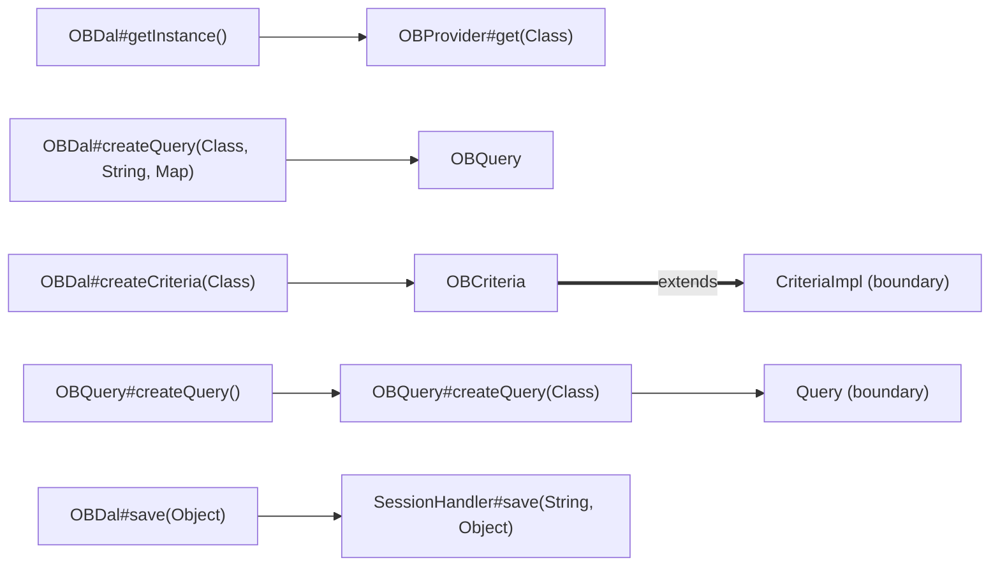

# 03 DAL service API: OBDal, OBCriteria, OBQuery and OBProvider

## Reading guide

This reference is for Java developers extending Openbravo modules. It documents every public member of the four [DAL](./05-glossary.md#data-access-layer-dal) service classes `OBDal`, `OBCriteria`, `OBQuery` and `OBProvider`: what the member's code does, which checks it performs, and a usage example copied from the `org.openbravo.test.dal` tests where one exists.

Reading order: [01-architecture.md](./01-architecture.md) -> [02-runtime-model.md](./02-runtime-model.md) -> 03-dal-service-api.md -> [04-security-and-filtering.md](./04-security-and-filtering.md) -> [05-glossary.md](./05-glossary.md). Previous file: [02-runtime-model.md](./02-runtime-model.md). Next file: [04-security-and-filtering.md](./04-security-and-filtering.md).

`OBDal` reads, saves and removes the [business objects](./05-glossary.md#business-object) of each [entity](./05-glossary.md#entity) in the Hibernate [session](./05-glossary.md#session) and [transaction](./05-glossary.md#transaction) that `SessionHandler` keeps for a database connection [pool](./05-glossary.md#pool), and it creates the two query classes (`OBDal#createQuery(Class, String, Map)`, `OBDal#createCriteria(Class)`). `OBCriteria` is a Hibernate [criteria](./05-glossary.md#criteria) object and `OBQuery` wraps an [HQL](./05-glossary.md#hql) [where clause](./05-glossary.md#where-clause) and [order by clause](./05-glossary.md#order-by-clause); both add [client](./05-glossary.md#client) and [organization](./05-glossary.md#organization) restrictions before they run (`OBCriteria#initialize`, `OBQuery#createQueryString`). `OBProvider` creates instances according to its [provider registrations](./05-glossary.md#provider-registration) (`OBProvider#get(Class)`).

Sources: every class cited in this file resolves to the path below.

| Class | Repository path |
| --- | --- |
| `OBDal` | `src/org/openbravo/dal/service/OBDal.java` |
| `OBCriteria` | `src/org/openbravo/dal/service/OBCriteria.java` |
| `OBQuery` | `src/org/openbravo/dal/service/OBQuery.java` |
| `OBProvider` | `src/org/openbravo/base/provider/OBProvider.java` |
| `SessionHandler` | `src/org/openbravo/dal/core/SessionHandler.java` |
| `OBContext` | `src/org/openbravo/dal/core/OBContext.java` |
| `DalUtil` | `src/org/openbravo/dal/core/DalUtil.java` |
| `SecurityChecker` | `src/org/openbravo/dal/security/SecurityChecker.java` |
| `EntityAccessChecker` | `src/org/openbravo/dal/security/EntityAccessChecker.java` |
| `BaseOBObject` | `src/org/openbravo/base/structure/BaseOBObject.java` |
| `ModelProvider` | `src/org/openbravo/base/model/ModelProvider.java` |
| `Entity` | `src/org/openbravo/base/model/Entity.java` |
| `DalTest` | `src-test/src/org/openbravo/test/dal/DalTest.java` |
| `DalFilterTest` | `src-test/src/org/openbravo/test/dal/DalFilterTest.java` |
| `IssuesTest` | `src-test/src/org/openbravo/test/dal/IssuesTest.java` |
| `DalLockingTest` | `src-test/src/org/openbravo/test/dal/DalLockingTest.java` |
| `DalQueryTest` | `src-test/src/org/openbravo/test/dal/DalQueryTest.java` |
| `ViewTest` | `src-test/src/org/openbravo/test/dal/ViewTest.java` |
| `DalPerformanceCriteriaTest` | `src-test/src/org/openbravo/test/dal/DalPerformanceCriteriaTest.java` |
| `ComputedColumnsTest` | `src-test/src/org/openbravo/test/dal/ComputedColumnsTest.java` |
| `DalPerformanceProductTest` | `src-test/src/org/openbravo/test/dal/DalPerformanceProductTest.java` |
| `DalPerformanceInventoryLineTest` | `src-test/src/org/openbravo/test/dal/DalPerformanceInventoryLineTest.java` |
| `DalPerformanceExampleTest` | `src-test/src/org/openbravo/test/dal/DalPerformanceExampleTest.java` |

Inventory rule: every public member declared in each class body is listed, each overload and each public constructor separately; inherited methods, including those OBCriteria inherits from Hibernate's CriteriaImpl, are excluded, as are members of package-private nested classes.

The inventory therefore holds 102 entries: 35 for `OBDal`, 21 for `OBCriteria` (17 methods and 4 constructors), 34 for `OBQuery`, whose only constructor is package-private, and 12 for `OBProvider` (11 methods and the constant `CONFIG_FILE_NAME`). The protected `OBProvider` methods `register(String, InputStream)` and `register(String, String)` are not public and are not listed.

Entry layout: each entry has a level-4 heading with the member's key, one line holding the signature copied from the source, behaviour sentences that each end with a `Class#method` citation, and exactly one example form. The example form is either a `java` block followed by a `Source:` line, or a line pointing to another entry of the same class whose block calls this member, or the sentence `No src-test usage found in org.openbravo.test.dal.` when no test in that package calls the member.

Example rule: every `java` block is copied verbatim from the body of the test method, or test helper, that its `Source:` line names under `src-test/src/org/openbravo/test/dal/`. Indentation may differ and blank lines are dropped; a line holding only `// ...` marks omitted lines, and an excerpt may start after the method's first line or stop before its last. A helper's `Source:` line also names the test method that invokes it. [Generated classes](./05-glossary.md#generated-class) that appear inside excerpts belong to the test code and are not described here. Tests appear only as examples or, after a statement cited to DAL code, as illustrations.

Design reasons are stated only where the cited method's code, source comment or Javadoc states them. Where a method's Javadoc and its body disagree, an **Ambiguity** note gives both readings and leaves them unresolved. Signatures and citations carry no line numbers.

The diagram shows how the four classes reach each other and Hibernate.



Diagram sources: observed calls (solid arrows): `OBDal#getInstance()` obtains its instance from `OBProvider#get(Class)`; `OBDal#createQuery(Class, String, Map)` constructs the `OBQuery`; `OBDal#createCriteria(Class)` constructs the `OBCriteria`; `OBQuery#createQuery()` calls `OBQuery#createQuery(Class)`, which creates the Hibernate `Query` (boundary) on the session from `SessionHandler#getSession(String)`; `OBDal#save(Object)` ends with `SessionHandler#save(String, Object)`. Declared supertype (thick arrow): the class declaration `public class OBCriteria<E extends BaseOBObject> extends CriteriaImpl`; `OBCriteria#list()` and `OBCriteria#uniqueResult()` call the superclass methods after `OBCriteria#initialize`.

## OBDal

`OBDal` keeps one instance per pool, and each instance works on the session that the current thread's `SessionHandler` holds for that pool (`OBDal#getSession()`, `SessionHandler#getInstance`). The session and transaction lifecycle is described in [01-architecture.md#sessions-and-transactions](./01-architecture.md#sessions-and-transactions) (`SessionHandler#getSession(String)`).

### OBDal instances and pools

#### `OBDal#getInstance()`

`public static OBDal getInstance()`

Returns the instance for the default pool: whenever its static field is null, it obtains an `OBDal` from `OBProvider#get(Class)`, stores it in that field and sets its pool to `ExternalConnectionPool.DEFAULT_POOL` (boundary), and it returns the instance the field holds (`OBDal#getInstance()`). The null check is not synchronized, so the code makes no exactly-once or thread-safety promise for that instance (`OBDal#getInstance()`). How this cached instance relates to the `OBNotSingleton` interface that `OBDal` implements is recorded in [02-runtime-model.md#baseobobject-and-its-interfaces](./02-runtime-model.md#baseobobject-and-its-interfaces) (`OBDal#getInstance()`).

Example: see [`OBDal#save(Object)`](#obdalsaveobject) (`DalTest#testCCreateBPGroup`).

#### `OBDal#getReadOnlyInstance()`

`public static OBDal getReadOnlyInstance()`

Returns `OBDal#getInstance(String)` for `ExternalConnectionPool.READONLY_POOL` (boundary) (`OBDal#getReadOnlyInstance()`). Its Javadoc states that the read-only instance is returned when the read-only pool is enabled in the configuration, when the preference `OBUIAPP_DefaultDBPoolForReports` is set to `RO`, or when a `DataPoolSelection` entry for the current process is set to `RO`, and that the default instance is returned otherwise; the code leaves that decision to `OBDal#getInstance(String)` (`OBDal#getReadOnlyInstance()`).

```java
assumeThat("read-only pool is configured", isReadOnlyPoolDefined(), is(true));
setTestUserContext();
try {
  // ...
  OBDal.getReadOnlyInstance().save(category);
  OBDal.getReadOnlyInstance().commitAndClose();
} catch (Exception ignored) {
}
final List<Category> categories = OBDal.getReadOnlyInstance()
    .createCriteria(Category.class)
    .add(Restrictions.eq(Category.PROPERTY_NAME, "ro_testname"))
    .list();
assertEquals(0, categories.size());
```

Source: `src-test/src/org/openbravo/test/dal/DalTest.java` — `DalTest#readOnlyPoolCanNotInsert`

#### `OBDal#getInstance(String)`

`public static OBDal getInstance(String pool)`

Returns `OBDal#getInstance()` when `pool` is `ExternalConnectionPool.DEFAULT_POOL` or when `DataPoolChecker` (boundary) reports that the default pool must be used (`OBDal#getInstance(String)`). Otherwise it returns the instance kept for that pool name in a static `ConcurrentHashMap`, created on first use through `OBProvider#get(Class)` with its pool set to `pool` (`OBDal#getOtherPoolInstance`).

No src-test usage found in org.openbravo.test.dal.

### OBDal active filter

#### `OBDal#enableActiveFilter()`

`public void enableActiveFilter()`

Enables the Hibernate session filter `activeFilter`, with its parameter `activeParam` set to `Y`, on the session that `SessionHandler#getSession(String)` returns for this instance's pool (`OBDal#enableActiveFilter()`). This session-level [active filter](./05-glossary.md#active-filter), its definition, and the disagreement between this method's Javadoc and the per-query `setFilterOnActive` switches are covered in [04-security-and-filtering.md#client-organization-and-active-filtering](./04-security-and-filtering.md#client-organization-and-active-filtering) (`OBDal#enableActiveFilter()`).

```java
OBDal.getInstance().commitAndClose();
OBDal.getInstance().enableActiveFilter();
doTest(false);
```

Source: `src-test/src/org/openbravo/test/dal/DalFilterTest.java` — `DalFilterTest#testActiveFilterEnabled`

#### `OBDal#disableActiveFilter()`

`public void disableActiveFilter()`

Disables the `activeFilter` session filter on the session of this instance's pool (`OBDal#disableActiveFilter()`). Its Javadoc states that the `setFilterOnActive` settings of `OBQuery` and `OBCriteria` apply again afterwards; [04-security-and-filtering.md#client-organization-and-active-filtering](./04-security-and-filtering.md#client-organization-and-active-filtering) records how the code relates to that statement (`OBDal#disableActiveFilter()`).

```java
OBDal.getInstance().commitAndClose();
OBDal.getInstance().enableActiveFilter();
OBDal.getInstance().disableActiveFilter();
doTest(true);
```

Source: `src-test/src/org/openbravo/test/dal/DalFilterTest.java` — `DalFilterTest#testActiveFilterEnDisabled`

#### `OBDal#isActiveFilterEnabled()`

`public boolean isActiveFilterEnabled()`

Returns true when the session of this instance's pool has the `activeFilter` filter enabled (`OBDal#isActiveFilterEnabled()`).

No src-test usage found in org.openbravo.test.dal.

### OBDal session, connection and transaction

#### `OBDal#getConnection()`

`public Connection getConnection()`

Calls `OBDal#getConnection(boolean)` with `true`, so `OBDal#flush()` runs before the JDBC connection is returned (`OBDal#getConnection()`).

```java
Module module = obc.list().get(0);
module.setInDevelopment(true);
OBDal.getInstance().save(module);
Connection con = OBDal.getInstance().getConnection();
final String sql = "SELECT isindevelopment FROM ad_module where ad_module_id = ?";
try {
  PreparedStatement st = con.prepareStatement(sql);
  st.setString(1, module.getId());
  ResultSet result = st.executeQuery();
  result.next();
  String isInDev = UtilSql.getValue(result, "isindevelopment");
  assertTrue(isInDev.equals("Y"));
```

Source: `src-test/src/org/openbravo/test/dal/IssuesTest.java` — `IssuesTest#test11681`

#### `OBDal#getConnection(boolean)`

`public Connection getConnection(boolean doFlush)`

When `doFlush` is true it first calls `OBDal#flush()`; it then returns the JDBC connection of the session that `SessionHandler#getSession(String)` returns for this instance's pool, read through Hibernate's `SessionImplementor` (boundary) (`OBDal#getConnection(boolean)`).

No src-test usage found in org.openbravo.test.dal.

#### `OBDal#getSession()`

`public Session getSession()`

Returns the Hibernate session of this instance's pool from `SessionHandler#getSession(String)`, which begins a session and a transaction for the pool when the current thread's `SessionHandler` holds none (`OBDal#getSession()`, `SessionHandler#getSession(String)`).

```java
AlertRule lockedRule = acquireLock();
LockMode lm = OBDal.getInstance().getSession().getCurrentLockMode(lockedRule);
assertTrue("Hibernate lock mode doesn't match DAL's one", lm.lessThan(LockMode.WRITE));
```

Source: `src-test/src/org/openbravo/test/dal/DalLockingTest.java` — `DalLockingTest#dalLockIsNotAHibernateLock`

#### `OBDal#isSessionDirty()`

`public boolean isSessionDirty()`

Returns `SessionHandler#isSessionDirty(String)` for this instance's pool, and its Javadoc warns that `isDirty` should not be invoked directly on the Hibernate session (`OBDal#isSessionDirty()`). The reason is given in the Javadoc of `SessionHandler#isSessionDirty(String)`: a direct call triggers the [entity persistence observers](./05-glossary.md#entity-persistence-observer) of modified entities, which the handler's [dirty check](./05-glossary.md#dirty-check) prevents (`SessionHandler#isSessionDirty(String)`).

No src-test usage found in org.openbravo.test.dal.

#### `OBDal#commitAndClose()`

`public void commitAndClose()`

When the current thread's `SessionHandler` is present and available for this instance's pool (`SessionHandler#isSessionHandlerPresent(String)`), it calls `SessionHandler#commitAndClose(String)`; otherwise it does nothing (`OBDal#commitAndClose()`). What that method checks, commits and closes, including its [flush](./05-glossary.md#flush) loop and the paths that skip the commit, is owned by [01-architecture.md#commit-rollback-and-flush](./01-architecture.md#commit-rollback-and-flush) (`SessionHandler#commitAndClose(String)`).

Example: see [`OBDal#get(Class, Object)`](#obdalgetclass-object) (`DalTest#testASaveBooleanValue1`).

#### `OBDal#rollbackAndClose()`

`public void rollbackAndClose()`

When the current thread's `SessionHandler` is present and available for this instance's pool, it calls `SessionHandler#rollback(String)`; otherwise it does nothing (`OBDal#rollbackAndClose()`, `SessionHandler#rollback(String)`). What that method rolls back and closes, including the paths that skip the rollback or leave the session open, is owned by [01-architecture.md#commit-rollback-and-flush](./01-architecture.md#commit-rollback-and-flush) (`SessionHandler#rollback(String)`).

Example: see [`OBDal#createQuery(Class, String)`](#obdalcreatequeryclass-string) (`DalTest#canDeleteWithOBQuery`).

#### `OBDal#flush()`

`public void flush()`

When the current thread's `SessionHandler` is present and available for this instance's pool, it flushes the Hibernate session of the pool; when `OBDal#isSessionDirty()` reports pending changes, it first passes the connection from `OBDal#getConnection(boolean)`, called without flushing, to `SessionInfo.saveContextInfoIntoDB` (boundary) (`OBDal#flush()`). With debug logging enabled it also logs the duration and the entities and collections held by the session; without an available `SessionHandler` the call does nothing (`OBDal#flush()`).

Example: see [`OBDal#createQuery(Class, String)`](#obdalcreatequeryclass-string) (`DalTest#canDeleteWithOBQuery`).

### OBDal persisting objects

#### `OBDal#save(Object)`

`public void save(Object obj)`

If `obj` is a `BaseOBObject` of a [view entity](./05-glossary.md#view-entity), it logs a warning and returns without saving (`OBDal#save(Object)`). Otherwise it first fills a missing client or organization of a [client-enabled](./05-glossary.md#client-enabled-entity) or [organization-enabled](./05-glossary.md#organization-enabled-entity) object with [proxies](./05-glossary.md#proxy) of the current client and organization of `OBContext` (`OBDal#setClientOrganization`).

In [admin mode](./05-glossary.md#admin-mode) (`OBContext#isInAdministratorMode`) it calls `BaseOBObject#setAccessChecks` on a `BaseOBObject` with the write access check disabled and the [org/client access check](./05-glossary.md#orgclient-access-check) set to `OBContext#doOrgClientAccessCheck`, and does nothing further for any other object before saving (`OBDal#save(Object)`). Outside admin mode it calls `EntityAccessChecker#checkWritable(Entity)` for a `BaseOBObject` and then `SecurityChecker#checkWriteAccess(Object)`, and both throw `OBSecurityException` when the check fails (`OBDal#save(Object)`, `EntityAccessChecker#checkWritable`, `SecurityChecker#checkWriteAccess(Object)`). The conditions are listed in [04-security-and-filtering.md#access-checks](./04-security-and-filtering.md#access-checks) and [04-security-and-filtering.md#admin-mode](./04-security-and-filtering.md#admin-mode) (`SecurityChecker#checkWriteAccess(Object)`).

Finally it calls `SessionHandler#save(String, Object)`, which calls Hibernate `saveOrUpdate` with the [entity name](./05-glossary.md#entity-name) for an `Identifiable` object and without it for any other object (`SessionHandler#save(String, Object)`).

```java
setTestUserContext();
addReadWriteAccess(Category.class);
final Category bpg = OBProvider.getInstance().get(Category.class);
bpg.setDefault(true);
bpg.setDescription("testdescription");
bpg.setName("testname");
bpg.setSearchKey("testvalue");
bpg.setActive(true);
OBDal.getInstance().save(bpg);
OBDal.getInstance().commitAndClose();
```

Source: `src-test/src/org/openbravo/test/dal/DalTest.java` — `DalTest#testCCreateBPGroup`

#### `OBDal#remove(Object)`

`public void remove(Object obj)`

If `obj` is a `BaseOBObject` of a view entity, it logs a warning and returns without removing it (`OBDal#remove(Object)`). Otherwise it calls `SecurityChecker#checkDeleteAllowed(Object)`, which outside admin mode throws `OBSecurityException` for an entity that is not deletable and then always runs `SecurityChecker#checkWriteAccess(Object)`, and it deletes the object through `SessionHandler#delete(String, Object)` (`OBDal#remove(Object)`, `SecurityChecker#checkDeleteAllowed`). See [04-security-and-filtering.md#access-checks](./04-security-and-filtering.md#access-checks) for the check conditions (`SecurityChecker#checkDeleteAllowed`).

```java
// first delete the related accounts
final List<CategoryAccounts> bpgas = OBDal.getInstance()
    .createCriteria(CategoryAccounts.class)
    .add(Restrictions.eq(CategoryAccounts.PROPERTY_BUSINESSPARTNERCATEGORY, bpgs.get(0)))
    .list();
for (final CategoryAccounts bga : bpgas) {
  OBDal.getInstance().refresh(bga);
  OBDal.getInstance().remove(bga);
}
OBDal.getInstance().remove(bpgs.get(0));
OBDal.getInstance().commitAndClose();
```

Source: `src-test/src/org/openbravo/test/dal/DalTest.java` — `DalTest#testDRemoveBPGroup`

#### `OBDal#refresh(Object)`

`public void refresh(Object obj)`

Calls `refresh` on the Hibernate session of this instance's pool, and its Javadoc states that initialized lists inside the object are refreshed as well (`OBDal#refresh(Object)`).

Example: see [`OBDal#remove(Object)`](#obdalremoveobject) (`DalTest#testDRemoveBPGroup`).

### OBDal reading by id

The two `get` overloads and every `createQuery` and `createCriteria` overload first run a private read check: the entity-name overloads call `OBDal#checkReadAccess(String)` with `entityName`, and the class overloads call `OBDal#checkReadAccess(Class)`, which gets the entity name from `DalUtil#getEntityName(Class)` and passes it to `OBDal#checkReadAccess(String)` (`OBDal#checkReadAccess(Class)`, `OBDal#checkReadAccess(String)`). `OBDal#checkReadAccess(String)` returns at once for the `Client` and `Organization` entities and in admin mode, and otherwise calls `EntityAccessChecker#checkReadable(Entity)`, which throws `OBSecurityException` for an entity that is not readable for the current user (`OBDal#checkReadAccess(String)`, `EntityAccessChecker#checkReadable(Entity)`). Its source comment gives the reason for the exemption: without read access to these very generic entities, querying on them would be really difficult (`OBDal#checkReadAccess(String)`). `OBDal#exists(String, Object)`, `OBDal#getProxy(String, Object)` and `OBDal#getProxy(Class, String)` do not run it, and `OBDal#get(Class, Object)` and `OBDal#get(String, Object)` add no client, organization or active restriction of their own (`OBDal#get(Class, Object)`); see [04-security-and-filtering.md#client-organization-and-active-filtering](./04-security-and-filtering.md#client-organization-and-active-filtering) (`OBDal#get(String, Object)`).

Because `OBDal#checkReadAccess(Class)` reads the entity name before the `Client`, `Organization` and admin-mode exemptions and before any model lookup, the class passed to `OBDal#get(Class, Object)`, to the three class overloads of `createQuery` and to the two class overloads of `createCriteria` must have a public static `ENTITY_NAME` field holding a non-null `String`, in admin mode and for `Client` and `Organization` as well (`OBDal#checkReadAccess(Class)`). `DalUtil#getEntityName(Class)` reads that field through reflection and wraps each `Exception` it catches in `OBException`, so a missing or non-public field, a non-static field or a value that is not a `String` makes the call throw `OBException`; an `Error` is not caught there (`DalUtil#getEntityName(Class)`). A null value is returned unchanged, and `OBDal#checkReadAccess(String)` then throws `NullPointerException` when it compares the name (`OBDal#checkReadAccess(String)`). The generic bound `<T extends Object>` of `OBDal#get(Class, Object)`, or `<T extends BaseOBObject>` of the other class overloads, does not by itself make a class valid here (`OBDal#checkReadAccess(Class)`). `DalUtil` is described in [02-runtime-model.md#dalutil](./02-runtime-model.md#dalutil) (`DalUtil#getEntityName(Class)`).

#### `OBDal#get(Class, Object)`

`public <T extends Object> T get(Class<T> clazz, Object id)`

Runs `OBDal#checkReadAccess(Class)` for `clazz`, so the class needs the `ENTITY_NAME` field described in [OBDal reading by id](#obdal-reading-by-id), then returns `SessionHandler#find(String, Class, Object)`, which translates a class implementing `Identifiable` to its entity name and returns null when no row exists (`OBDal#get(Class, Object)`, `SessionHandler#find(String, Class, Object)`). An `ObjectNotFoundException`, which the source comment attributes to a cached proxy whose record does not exist in the database, is caught and null is returned (`OBDal#get(Class, Object)`).

```java
setSystemAdministratorContext();
SystemInformation sysInfo = OBDal.getInstance().get(SystemInformation.class, "0");
if (sysInfo.isEnableHeartbeat() == null) {
  sysInfo.setEnableHeartbeat(false);
}
OBDal.getInstance().save(sysInfo);
OBDal.getInstance().commitAndClose();
```

Source: `src-test/src/org/openbravo/test/dal/DalTest.java` — `DalTest#testASaveBooleanValue1`

#### `OBDal#exists(String, Object)`

`public boolean exists(String entityName, Object id)`

Returns whether `SessionHandler#find(String, String, Object)` returns an object for `entityName` and `id`; it runs no read-access check and does not catch `ObjectNotFoundException` (`OBDal#exists(String, Object)`).

No src-test usage found in org.openbravo.test.dal.

#### `OBDal#get(String, Object)`

`public BaseOBObject get(String entityName, Object id)`

Runs `OBDal#checkReadAccess(String)` for `entityName`, then returns `SessionHandler#find(String, String, Object)`; null is returned when no row exists or when an `ObjectNotFoundException` is caught (`OBDal#get(String, Object)`). Illustrated by `DalTest#getInexistentObjByEntityNameShouldBeNullEvenIfItWasProxied`, whose excerpt is shown at [`OBDal#getProxy(String, Object)`](#obdalgetproxystring-object) (`OBDal#get(String, Object)`).

```java
BusinessPartner bp = (BusinessPartner) OBDal.getInstance()
    .get(BusinessPartner.ENTITY_NAME, "DummyId");
assertThat(bp, is(nullValue()));
```

Source: `src-test/src/org/openbravo/test/dal/DalTest.java` — `DalTest#getInexistentObjByEntityNameShouldBeNull`

#### `OBDal#getProxy(String, Object)`

`public BaseOBObject getProxy(String entityName, Object id)`

Returns the result of `internalLoad(entityName, (Serializable) id, false, false)` on the `SessionImplementor` (boundary) of `OBDal#getSession()`, cast to `BaseOBObject`, with no read-access check and no existence check (`OBDal#getProxy(String, Object)`). Its Javadoc states that a non-loaded Hibernate proxy is returned when the object is not already loaded, and that a missing row is detected only when a referencing object is persisted or the proxy is initialized, unlike the other `get` methods, which load the object eagerly (`OBDal#getProxy(String, Object)`).

> **Ambiguity:** The `@return` tag of `OBDal#getProxy(String, Object)` says the method returns the object "or null if none found", while the same Javadoc says the method does not check whether the object exists, and the body returns the `internalLoad` result with no existence check (`OBDal#getProxy(String, Object)`). These docs do not resolve which reading is intended.

```java
BusinessPartner bpProxy = (BusinessPartner) OBDal.getInstance()
    .getProxy(BusinessPartner.ENTITY_NAME, "DummyId");
BusinessPartner bp = (BusinessPartner) OBDal.getInstance()
    .get(BusinessPartner.ENTITY_NAME, "DummyId");
assertThat(bp, is(nullValue()));
```

Source: `src-test/src/org/openbravo/test/dal/DalTest.java` — `DalTest#getInexistentObjByEntityNameShouldBeNullEvenIfItWasProxied`

#### `OBDal#getProxy(Class, String)`

`public <T extends BaseOBObject> T getProxy(Class<T> entityClass, String id)`

Typed form of `OBDal#getProxy(String, Object)`: it resolves the entity name with `DalUtil#getEntityName(Class)`, which reads the class's static `ENTITY_NAME` field and wraps each `Exception` it catches in `OBException` (an `Error` is not caught there), and casts the result to `T` (`OBDal#getProxy(Class, String)`, `DalUtil#getEntityName(Class)`). `DalUtil` is described in [02-runtime-model.md#dalutil](./02-runtime-model.md#dalutil) (`DalUtil#getEntityName(Class)`).

```java
Currency euro = OBDal.getInstance().getProxy(Currency.class, EURO_ID);
euro.getId();
assertThat("Proxy is not initialized", Hibernate.isInitialized(euro), equalTo(false));
```

Source: `src-test/src/org/openbravo/test/dal/DalTest.java` — `DalTest#proxyShouldNotBeInitialized`

### OBDal creating queries

Each overload runs `OBDal#checkReadAccess(Class)` or `OBDal#checkReadAccess(String)` (see [OBDal reading by id](#obdal-reading-by-id)) and resolves the entity with `ModelProvider#getEntity(Class)` or `ModelProvider#getEntity(String)`, which throw `CheckException` for a class or name that is not in the [runtime model](./05-glossary.md#runtime-model) (`OBDal#createQuery(Class, String, Map)`, `ModelProvider#getEntity(String)`). The returned `OBQuery` or `OBCriteria` works on the session of this instance's pool (`OBDal#createQuery(Class, String, Map)`, `OBDal#createCriteria(Class)`).

#### `OBDal#createQuery(Class, String)`

`public <T extends BaseOBObject> OBQuery<T> createQuery(Class<T> fromClz, String whereOrderByClause)`

Calls `OBDal#createQuery(Class, String, Map)` with a new empty `HashMap`, so `fromClz` needs the `ENTITY_NAME` field described in [OBDal reading by id](#obdal-reading-by-id) (`OBDal#createQuery(Class, String)`, `OBDal#checkReadAccess(Class)`). `whereOrderByClause` is the HQL where and order by clause; how `OBQuery` turns it into a query string is described in [OBQuery clauses and parameters](#obquery-clauses-and-parameters) (`OBQuery#createQueryString`).

```java
User user = getNewUser();
// save the new user...
OBDal.getInstance().save(user);
OBDal.getInstance().flush();
// ...and now delete it using an OBQuery instance
String hql = "id = :id";
deletions = OBDal.getInstance()
    .createQuery(User.class, hql)
    .setNamedParameter("id", user.getId())
    .deleteQuery()
    .executeUpdate();
} finally {
  OBDal.getInstance().rollbackAndClose();
}
```

Source: `src-test/src/org/openbravo/test/dal/DalTest.java` — `DalTest#canDeleteWithOBQuery`

#### `OBDal#createQuery(Class, String, List)`

`@Deprecated public <T extends BaseOBObject> OBQuery<T> createQuery(Class<T> fromClz, String whereOrderByClause, List<Object> parameters)`

Runs `OBDal#checkReadAccess(Class)` for `fromClz`, which needs the `ENTITY_NAME` field described in [OBDal reading by id](#obdal-reading-by-id), sets the clause, the entity and this instance's pool like `OBDal#createQuery(Class, String, Map)`, and hands `parameters` to `OBQuery#setParameters(List)` after the clause is set (`OBDal#createQuery(Class, String, List)`). For a non-empty list, `OBQuery#setParameters(List)` rewrites each `?` of the clause as a [named parameter](./05-glossary.md#named-parameter) set to the value at that position; a null or empty list leaves the clause unchanged and sets no parameter (`OBQuery#setParameters(List)`). The list must hold exactly one value per `?` marker: fewer values than markers fail with `IndexOutOfBoundsException` at the first marker without a value, and more values than markers fail the `Check.isTrue` count assertion, both inside this factory call before any query is returned; see [`OBQuery#setParameters(List)`](#obquerysetparameterslist) (`OBQuery#setParameters(List)`). The `?` markers are [positional parameters](./05-glossary.md#positional-parameter); the Javadoc deprecates this overload and names `createQuery(Class, String, Map)` as its replacement (`OBDal#createQuery(Class, String, List)`).

No src-test usage found in org.openbravo.test.dal.

#### `OBDal#createQuery(Class, String, Map)`

`public <T extends BaseOBObject> OBQuery<T> createQuery(Class<T> fromClz, String whereOrderByClause, Map<String, Object> parameters)`

Runs `OBDal#checkReadAccess(Class)` for `fromClz`, creates an `OBQuery`, and sets its where and order by clause, its entity from `ModelProvider#getEntity(Class)`, the `parameters` map through `OBQuery#setNamedParameters(Map)` and this instance's pool (`OBDal#createQuery(Class, String, Map)`). `fromClz` needs the `ENTITY_NAME` field described in [OBDal reading by id](#obdal-reading-by-id) (`OBDal#checkReadAccess(Class)`). The map is stored, not copied (`OBQuery#setNamedParameters(Map)`).

```java
final Map<String, Object> parameters = new HashMap<>(1);
parameters.put("category", bpgs.get(0));
final OBQuery<CategoryAccounts> q2 = OBDal.getInstance()
    .createQuery(CategoryAccounts.class,
        " " + CategoryAccounts.PROPERTY_BUSINESSPARTNERCATEGORY + "=:category", parameters);
final List<CategoryAccounts> bpgas = q2.list();
```

Source: `src-test/src/org/openbravo/test/dal/DalQueryTest.java` — `DalQueryTest#testGRemoveBPGroup`

#### `OBDal#createQuery(String, String)`

`public OBQuery<BaseOBObject> createQuery(String entityName, String whereOrderByClause)`

Calls `OBDal#createQuery(String, String, Map)` with a new empty `HashMap` and returns an untyped `OBQuery<BaseOBObject>` (`OBDal#createQuery(String, String)`).

```java
for (Entity entity : ModelProvider.getInstance().getModel()) {
  if (!entity.isView()) {
    continue;
  }
  OBQuery<BaseOBObject> query = OBDal.getInstance().createQuery(entity.getName(), "");
  query.setMaxResult(1);
  aViewBOB = query.uniqueResult();
```

Source: `src-test/src/org/openbravo/test/dal/ViewTest.java` — `ViewTest#viewsCanBeQueried`

#### `OBDal#createQuery(String, String, List)`

`@Deprecated public OBQuery<BaseOBObject> createQuery(String entityName, String whereOrderByClause, List<Object> parameters)`

Runs `OBDal#checkReadAccess(String)` for `entityName`, sets the clause, the entity and this instance's pool like `OBDal#createQuery(String, String, Map)`, and hands `parameters` to `OBQuery#setParameters(List)` after the clause is set (`OBDal#createQuery(String, String, List)`). The rewriting of a non-empty list, the unchanged clause for a null or empty list and both count failures are the same as for [`OBDal#createQuery(Class, String, List)`](#obdalcreatequeryclass-string-list) (`OBDal#createQuery(String, String, List)`, `OBQuery#setParameters(List)`). The Javadoc deprecates this overload and names `createQuery(String, String, Map)` as its replacement (`OBDal#createQuery(String, String, List)`).

No src-test usage found in org.openbravo.test.dal.

#### `OBDal#createQuery(String, String, Map)`

`public OBQuery<BaseOBObject> createQuery(String entityName, String whereOrderByClause, Map<String, Object> parameters)`

Runs `OBDal#checkReadAccess(String)` for `entityName`, creates an `OBQuery`, and sets its where and order by clause, its entity from `ModelProvider#getEntity(String)`, the `parameters` map through `OBQuery#setNamedParameters(Map)` and this instance's pool (`OBDal#createQuery(String, String, Map)`).

No src-test usage found in org.openbravo.test.dal.

#### `OBDal#createCriteria(Class)`

`public <T extends BaseOBObject> OBCriteria<T> createCriteria(Class<T> clz)`

Runs `OBDal#checkReadAccess(Class)` for `clz`, resolves the entity with `ModelProvider#getEntity(Class)`, and returns an `OBCriteria` built by `OBCriteria#OBCriteria(String, SessionImplementor)` from the class name and the session of this instance's pool, with that entity set (`OBDal#createCriteria(Class)`). `clz` needs the `ENTITY_NAME` field described in [OBDal reading by id](#obdal-reading-by-id) (`OBDal#checkReadAccess(Class)`).

Example: see [`OBDal#remove(Object)`](#obdalremoveobject) (`DalTest#testDRemoveBPGroup`).

#### `OBDal#createCriteria(Class, String)`

`public <T extends BaseOBObject> OBCriteria<T> createCriteria(Class<T> clz, String alias)`

Same as `OBDal#createCriteria(Class)`, but passes `alias` to `OBCriteria#OBCriteria(String, String, SessionImplementor)` so that the criteria can refer to the queried object by that [alias](./05-glossary.md#alias) (`OBDal#createCriteria(Class, String)`). `clz` needs the `ENTITY_NAME` field described in [OBDal reading by id](#obdal-reading-by-id) (`OBDal#checkReadAccess(Class)`).

No src-test usage found in org.openbravo.test.dal.

#### `OBDal#createCriteria(String)`

`public <T extends BaseOBObject> OBCriteria<T> createCriteria(String entityName)`

Runs `OBDal#checkReadAccess(String)` for `entityName`, resolves the entity with `ModelProvider#getEntity(String)`, and returns an `OBCriteria` built by `OBCriteria#OBCriteria(String, SessionImplementor)` from the name of the class returned by `Entity#getMappingClass()` and the session of this instance's pool, with that entity set (`OBDal#createCriteria(String)`). The entity therefore needs a loadable [mapping class](./05-glossary.md#mapping-class): `Entity#getMappingClass()` returns null when the class named by `Entity#getClassName()` is not found, and this factory then dereferences that null and throws `NullPointerException` instead of returning a criteria (`OBDal#createCriteria(String)`, `Entity#getMappingClass()`). The mapping class of an `Entity` is described in [02-runtime-model.md#mapping-class-and-generated-interfaces](./02-runtime-model.md#mapping-class-and-generated-interfaces) (`Entity#getMappingClass()`).

```java
final int count = OBDal.getInstance().createCriteria(CashBook.ENTITY_NAME).count();
final int pageSize = 5;
final int pageCount = 1 + (count / 5);
for (int i = 0; i < pageCount; i++) {
  final OBCriteria<CashBook> obc = OBDal.getInstance().createCriteria(CashBook.ENTITY_NAME);
  obc.setFirstResult(i * pageSize);
  obc.setMaxResults(pageSize);
  log.debug("CashBook PAGE>>> " + (1 + i));
  for (final CashBook c : obc.list()) {
    log.debug(c.getName() + " " + c.getDescription());
  }
}
```

Source: `src-test/src/org/openbravo/test/dal/DalTest.java` — `DalTest#testLCashBookPageRead`

#### `OBDal#createCriteria(String, String)`

`public <T extends BaseOBObject> OBCriteria<T> createCriteria(String entityName, String alias)`

Same as `OBDal#createCriteria(String)`, including the `NullPointerException` when `Entity#getMappingClass()` returns null, but passes `alias` to `OBCriteria#OBCriteria(String, String, SessionImplementor)` (`OBDal#createCriteria(String, String)`, `Entity#getMappingClass()`).

No src-test usage found in org.openbravo.test.dal.

### OBDal other

#### `OBDal#findUniqueConstrainedObjects(BaseOBObject)`

`public List<BaseOBObject> findUniqueConstrainedObjects(BaseOBObject obObject)`

For each [unique constraint](./05-glossary.md#unique-constraint) of the object's entity (`Entity#getUniqueConstraints`), it builds a criteria with `OBDal#createCriteria(String)`, excludes the object's own id when that id is not null, and adds an equality restriction for every [property](./05-glossary.md#property) of the constraint with the value read by `BaseOBObject#getValue`; it returns the objects found, each listed once (`OBDal#findUniqueConstrainedObjects(BaseOBObject)`). Because the lookup runs through `OBDal#createCriteria(String)` and `OBCriteria#list()`, the read check of `OBDal#checkReadAccess(String)`, the mapping-class requirement of `OBDal#createCriteria(String)` and the restrictions of `OBCriteria#initialize` apply to it (`OBDal#findUniqueConstrainedObjects(BaseOBObject)`). Its Javadoc notes that the result can hold more than one object because several unique constraints are used (`OBDal#findUniqueConstrainedObjects(BaseOBObject)`).

No src-test usage found in org.openbravo.test.dal.

#### `OBDal#getReadableOrganizationsInClause()`

`@Deprecated public String getReadableOrganizationsInClause()`

Returns an HQL [IN clause](./05-glossary.md#in-clause) such as `in ('1000000', '1000001')`, built from the [readable organizations](./05-glossary.md#readable-organizations) of `OBContext#getReadableOrganizations`, or `in ('')` when that array is empty (`OBDal#getReadableOrganizationsInClause()`). The Javadoc deprecates it with the advice to use a bind statement parameter instead, and names no replacement method (`OBDal#getReadableOrganizationsInClause()`).

No src-test usage found in org.openbravo.test.dal.

#### `OBDal#getReadableClientsInClause()`

`@Deprecated public String getReadableClientsInClause()`

Returns the same kind of IN clause built from the [readable clients](./05-glossary.md#readable-clients) of `OBContext#getReadableClients`, or `in ('')` when that array is empty (`OBDal#getReadableClientsInClause()`). The Javadoc deprecates it with the advice to use a bind statement parameter instead, and names no replacement method (`OBDal#getReadableClientsInClause()`).

No src-test usage found in org.openbravo.test.dal.

#### `OBDal#getObjectLockForNoKeyUpdate(T)`

`public <T extends BaseOBObject> T getObjectLockForNoKeyUpdate(T object)`

Requires an entity with exactly one id property, asserted with `Check.isTrue` (`OBDal#getObjectLockForNoKeyUpdate(T)`). It evicts `object` from the session, runs a [native query](./05-glossary.md#native-query) `SELECT ... FOR <lock type>` on the object's id, where the [lock](./05-glossary.md#lock) type is `UPDATE` when `DalConnectionProvider` (boundary) reports `ORACLE` and `NO KEY UPDATE` otherwise, and returns a new instance read through `OBDal#getInstance()` and `OBDal#get(Class, Object)` (`OBDal#getObjectLockForNoKeyUpdate(T)`). Its Javadoc gives the design: on PostgreSQL the `FOR NO KEY UPDATE` lock lets other transactions insert child records while the parent is locked, the method is a workaround until Hibernate issue HHH-13135 is fixed, and the lock exists only in the database, where Hibernate cannot detect it (`OBDal#getObjectLockForNoKeyUpdate(T)`). The same Javadoc warns that state not persisted before the call is ignored and that the returned instance must be used instead of the parameter (`OBDal#getObjectLockForNoKeyUpdate(T)`). Illustrated by `DalLockingTest#dalLockIsNotAHibernateLock` (`OBDal#getObjectLockForNoKeyUpdate(T)`).

```java
AlertRule originalInstance = getTestingAlertRule();
AlertRule lockedAlert = OBDal.getInstance().getObjectLockForNoKeyUpdate(originalInstance);
assertThat(lockedAlert, not(sameInstance(originalInstance)));
```

Source: `src-test/src/org/openbravo/test/dal/DalLockingTest.java` — `DalLockingTest#lockedObjectShouldBeANewInstance`

## OBCriteria

`OBCriteria` extends Hibernate's `CriteriaImpl` (boundary), and its class Javadoc states the design: it adds transparent client and organization filtering to the Hibernate criteria, and it offers an order-by convenience method whose referenced entities are [joined](./05-glossary.md#join) automatically (`OBCriteria#initialize`, `OBCriteria#addOrderBy(String, boolean)`). The executing methods first call the package-private `OBCriteria#initialize`, which applies, each under its own condition, the read check `EntityAccessChecker#checkReadable(Entity)` and the client, organization and active restrictions, adds the recorded order-by entries, and sets a [query timeout](./05-glossary.md#query-timeout) through `QueryTimeOutUtil` (boundary) when `SessionInfo` (boundary) holds a [query profile](./05-glossary.md#query-profile) (`OBCriteria#initialize`). [04-security-and-filtering.md#criteria-restrictions](./04-security-and-filtering.md#criteria-restrictions) describes when the read check and each restriction apply, and [04-security-and-filtering.md#access-checks](./04-security-and-filtering.md#access-checks) describes the read check's failure (`OBCriteria#initialize`).

### OBCriteria constructors

The four constructors pass their arguments to the matching `CriteriaImpl` constructor, and the two without a `SessionImplementor` use the default-pool session from `SessionHandler#getSession()` (`OBCriteria#OBCriteria(String)`, `OBCriteria#OBCriteria(String, String)`). None of them sets the entity that `OBCriteria#initialize` reads through `OBCriteria#getEntity()`; the `OBDal#createCriteria` overloads set it through the package-private `setEntity` (`OBDal#createCriteria(Class)`). A criteria built directly by one of these constructors therefore throws from its executing methods while the default switches are on: outside admin mode `OBCriteria#initialize` passes the null entity to `EntityAccessChecker#checkReadable(Entity)`, which, once the checker is initialized, throws `OBSecurityException` unless the checker counts null among its readable or [derived readable](./05-glossary.md#derived-readable) entities, and whenever a filter switch is on `OBCriteria#initialize` dereferences the null entity and throws `NullPointerException` (`OBCriteria#initialize`, `EntityAccessChecker#checkReadable(Entity)`).

#### `OBCriteria#OBCriteria(String)`

`public OBCriteria(String entityOrClassName)`

Creates a criteria for `entityOrClassName` on the session returned by `SessionHandler#getSession()` (`OBCriteria#OBCriteria(String)`).

No src-test usage found in org.openbravo.test.dal.

#### `OBCriteria#OBCriteria(String, SessionImplementor)`

`public OBCriteria(String entityOrClassName, SessionImplementor session)`

Creates a criteria for `entityOrClassName` on the given session; `OBDal#createCriteria(Class)` and `OBDal#createCriteria(String)` use this constructor (`OBCriteria#OBCriteria(String, SessionImplementor)`).

No src-test usage found in org.openbravo.test.dal.

#### `OBCriteria#OBCriteria(String, String)`

`public OBCriteria(String entityOrClassName, String alias)`

Creates a criteria with `alias` for `entityOrClassName` on the session returned by `SessionHandler#getSession()` (`OBCriteria#OBCriteria(String, String)`).

No src-test usage found in org.openbravo.test.dal.

#### `OBCriteria#OBCriteria(String, String, SessionImplementor)`

`public OBCriteria(String entityOrClassName, String alias, SessionImplementor session)`

Creates a criteria with `alias` for `entityOrClassName` on the given session; `OBDal#createCriteria(Class, String)` and `OBDal#createCriteria(String, String)` use this constructor (`OBCriteria#OBCriteria(String, String, SessionImplementor)`).

No src-test usage found in org.openbravo.test.dal.

### OBCriteria executing

#### `OBCriteria#list()`

`public List<E> list() throws HibernateException`

Calls `OBCriteria#initialize` and returns the result of the superclass `list()` (`OBCriteria#list()`).

```java
final List<Category> bpgs = OBDal.getInstance()
    .createCriteria(Category.class)
    .add(Restrictions.eq(Category.PROPERTY_NAME, "testname"))
    .list();
assertEquals(1, bpgs.size());
```

Source: `src-test/src/org/openbravo/test/dal/DalTest.java` — `DalTest#testDRemoveBPGroup`

#### `OBCriteria#count()`

`public int count()`

A convenience method that the standard Hibernate criteria lacks, per its Javadoc: it calls `OBCriteria#initialize`, sets a row-count [projection](./05-glossary.md#projection), reads the count through `OBCriteria#uniqueResult()`, resets the projection to null and returns the count as an `int` (`OBCriteria#count()`).

```java
setSystemAdministratorContext();
final int count = OBDal.getInstance().createCriteria(CashBook.ENTITY_NAME).count();
```

Source: `src-test/src/org/openbravo/test/dal/DalTest.java` — `DalTest#testLCashBookPageRead`

#### `OBCriteria#scroll()`

`public ScrollableResults scroll() throws HibernateException`

Marks the criteria as scrolling, calls `OBCriteria#initialize`, returns the superclass `scroll()` result as `ScrollableResults` (boundary), and clears the mark in a `finally` block (`OBCriteria#scroll()`). While the mark is set and an entity is set, `OBCriteria#getEntityOrClassName()` returns the entity name, and otherwise it returns the superclass value (`OBCriteria#getEntityOrClassName()`).

No src-test usage found in org.openbravo.test.dal.

#### `OBCriteria#scroll(ScrollMode)`

`public ScrollableResults scroll(ScrollMode scrollMode) throws HibernateException`

Same as `OBCriteria#scroll()`, passing `scrollMode` to the superclass `scroll(ScrollMode)` (`OBCriteria#scroll(ScrollMode)`).

```java
OBCriteria<BusinessPartner> c = OBDal.getInstance().createCriteria(BusinessPartner.class);
ScrollableResults iterator = c.scroll(ScrollMode.FORWARD_ONLY);
iterator.next();
```

Source: `src-test/src/org/openbravo/test/dal/DalPerformanceCriteriaTest.java` — `DalPerformanceCriteriaTest#testCriteriaScrollable`

#### `OBCriteria#uniqueResult()`

`public Object uniqueResult() throws HibernateException`

Calls `OBCriteria#initialize` and returns the result of the superclass `uniqueResult()`, typed as `Object` (`OBCriteria#uniqueResult()`).

```java
// load one order
OBCriteria<Order> qOrder = OBDal.getInstance().createCriteria(Order.class);
qOrder.setMaxResults(1);
Order order = (Order) qOrder.uniqueResult();
```

Source: `src-test/src/org/openbravo/test/dal/ComputedColumnsTest.java` — `ComputedColumnsTest#testLazyLoad`

### OBCriteria building

#### `OBCriteria#addOrderBy(String, boolean)`

`public OBCriteria<E> addOrderBy(String orderOn, boolean ascending)`

Records an order-by entry, marks the criteria as modified and returns it for chaining (`OBCriteria#addOrderBy(String, boolean)`). `OBCriteria#initialize` turns each entry into an ascending or descending order; for a dotted path it creates an alias for the part before the last dot and orders on that alias, so the referenced entity is joined (`OBCriteria#initialize`).

> **Ambiguity:** `OBCriteria#initialize` builds the [join](./05-glossary.md#join) alias as `"order_ob_" + j` with `final int j = 0` declared inside the loop over the order-by entries, so every dotted path receives the same alias `order_ob_0` (`OBCriteria#initialize`). No `org.openbravo.test.dal` test orders by two dotted paths, so whether a shared alias is intended is not shown (`OBCriteria#addOrderBy(String, boolean)`). These docs do not resolve it.

```java
final OBCriteria<Product> obc = OBDal.getInstance().createCriteria(Product.class);
obc.setFilterOnReadableOrganization(false);
obc.addOrderBy(Product.PROPERTY_NAME, true);
obc.setMaxResults(pageSize);
obc.setFirstResult(i * pageSize);
log.debug("PAGE>>> " + (1 + i));
for (final Product t : obc.list()) {
  log.debug(t.getIdentifier());
}
```

Source: `src-test/src/org/openbravo/test/dal/DalPerformanceProductTest.java` — `DalPerformanceProductTest#testProduct25PageRead`

#### `OBCriteria#add(Criterion)`

`public OBCriteria<E> add(Criterion expression)`

Overrides the superclass `add` only to return this `OBCriteria` for chaining; unlike the filter switches it does not mark the criteria as modified (`OBCriteria#add(Criterion)`).

Example: see [`OBCriteria#list()`](#obcriterialist) (`DalTest#testDRemoveBPGroup`).

#### `OBCriteria#setMaxResults(int)`

`public OBCriteria<E> setMaxResults(int maxResults)`

Overrides the superclass `setMaxResults` only to return this `OBCriteria` for chaining (`OBCriteria#setMaxResults(int)`).

Example: see [`OBCriteria#uniqueResult()`](#obcriteriauniqueresult) (`ComputedColumnsTest#testLazyLoad`).

#### `OBCriteria#setFirstResult(int)`

`public OBCriteria<E> setFirstResult(int firstResult)`

Overrides the superclass `setFirstResult` only to return this `OBCriteria` for chaining; its Javadoc numbers results from 0 (`OBCriteria#setFirstResult(int)`).

```java
final OBCriteria<InventoryCount> icObc = OBDal.getInstance()
    .createCriteria(InventoryCount.class);
icObc.setFirstResult(1);
icObc.setMaxResults(1);
icObc.addOrderBy("id", false);
final InventoryCount baseIc = (InventoryCount) DalUtil.copy(icObc.list().get(0), false);
```

Source: `src-test/src/org/openbravo/test/dal/DalPerformanceInventoryLineTest.java` — `DalPerformanceInventoryLineTest#testACreateInventoryLine`

### OBCriteria filter switches

The three switches default to true and are read by `OBCriteria#initialize`; each setter stores the value, marks the criteria as modified and returns it for chaining (`OBCriteria#setFilterOnActive(boolean)`). When `OBCriteria#initialize` runs again on an initialized criteria that was modified, it logs a warning that the multiple calls should be fixed to prevent duplicated filters, and adds its restrictions again (`OBCriteria#initialize`). The restrictions each switch controls are described in [04-security-and-filtering.md#client-organization-and-active-filtering](./04-security-and-filtering.md#client-organization-and-active-filtering) (`OBCriteria#initialize`).

#### `OBCriteria#isFilterOnReadableOrganization()`

`public boolean isFilterOnReadableOrganization()`

Returns whether `OBCriteria#initialize` restricts the results to the readable organizations of `OBContext#getReadableOrganizations` (`OBCriteria#isFilterOnReadableOrganization()`).

No src-test usage found in org.openbravo.test.dal.

#### `OBCriteria#setFilterOnReadableOrganization(boolean)`

`public OBCriteria<E> setFilterOnReadableOrganization(boolean filterOnReadableOrganization)`

Sets whether `OBCriteria#initialize` adds the readable-organization restriction (`OBCriteria#setFilterOnReadableOrganization(boolean)`).

```java
final OBCriteria<Product> obc = OBDal.getInstance().createCriteria(Product.class);
obc.setFilterOnReadableOrganization(false);
obc.addOrderBy(Product.PROPERTY_NAME, true);
final long time = System.currentTimeMillis();
for (final Product t : obc.list()) {
```

Source: `src-test/src/org/openbravo/test/dal/DalPerformanceProductTest.java` — `DalPerformanceProductTest#testReadProducts`

#### `OBCriteria#isFilterOnActive()`

`public boolean isFilterOnActive()`

Returns whether `OBCriteria#initialize` restricts the results to active objects; its Javadoc states that only objects with `isActive` true are then returned (`OBCriteria#isFilterOnActive()`).

No src-test usage found in org.openbravo.test.dal.

#### `OBCriteria#setFilterOnActive(boolean)`

`public OBCriteria<E> setFilterOnActive(boolean filterOnActive)`

Sets whether `OBCriteria#initialize` adds the active restriction (`OBCriteria#setFilterOnActive(boolean)`).

```java
OBCriteria<BusinessPartner> c = OBDal.getInstance().createCriteria(BusinessPartner.class);
c.setFilterOnActive(false);
c.setFilterOnReadableClients(false);
c.setFilterOnReadableOrganization(false);
c.setMaxResults(1000);
```

Source: `src-test/src/org/openbravo/test/dal/DalPerformanceCriteriaTest.java` — `DalPerformanceCriteriaTest.QueryTest5#doCriteriaQry` (helper; invoked from `DalPerformanceCriteriaTest#testPerformance`)

#### `OBCriteria#isFilterOnReadableClients()`

`public boolean isFilterOnReadableClients()`

Returns whether `OBCriteria#initialize` restricts the results to the readable clients of `OBContext#getReadableClients` (`OBCriteria#isFilterOnReadableClients()`).

No src-test usage found in org.openbravo.test.dal.

#### `OBCriteria#setFilterOnReadableClients(boolean)`

`public OBCriteria<E> setFilterOnReadableClients(boolean filterOnReadableClients)`

Sets whether `OBCriteria#initialize` adds the readable-client restriction (`OBCriteria#setFilterOnReadableClients(boolean)`).

Example: see [`OBCriteria#setFilterOnActive(boolean)`](#obcriteriasetfilteronactiveboolean) (`DalPerformanceCriteriaTest.QueryTest5#doCriteriaQry`, helper invoked from `DalPerformanceCriteriaTest#testPerformance`).

### OBCriteria metadata

#### `OBCriteria#getEntityOrClassName()`

`public String getEntityOrClassName()`

Overrides the superclass method: while `OBCriteria#scroll()` or `OBCriteria#scroll(ScrollMode)` runs and an entity is set, it returns the entity name, and otherwise it returns the superclass value (`OBCriteria#getEntityOrClassName()`).

No src-test usage found in org.openbravo.test.dal.

#### `OBCriteria#getEntity()`

`public Entity getEntity()`

Returns the entity set by the `OBDal#createCriteria` overloads, or null when none was set (`OBCriteria#getEntity()`).

No src-test usage found in org.openbravo.test.dal.

## OBQuery

`OBQuery` runs a free-format HQL where and order by clause, and its class Javadoc states that it adds the applicable client and organization filters and handles joins for order by clauses (`OBQuery#createQueryString`). Its only constructor is package-private, so instances come from the `OBDal#createQuery` overloads, which set the clause, the entity, the parameters and the pool (`OBDal#createQuery(Class, String, Map)`). Every executing method builds its query string with the package-private `OBQuery#createQueryString`, which calls `EntityAccessChecker#checkReadable(Entity)` only outside admin mode and then, in every mode, appends the restrictions of `OBQuery#addOrgClientActiveFilter` that the filter switches and the entity allow, described in [04-security-and-filtering.md#client-organization-and-active-filtering](./04-security-and-filtering.md#client-organization-and-active-filtering) (`OBQuery#createQueryString`).

### OBQuery executing

#### `OBQuery#uniqueResult()`

`public E uniqueResult()`

Returns the Hibernate `uniqueResult()` of `OBQuery#createQuery()`; its Javadoc states that the result is null when nothing matches and that `HibernateException` is thrown when more than one result matches (`OBQuery#uniqueResult()`).

```java
String hql = "as c where c.iSOCode = ? and c.symbol = ?";
OBQuery<Currency> query = OBDal.getInstance().createQuery(Currency.class, hql);
List<Object> parameters = new ArrayList<>(2);
parameters.add(EURO);
parameters.add("€");
query.setParameters(parameters);
assertNotNull(query.uniqueResult());
```

Source: `src-test/src/org/openbravo/test/dal/DalTest.java` — `DalTest#testOBQueryWithLegacyStyleParameters`

#### `OBQuery#uniqueResultObject()`

`public Object uniqueResultObject()`

Returns the Hibernate `uniqueResult()` of `OBQuery#createQuery(Class)` for `Object`, so the result is not typed to the queried entity; its Javadoc states that the result is null when nothing matches and that `HibernateException` is thrown when more than one result matches, and it points to `OBQuery#uniqueResult()` for the type-safe version (`OBQuery#uniqueResultObject()`).

```java
isoCode = (String) OBDal.getInstance()
    .createQuery(Currency.class, hql.toString())
    .setNamedParameter("currencyId", currencyId)
    .setSelectClause(Currency.PROPERTY_ISOCODE)
    .uniqueResultObject();
```

Source: `src-test/src/org/openbravo/test/dal/DalTest.java` — `DalTest#getISOCodeFromCurrencyId` (helper; invoked from `DalTest#testOBQueryWithoutAlias`)

#### `OBQuery#list()`

`public List<E> list()`

Returns the Hibernate `list()` of `OBQuery#createQuery()`, ordered by the order by clause (`OBQuery#list()`).

```java
final OBQuery<Category> obQuery = OBDal.getInstance()
    .createQuery(Category.class, Category.PROPERTY_NAME + "='testname' or "
        + Category.PROPERTY_SEARCHKEY + "='testvalue'");
final List<Category> bpgs = obQuery.list();
assertEquals(1, bpgs.size());
```

Source: `src-test/src/org/openbravo/test/dal/DalQueryTest.java` — `DalQueryTest#testGRemoveBPGroup`

#### `OBQuery#stream()`

`public Stream<E> stream()`

Returns the Hibernate `stream()` of `OBQuery#createQuery()`; its Javadoc asks the caller to close the stream after processing (`OBQuery#stream()`).

No src-test usage found in org.openbravo.test.dal.

#### `OBQuery#iterate()`

`@Deprecated public Iterator<E> iterate()`

Returns the Hibernate `iterate()` of `OBQuery#createQuery()`; its Javadoc marks it deprecated without naming a replacement (`OBQuery#iterate()`).

No src-test usage found in org.openbravo.test.dal.

#### `OBQuery#scroll(ScrollMode)`

`public ScrollableResults scroll(ScrollMode scrollMode)`

Returns the Hibernate `scroll(scrollMode)` of `OBQuery#createQuery()` as `ScrollableResults` (boundary) (`OBQuery#scroll(ScrollMode)`).

```java
final OBQuery<Product> productQuery = OBDal.getInstance().createQuery(Product.class, "");
// 1000 is normally a good fetch size
productQuery.setFetchSize(1000);
final ScrollableResults productScroller2 = productQuery.scroll(ScrollMode.FORWARD_ONLY);
while (productScroller2.next()) {
  final Product product = (Product) productScroller2.get()[0];
  System.err.println(product.getId());
```

Source: `src-test/src/org/openbravo/test/dal/DalPerformanceExampleTest.java` — `DalPerformanceExampleTest#testSimpleScrollQuery`

#### `OBQuery#count()`

`public int count()`

Builds a `select count(*)` query from the part of the `OBQuery#createQueryString` result that follows its first `from` keyword, without the order by clause, binds the named parameters and returns the count as an `int` (`OBQuery#count()`). It does not apply the first result, max result, [fetch size](./05-glossary.md#fetch-size) or [query type](./05-glossary.md#query-type) settings (`OBQuery#count()`).

```java
final OBQuery<MaterialTransaction> cq = OBDal.getInstance()
    .createQuery(MaterialTransaction.class, " order by product.name");
final int count = cq.count();
// ...
for (int i = 0; i < pageCount; i++) {
  final OBQuery<MaterialTransaction> obq = OBDal.getInstance()
      .createQuery(MaterialTransaction.class,
          " order by " + MaterialTransaction.PROPERTY_PRODUCT + "." + Product.PROPERTY_NAME);
  final Query<MaterialTransaction> qry = obq.createQuery();
  qry.setMaxResults(pageSize);
  qry.setFirstResult(i * pageSize);
```

Source: `src-test/src/org/openbravo/test/dal/DalQueryTest.java` — `DalQueryTest#testJTransaction25PageRead`

#### `OBQuery#getRowNumber(String)`

`public int getRowNumber(String targetId)`

When the lower-cased `OBQuery#createQueryString` result holds a `from` with a space on each side, it drops everything up to the end of the first such `from` written in lower case, or the first five characters when every such `from` is written in upper or mixed case (`OBQuery#getRowNumber(String)`). It then builds a query that selects `id`, prefixed with the alias and a dot when the clause starts with an `as` alias, followed by `from` and the rest of the result, or the whole result when nothing was dropped, which keeps the filters and order by clause when the dropped part ends at the `from` that `OBQuery#createQueryString` writes before the entity name (`OBQuery#getRowNumber(String)`, `OBQuery#createQueryString`). It applies the query timeout of `OBQuery#addQueryProfile`, binds the named parameters, scrolls forward through the rows and returns the row number of the first id equal to `targetId`, or `-1` when none matches (`OBQuery#getRowNumber(String)`).

> **Ambiguity:** The Javadoc of `OBQuery#getRowNumber(String)` says it returns the row number of the record with the given id, or `-1` when it is not found, taking the query's filter and sorting settings into account (`OBQuery#getRowNumber(String)`). Without an alias and without a [select clause](./05-glossary.md#select-clause), the `OBQuery#createQueryString` result starts with `from` with no space before it, so the body drops nothing when the where and order by part holds no spaced `from`, and the query string it builds then has `from` twice in a row before the entity name; when that part holds a lower-case spaced `from`, the dropped part ends inside it instead (`OBQuery#getRowNumber(String)`, `OBQuery#createQueryString`). `OBQuery#count()` puts a space before the query string ahead of the same search, while `OBQuery#getRowNumber(String)` does not (`OBQuery#count()`, `OBQuery#getRowNumber(String)`). These docs do not resolve whether the Javadoc contract holds for such queries.

No src-test usage found in org.openbravo.test.dal.

#### `OBQuery#deleteQuery()`

`public Query deleteQuery()`

Builds `DELETE FROM` the entity name followed by the `OBQuery#createQueryString` result from its first `where` onwards, so the client, organization and active restrictions become part of the delete, binds the named parameters and returns the Hibernate `Query` (boundary) without executing it (`OBQuery#deleteQuery()`). It throws `OBException` when the query string has no `where` and wraps query creation errors in `OBException` (`OBQuery#deleteQuery()`).

```java
String hql = "id = :id";
deletions = OBDal.getInstance()
    .createQuery(User.class, hql)
    .setNamedParameter("id", user.getId())
    .deleteQuery()
    .executeUpdate();
```

Source: `src-test/src/org/openbravo/test/dal/DalTest.java` — `DalTest#canDeleteWithOBQuery`

### OBQuery Hibernate query access

#### `OBQuery#createQuery()`

`public Query<E> createQuery()`

Returns `OBQuery#createQuery(Class)` for `BaseOBObject`, cast to `Query<E>` (`OBQuery#createQuery()`).

Example: see [`OBQuery#count()`](#obquerycount) (`DalQueryTest#testJTransaction25PageRead`).

#### `OBQuery#createQuery(Class)`

`public <T extends Object> Query<T> createQuery(Class<T> clz)`

Creates a Hibernate `Query` typed to `clz` from the `OBQuery#createQueryString` result on the session of the query's pool, binds the named parameters, and applies the fetch size, first result and max result when each is above `-1` (`OBQuery#createQuery(Class)`). It then sets a query timeout through `QueryTimeOutUtil` (boundary) from `OBQuery#getQueryType()` or, when that is null, from the `SessionInfo` (boundary) query profile (`OBQuery#addQueryProfile`, `OBQuery#createQuery(Class)`). It wraps any exception thrown by these steps, from creating the query on the session to setting the query timeout, in `OBException` (`OBQuery#createQuery(Class)`). It builds the query string before these steps and outside that wrapping, so a failure of `OBQuery#createQueryString`, such as the `OBSecurityException` that `EntityAccessChecker#checkReadable(Entity)` throws outside admin mode for an entity that is not readable, reaches the caller unwrapped; [04-security-and-filtering.md#access-checks](./04-security-and-filtering.md#access-checks) describes that read check (`OBQuery#createQuery(Class)`, `OBQuery#createQueryString`, `EntityAccessChecker#checkReadable(Entity)`). Its Javadoc notes that a [select clause](./05-glossary.md#select-clause) set with `OBQuery#setSelectClause(String)` takes precedence over `clz` for the type of the returned objects (`OBQuery#createQuery(Class)`).

No src-test usage found in org.openbravo.test.dal.

### OBQuery clauses and parameters

When the query string is built, `OBQuery#createQueryString` splits the where and order by clause stored by `OBQuery#setWhereAndOrderBy(String)` at `order by`, strips a leading `where`, accepts a leading `as` alias with optional joins, and wraps the remaining where part in parentheses; its source comment gives the reason: the clauses the DAL adds are all and-ed to it (`OBQuery#createQueryString`). Without an alias the result starts with `from` and the entity name, with an alias it starts with `select` and the alias, and a select clause set through `OBQuery#setSelectClause(String)` makes it start with `select` and that clause in both cases, in place of the alias when an alias is used (`OBQuery#createQueryString`). The `OBQuery#setSelectClause(String)` Javadoc warns that the select clause can change the type of the objects the query returns, and `OBQuery#uniqueResultObject()` returns its single result as `Object` (`OBQuery#setSelectClause(String)`, `OBQuery#uniqueResultObject()`).

When a Hibernate query is created, a named parameter value that is a `Collection` or a `String[]` is bound as a parameter list and any other value as a single parameter (`OBQuery#setParameters(Query)`).

#### `OBQuery#getWhereAndOrderBy()`

`public String getWhereAndOrderBy()`

Replaces the upper-case keyword `WHERE`, surrounded by spaces, with `where` in the stored clause, stores the result and returns it; the source comment gives the reason: the upper-case keyword makes Hibernate's HQL parser throw an exception (`OBQuery#getWhereAndOrderBy()`). `OBQuery#createQueryString` reads the clause through this method (`OBQuery#createQueryString`).

```java
final OBQuery<MaterialTransaction> obq = OBDal.getInstance()
    .createQuery(MaterialTransaction.class, " uOM <> null order by product.name desc");
obq.setMaxResult(10);
obq.setFirstResult(0);
final List<MaterialTransaction> cs = obq.list();
qryStr = "MaterialTransaction with " + obq.getWhereAndOrderBy();
```

Source: `src-test/src/org/openbravo/test/dal/DalPerformanceCriteriaTest.java` — `DalPerformanceCriteriaTest.QueryTest3#doHqlQry` (helper; invoked from `DalPerformanceCriteriaTest#testPerformance`)

#### `OBQuery#setWhereAndOrderBy(String)`

`public OBQuery<E> setWhereAndOrderBy(String queryString)`

Stores the where and order by clause described in [OBQuery clauses and parameters](#obquery-clauses-and-parameters), storing an empty string for null, and returns the query (`OBQuery#setWhereAndOrderBy(String)`).

No src-test usage found in org.openbravo.test.dal.

#### `OBQuery#setParameters(List)`

`@Deprecated public void setParameters(List<Object> parameters)`

Converts positional parameters to named ones: each `?` in the stored clause becomes `:__p0`, `:__p1` and so on, with the value at that position set through `OBQuery#setNamedParameter(String, Object)`, and a null or empty list changes nothing (`OBQuery#setParameters(List)`). When the clause holds more `?` markers than the list holds values, reading the value for the first marker without one fails with `IndexOutOfBoundsException`; when it holds fewer, `Check.isTrue` fails after the last marker; in both cases the named parameters already set stay in the parameter map and the stored clause keeps its `?` markers, because the clause is replaced only after that check passes (`OBQuery#setParameters(List)`, `OBQuery#converToNamedParameterQuery`). Its Javadoc gives the reason, that legacy-style query parameters are no longer supported in Hibernate, and names `setNamedParameters(Map)` as the replacement (`OBQuery#setParameters(List)`). Because it rewrites the stored clause, it acts on the clause set before the call, as `OBDal#createQuery(Class, String, List)` does by setting the clause first (`OBQuery#setParameters(List)`).

Example: see [`OBQuery#uniqueResult()`](#obqueryuniqueresult) (`DalTest#testOBQueryWithLegacyStyleParameters`).

#### `OBQuery#getNamedParameters()`

`public Map<String, Object> getNamedParameters()`

Returns the stored map of named parameters, null until a map or a parameter is set; the map also receives the `_dal_readableOrganizations_dal_` and `_dal_readableClients_dal_` parameters that `OBQuery#addOrgClientActiveFilter` adds while the query string is built (`OBQuery#getNamedParameters()`, `OBQuery#addOrgClientActiveFilter`).

No src-test usage found in org.openbravo.test.dal.

#### `OBQuery#setNamedParameters(Map)`

`public OBQuery<E> setNamedParameters(Map<String, Object> namedParameters)`

Stores `namedParameters` as the parameter map without copying it, so later calls to `OBQuery#setNamedParameter(String, Object)`, including those of `OBQuery#addOrgClientActiveFilter`, put their values into the caller's map, and returns the query for chaining (`OBQuery#setNamedParameters(Map)`, `OBQuery#setNamedParameter(String, Object)`).

No src-test usage found in org.openbravo.test.dal.

#### `OBQuery#setNamedParameter(String, Object)`

`public OBQuery<E> setNamedParameter(String paramName, Object value)`

Puts one value into the parameter map, creating a `HashMap` first when none is set, and returns the query; [OBQuery clauses and parameters](#obquery-clauses-and-parameters) describes how the values are bound (`OBQuery#setNamedParameter(String, Object)`, `OBQuery#setParameters(Query)`).

Example: see [`OBQuery#deleteQuery()`](#obquerydeletequery) (`DalTest#canDeleteWithOBQuery`).

#### `OBQuery#getSelectClause()`

`public String getSelectClause()`

Returns the select clause, null until one is set (`OBQuery#getSelectClause()`).

No src-test usage found in org.openbravo.test.dal.

#### `OBQuery#setSelectClause(String)`

`public OBQuery<E> setSelectClause(String selectClause)`

Stores the select clause and returns the query; [OBQuery clauses and parameters](#obquery-clauses-and-parameters) describes how `OBQuery#createQueryString` uses it (`OBQuery#setSelectClause(String)`, `OBQuery#createQueryString`).

Example: see [`OBQuery#uniqueResultObject()`](#obqueryuniqueresultobject) (`DalTest#getISOCodeFromCurrencyId`, helper invoked from `DalTest#testOBQueryWithoutAlias`).

### OBQuery paging and fetching

#### `OBQuery#getFirstResult()`

`public int getFirstResult()`

Returns the position of the first row to retrieve, `-1` until one is set (`OBQuery#getFirstResult()`).

No src-test usage found in org.openbravo.test.dal.

#### `OBQuery#setFirstResult(int)`

`public OBQuery<E> setFirstResult(int firstResult)`

Stores the position of the first row to retrieve and returns the query; `OBQuery#createQuery(Class)` applies it when it is above `-1` (`OBQuery#setFirstResult(int)`, `OBQuery#createQuery(Class)`).

Example: see [`OBQuery#getWhereAndOrderBy()`](#obquerygetwhereandorderby) (`DalPerformanceCriteriaTest.QueryTest3#doHqlQry`, helper invoked from `DalPerformanceCriteriaTest#testPerformance`).

#### `OBQuery#getMaxResult()`

`public int getMaxResult()`

Returns the maximum number of rows to retrieve, `-1` until one is set (`OBQuery#getMaxResult()`).

No src-test usage found in org.openbravo.test.dal.

#### `OBQuery#setMaxResult(int)`

`public OBQuery<E> setMaxResult(int maxResult)`

Stores the maximum number of rows to retrieve and returns the query; `OBQuery#createQuery(Class)` applies it when it is above `-1` (`OBQuery#setMaxResult(int)`, `OBQuery#createQuery(Class)`).

```java
final OBQuery<Order> orderQuery = OBDal.getInstance().createQuery(Order.class, "");
orderQuery.setMaxResult(1);
Order order = orderQuery.uniqueResult();
```

Source: `src-test/src/org/openbravo/test/dal/DalPerformanceExampleTest.java` — `DalPerformanceExampleTest#testShowCollectionLoading`

#### `OBQuery#getFetchSize()`

`public int getFetchSize()`

Returns the fetch size of the underlying query, `-1` until one is set (`OBQuery#getFetchSize()`).

No src-test usage found in org.openbravo.test.dal.

#### `OBQuery#setFetchSize(int)`

`public OBQuery<E> setFetchSize(int fetchSize)`

Stores the fetch size and returns the query; `OBQuery#createQuery(Class)` applies it when it is above `-1` (`OBQuery#setFetchSize(int)`, `OBQuery#createQuery(Class)`).

Example: see [`OBQuery#scroll(ScrollMode)`](#obqueryscrollscrollmode) (`DalPerformanceExampleTest#testSimpleScrollQuery`).

### OBQuery filter switches

The three switches default to true and are read each time `OBQuery#createQueryString` builds a query string; each setter stores the value and returns the query for chaining (`OBQuery#setFilterOnActive(boolean)`). The restrictions they control are added by `OBQuery#addOrgClientActiveFilter` and described in [04-security-and-filtering.md#client-organization-and-active-filtering](./04-security-and-filtering.md#client-organization-and-active-filtering) (`OBQuery#addOrgClientActiveFilter`).

#### `OBQuery#isFilterOnReadableOrganization()`

`public boolean isFilterOnReadableOrganization()`

Returns the stored readable-organization switch, true by default and set by `OBQuery#setFilterOnReadableOrganization(boolean)`; `OBQuery#addOrgClientActiveFilter` adds the restriction to the readable organizations of `OBContext#getReadableOrganizations` only when the switch is on and the entity supports it, as described in [04-security-and-filtering.md#client-organization-and-active-filtering](./04-security-and-filtering.md#client-organization-and-active-filtering) (`OBQuery#isFilterOnReadableOrganization()`, `OBQuery#addOrgClientActiveFilter`).

No src-test usage found in org.openbravo.test.dal.

#### `OBQuery#setFilterOnReadableOrganization(boolean)`

`public OBQuery<E> setFilterOnReadableOrganization(boolean filterOnReadableOrganizations)`

Sets whether the readable-organization restriction is added to the query (`OBQuery#setFilterOnReadableOrganization(boolean)`).

```java
// now load the category directly
final OBQuery<Category> categoryQuery = OBDal.getInstance()
    .createQuery(Category.class, "id=:id");
categoryQuery.setFilterOnActive(false);
categoryQuery.setFilterOnReadableClients(false);
categoryQuery.setFilterOnReadableOrganization(false);
categoryQuery.setNamedParameter("id", category.getId());
final Category category2 = categoryQuery.list().get(0);
```

Source: `src-test/src/org/openbravo/test/dal/DalPerformanceExampleTest.java` — `DalPerformanceExampleTest#testShowObjectGraph`

#### `OBQuery#isFilterOnActive()`

`public boolean isFilterOnActive()`

Returns the stored `active='Y'` switch, true by default and set by `OBQuery#setFilterOnActive(boolean)`; `OBQuery#addOrgClientActiveFilter` adds the `active='Y'` restriction only when the switch is on and the entity supports it, as described in [04-security-and-filtering.md#client-organization-and-active-filtering](./04-security-and-filtering.md#client-organization-and-active-filtering) (`OBQuery#isFilterOnActive()`, `OBQuery#addOrgClientActiveFilter`).

No src-test usage found in org.openbravo.test.dal.

#### `OBQuery#setFilterOnActive(boolean)`

`public OBQuery<E> setFilterOnActive(boolean filterOnActive)`

Sets whether the `active='Y'` restriction is added to the query (`OBQuery#setFilterOnActive(boolean)`).

Example: see [`OBQuery#setFilterOnReadableOrganization(boolean)`](#obquerysetfilteronreadableorganizationboolean) (`DalPerformanceExampleTest#testShowObjectGraph`).

#### `OBQuery#isFilterOnReadableClients()`

`public boolean isFilterOnReadableClients()`

Returns the stored readable-client switch, true by default and set by `OBQuery#setFilterOnReadableClients(boolean)`; `OBQuery#addOrgClientActiveFilter` adds the restriction to the readable clients of `OBContext#getReadableClients` only when the switch is on and the entity supports it, as described in [04-security-and-filtering.md#client-organization-and-active-filtering](./04-security-and-filtering.md#client-organization-and-active-filtering) (`OBQuery#isFilterOnReadableClients()`, `OBQuery#addOrgClientActiveFilter`).

No src-test usage found in org.openbravo.test.dal.

#### `OBQuery#setFilterOnReadableClients(boolean)`

`public OBQuery<E> setFilterOnReadableClients(boolean filterOnReadableClients)`

Sets whether the readable-client restriction is added to the query (`OBQuery#setFilterOnReadableClients(boolean)`).

Example: see [`OBQuery#setFilterOnReadableOrganization(boolean)`](#obquerysetfilteronreadableorganizationboolean) (`DalPerformanceExampleTest#testShowObjectGraph`).

### OBQuery metadata and timeout

When the query type set through `OBQuery#setQueryType(String)` is not null, `OBQuery#createQuery(Class)` and `OBQuery#getRowNumber(String)` pass it to `QueryTimeOutUtil` (boundary) to set the query timeout, in place of the `SessionInfo` (boundary) query profile (`OBQuery#addQueryProfile`).

#### `OBQuery#getEntity()`

`public Entity getEntity()`

Returns the entity set by the `OBDal#createQuery` overloads, whose name `OBQuery#createQueryString` puts after `from` (`OBQuery#getEntity()`, `OBQuery#createQueryString`).

No src-test usage found in org.openbravo.test.dal.

#### `OBQuery#setQueryType(String)`

`public OBQuery<E> setQueryType(String queryType)`

Stores the query type and returns the query; [OBQuery metadata and timeout](#obquery-metadata-and-timeout) describes how the type sets the query timeout (`OBQuery#setQueryType(String)`, `OBQuery#addQueryProfile`).

No src-test usage found in org.openbravo.test.dal.

#### `OBQuery#getQueryType()`

`public String getQueryType()`

Returns the stored query type, null until one is set (`OBQuery#getQueryType()`).

No src-test usage found in org.openbravo.test.dal.

## OBProvider

`OBProvider` keeps registrations keyed by class or service name and creates the instances that callers request, for example the instances returned by `OBDal#getInstance()` (`OBProvider#get(Class)`). Its class Javadoc describes it as an implementation of the [service locator](./05-glossary.md#service-locator) pattern, in which each registered class is identified as one to be treated as a [singleton](./05-glossary.md#singleton) or not (`OBProvider#register(String, Class, boolean)`).

### OBProvider instance

#### `OBProvider#getInstance()`

`public static OBProvider getInstance()`

Returns the static instance, which is created when the class is initialized and can be replaced with `OBProvider#setInstance(OBProvider)` (`OBProvider#getInstance()`).

Example: see [`OBProvider#get(Class)`](#obprovidergetclass) (`DalTest#testCCreateBPGroup`).

#### `OBProvider#setInstance(OBProvider)`

`public static void setInstance(OBProvider instance)`

Replaces the static instance that `OBProvider#getInstance()` returns (`OBProvider#setInstance(OBProvider)`).

No src-test usage found in org.openbravo.test.dal.

### OBProvider registration

#### `OBProvider#isRegistered(Class)`

`public boolean isRegistered(Class<?> clz)`

Returns `OBProvider#isRegistered(String)` for the name of `clz` (`OBProvider#isRegistered(Class)`).

No src-test usage found in org.openbravo.test.dal.

#### `OBProvider#isRegistered(String)`

`public boolean isRegistered(String name)`

Returns whether a registration exists under `name` (`OBProvider#isRegistered(String)`).

No src-test usage found in org.openbravo.test.dal.

#### `OBProvider#registerInstance(Class, Object, boolean)`

`public void registerInstance(Class<?> registrationClass, Object instanceObj, boolean overwrite)`

Calls `OBProvider#register(String, Class, boolean)` with the name of `registrationClass`, the class of `instanceObj` and `overwrite`, then sets `instanceObj` as the instance of the registration stored under that name (`OBProvider#registerInstance(Class, Object, boolean)`). Its Javadoc describes `instanceObj` as "the instance to use when the class is requested" (`OBProvider#registerInstance(Class, Object, boolean)`).

> **Ambiguity:** The Javadoc of `OBProvider#registerInstance(Class, Object, boolean)` says that with `overwrite` false a current registration is not overwritten (`OBProvider#registerInstance(Class, Object, boolean)`). The body sets `instanceObj` on whichever registration is stored under the name after `OBProvider#register(String, Class, boolean)` returns, and that call keeps an existing registration when `overwrite` is false or the existing one is not overwritable, so the kept registration still receives the new instance (`OBProvider#registerInstance(Class, Object, boolean)`, `OBProvider#register(String, Class, boolean)`). These docs do not resolve which behaviour is intended.

No src-test usage found in org.openbravo.test.dal.

#### `OBProvider#register(Class, Class, boolean)`

`public void register(Class<?> registrationClass, Class<?> instanceClass, boolean overwrite)`

Registers `instanceClass` as the implementation of the Openbravo class `registrationClass` by calling `OBProvider#register(String, Class, boolean)` with the name of `registrationClass`; per its Javadoc, a current registration is overwritten only when `overwrite` is true (`OBProvider#register(Class, Class, boolean)`). It is the extension point that the core exposes for registering a different implementation of an Openbravo class, which `OBProvider#get(Class)` then instantiates (`OBProvider#register(Class, Class, boolean)`, `OBProvider#get(Class)`).

No src-test usage found in org.openbravo.test.dal.

#### `OBProvider#register(String, Class, boolean)`

`public void register(String name, Class<?> instanceClass, boolean overwrite)`

Creates a registration for `name` whose instance is a singleton when `instanceClass` implements `OBSingleton` (boundary), and marks it as overwritable only when `overwrite` is false; the source comment gives the reason: a registration which overwrites others is not overwritable (`OBProvider#register(String, Class, boolean)`). When a registration already exists under `name`, it is kept, with a debug log entry, if `overwrite` is false or the existing registration is not overwritable, and it is replaced otherwise (`OBProvider#register(String, Class, boolean)`).

No src-test usage found in org.openbravo.test.dal.

#### `OBProvider#removeInstance(Class)`

`public void removeInstance(Class<?> clz)`

Sets the instance of the registration stored under the name of `clz` to null; when `clz` is not registered, it writes a debug log entry and returns without changing the registry (`OBProvider#removeInstance(Class)`). Its Javadoc describes this as removing the singleton instance of `clz`, if any, from the internal registry, and states that the instance will be recreated at the next request (`OBProvider#removeInstance(Class)`).

No src-test usage found in org.openbravo.test.dal.

### OBProvider lookup

#### `OBProvider#get(Class)`

`public <T extends Object> T get(Class<T> clz)`

Returns the instance of the registration stored under the name of `clz`; when there is none, it first registers `clz` as its own implementation through `OBProvider#register(Class, Class, boolean)` with `overwrite` false (`OBProvider#get(Class)`). Its Javadoc states that the method checks the registry for which class should be used for the passed `clz`, that a new registration using `clz` is created when none is found, and that it returns an instance of `clz` (`OBProvider#get(Class)`).

```java
final Category bpg = OBProvider.getInstance().get(Category.class);
bpg.setDefault(true);
bpg.setDescription("testdescription");
bpg.setName("testname");
bpg.setSearchKey("testvalue");
bpg.setActive(true);
```

Source: `src-test/src/org/openbravo/test/dal/DalTest.java` — `DalTest#testCCreateBPGroup`

#### `OBProvider#get(String)`

`public Object get(String name)`

Returns the instance of the registration stored under `name`, and throws `OBProviderException` when there is none (`OBProvider#get(String)`).

No src-test usage found in org.openbravo.test.dal.

#### `OBProvider#getMostSpecificService(String)`

`public Object getMostSpecificService(String path)`

Removes one leading and one trailing `/` from `path`, splits the rest at `/`, and looks up the registrations for the joined segments from the full path down to the first segment alone, returning the instance of the first registration found; it throws `OBProviderException` when none is found (`OBProvider#getMostSpecificService(String)`).

> **Ambiguity:** The Javadoc of `OBProvider#getMostSpecificService(String)` lists the names it checks with a leading `/`, with a trailing `/` on the shorter ones, and stops at the first two segments (`OBProvider#getMostSpecificService(String)`). The body removes only one leading and one trailing `/` from `path` and makes no other change to it before splitting it at `/`, so for the Javadoc's example path it looks up names without a leading or trailing `/` and continues down to the first segment alone (`OBProvider#getMostSpecificService(String)`). These docs do not resolve which form registrations are expected to use.

No src-test usage found in org.openbravo.test.dal.

### OBProvider constants

#### `OBProvider#CONFIG_FILE_NAME`

`public static final String CONFIG_FILE_NAME = "provider-config.xml";`

Holds the [provider configuration](./05-glossary.md#provider-configuration) file name `provider-config.xml` (`OBProvider#CONFIG_FILE_NAME`). Neither configuration registration method reads it: the protected `OBProvider#register(String, InputStream)` receives the configuration as a stream, and the protected `OBProvider#register(String, String)` receives a file name as its `configFile` argument (`OBProvider#CONFIG_FILE_NAME`, `OBProvider#register(String, InputStream)`, `OBProvider#register(String, String)`). Each creates an `OBProviderConfigReader` (boundary) and hands it a prefix together with the stream or the file name, and their source comments mark both as used by `OBConfigFileProvider` (boundary) (`OBProvider#register(String, InputStream)`, `OBProvider#register(String, String)`).

No src-test usage found in org.openbravo.test.dal.
