# 04 Security and filtering

## Reading guide

Audience: Java developers extending Openbravo modules who need to know why a query returns fewer rows than expected, or why a save throws `OBSecurityException`.

Coverage: the [user context](./05-glossary.md#user-context) held by `OBContext`; the [readable clients](./05-glossary.md#readable-clients), [readable organizations](./05-glossary.md#readable-organizations), [writable organizations](./05-glossary.md#writable-organizations) and [deactivated organizations](./05-glossary.md#deactivated-organization) computed for the current [role](./05-glossary.md#role); [admin mode](./05-glossary.md#admin-mode); the [client](./05-glossary.md#client), [organization](./05-glossary.md#organization) and active restrictions that `OBCriteria` and `OBQuery` add to a query only when the queried [entity](./05-glossary.md#entity) has the matching capability and the restriction's per-query switch is on, as set out in [Client, organization and active filtering](#client-organization-and-active-filtering), and the separate [active filter](./05-glossary.md#active-filter) of the Hibernate [session](./05-glossary.md#session); the checks that decide whether the role may read or write an [entity](./05-glossary.md#entity), namely the [entity access](./05-glossary.md#entity-access), write and [access level](./05-glossary.md#access-level) checks; and the Hibernate [interceptor](./05-glossary.md#interceptor) implemented by `OBInterceptor`.

Reading order: [01-architecture.md](./01-architecture.md) → [02-runtime-model.md](./02-runtime-model.md) → [03-dal-service-api.md](./03-dal-service-api.md) → 04-security-and-filtering.md (this file) → [05-glossary.md](./05-glossary.md).

Previous: [03-dal-service-api.md](./03-dal-service-api.md). Next: [05-glossary.md](./05-glossary.md).

Conventions: every behavioural statement ends with a `Class#method` citation, and each class name resolves through the Sources table below; line numbers are not used. The first use of a glossary term links to its entry in [05-glossary.md](./05-glossary.md). Names marked "(boundary)", such as `OBAdminMode`, `RoleAccessUtils`, `AccessLevelChecker`, `OBException` and [generated classes](./05-glossary.md#generated-class) like `User`, `Role`, `Organization`, `Client` and `AttributeSetInstance`, are named only, and their internals are not documented. Tests are named only as illustrations of behaviour that is cited to code. Role-dependent outcomes depend on role data in the database, so this file documents how each set and check is computed, not which rows a given role sees.

Sources:

| Class | Repository path |
|-------|-----------------|
| `OBContext` | `src/org/openbravo/dal/core/OBContext.java` |
| `OBInterceptor` | `src/org/openbravo/dal/core/OBInterceptor.java` |
| `SessionHandler` | `src/org/openbravo/dal/core/SessionHandler.java` |
| `DalMappingGenerator` | `src/org/openbravo/dal/core/DalMappingGenerator.java` |
| `DalRequestFilter` | `src/org/openbravo/dal/core/DalRequestFilter.java` |
| `DalSessionFactoryController` | `src/org/openbravo/dal/core/DalSessionFactoryController.java` |
| `OBDal` | `src/org/openbravo/dal/service/OBDal.java` |
| `OBCriteria` | `src/org/openbravo/dal/service/OBCriteria.java` |
| `OBQuery` | `src/org/openbravo/dal/service/OBQuery.java` |
| `OBProvider` | `src/org/openbravo/base/provider/OBProvider.java` |
| `BaseOBObject` | `src/org/openbravo/base/structure/BaseOBObject.java` |
| `Entity` | `src/org/openbravo/base/model/Entity.java` |
| `Property` | `src/org/openbravo/base/model/Property.java` |
| `SecurityChecker` | `src/org/openbravo/dal/security/SecurityChecker.java` |
| `EntityAccessChecker` | `src/org/openbravo/dal/security/EntityAccessChecker.java` |
| `OrganizationStructureProvider` | `src/org/openbravo/dal/security/OrganizationStructureProvider.java` |
| `AcctSchemaStructureProvider` | `src/org/openbravo/dal/security/AcctSchemaStructureProvider.java` |
| `AdminContextTest` | `src-test/src/org/openbravo/test/dal/AdminContextTest.java` |
| `DoOrgClientAccessCheckTest` | `src-test/src/org/openbravo/test/dal/DoOrgClientAccessCheckTest.java` |
| `OBContextTest` | `src-test/src/org/openbravo/test/dal/OBContextTest.java` |
| `DalFilterTest` | `src-test/src/org/openbravo/test/dal/DalFilterTest.java` |
| `DalTest` | `src-test/src/org/openbravo/test/dal/DalTest.java` |

## OBContext

Module code reads the context of the current thread with `OBContext#getOBContext()`, which returns null when no context is set, installs a context for known ids with an `OBContext#setOBContext(String, String, String, String)` overload, and widens its privileges for a block of code with the calls described in [Admin mode](#admin-mode) (`OBContext#getOBContext()`, `OBContext#setOBContext(String, String, String, String, String, String)`).

### Creating and installing a context

| Entry point | Behaviour |
|-------------|-----------|
| `OBContext#setOBContext(HttpServletRequest)` | Returns without action when the request has no [HTTP session](./05-glossary.md#http-session) (`OBContext#setOBContext(HttpServletRequest)`). Otherwise, synchronized on the HTTP session, it reads the context stored under the attribute `#OBContext` (`OBContext#setOBContext(HttpServletRequest)`). When none is stored it creates a context and initializes it through `OBContext#setFromRequest(HttpServletRequest)`; on success it stores the context in the HTTP session and in the thread (`OBContext#setOBContext(HttpServletRequest)`, `OBContext#setOBContextInSession(HttpServletRequest, OBContext)`). When one is stored, it re-initializes it from the request if its user, role, client or organization is unset or differs from a value present in the HTTP session, and then sets it in the thread whether or not it re-initialized it (`OBContext#setOBContext(HttpServletRequest)`, `OBContext#isInSync(HttpServletRequest)`). |
| `OBContext#setFromRequest(HttpServletRequest)` | Reads the user id from the HTTP session attribute `#AD_User_ID`, matching the attribute name case-insensitively, and returns false when there is no HTTP session or no user (`OBContext#setFromRequest(HttpServletRequest)`). Otherwise it calls `OBContext#initialize(String, String, String, String)` with that user and the values of the session attributes `#AD_Role_ID`, `#AD_Client_ID` and `#AD_Org_ID`, read under their upper-case names, and returns its result (`OBContext#setFromRequest(HttpServletRequest)`, `OBContext#getSessionValue(HttpServletRequest, String)`). When initialization throws `OBSecurityException`, it clears the `#AD_User_ID` attribute and rethrows (`OBContext#setFromRequest(HttpServletRequest)`). |
| `OBContext#setOBContext(String)` | Delegates to `OBContext#setOBContext(String, String, String, String)` with null role, client and organization ids (`OBContext#setOBContext(String)`). |
| `OBContext#setOBContext(String, String, String, String)` | Delegates with a null language code and a null warehouse id (`OBContext#setOBContext(String, String, String, String)`). |
| `OBContext#setOBContext(String, String, String, String, String)` | Delegates with a null warehouse id (`OBContext#setOBContext(String, String, String, String, String)`). |
| `OBContext#setOBContext(String, String, String, String, String, String)` | Obtains a new instance through `OBProvider#get(Class)`, clears the context of the thread, initializes the instance with the user, role, client, organization, language code and warehouse ids, and sets it in the thread (`OBContext#setOBContext(String, String, String, String, String, String)`). |
| `OBContext#createOBContext(String)` | Creates and initializes a context for the user without setting it in the thread (`OBContext#createOBContext(String)`). |
| `OBContext#setOBContext(OBContext)` | Stores the context in the thread-local field, or removes it when the argument is null, and in both cases removes the thread-local flag that the deprecated `OBContext#setInAdministratorMode(boolean)` sets (`OBContext#setOBContext(OBContext)`). |
| `OBContext#getOBContext()` | Returns the context of the thread, or null when none is set (`OBContext#getOBContext()`). |

Each thread holds its own context in a static thread-local field that `OBContext#getOBContext()` reads and `OBContext#setOBContext(OBContext)` writes (`OBContext#getOBContext()`, `OBContext#setOBContext(OBContext)`). `OBContext#setOBContextInSession(HttpServletRequest, OBContext)` copies a context into the HTTP session attribute `#OBContext`: it returns without writing when the request has no HTTP session, it refuses with a warning to store the admin context, it sets the new-UI flag of the context from the `#HIDE_BACKBUTTON` session attribute, and it writes the attribute only when the attribute holds a different object (`OBContext#setOBContextInSession(HttpServletRequest, OBContext)`). The per-request calls to these methods are shown in [01-architecture.md](./01-architecture.md#request-lifecycle) (`DalRequestFilter#doFilter`).

### Initialization order

The public `OBContext#initialize(String)` and `OBContext#initialize(String, String, String, String)` delegate to the private six-argument overload, whose body resolves the context in this order (`OBContext#initialize(String)`, `OBContext#initialize(String, String, String, String)`, `OBContext#initialize(String, String, String, String, String, String)`):

- **Ids and user.** It stores the passed user, role, client, organization, language code and warehouse ids, resets the additional writable organizations, and loads the user through `SessionHandler#find(Class, Object)`; it returns false when no user has that id (`OBContext#initialize(String, String, String, String, String, String)`).
- **Temporary admin entry.** It pushes an admin entry with the org/client check enabled directly onto the [admin mode stack](./05-glossary.md#admin-mode-stack), and in a `finally` block pops it and marks the context initialized (`OBContext#initialize(String, String, String, String, String, String)`).
- **Role.** It takes the passed role id; otherwise the default role of the user when that role is active; otherwise the first active user-role assignment with an active role, ordered by role id (`OBContext#initialize(String, String, String, String, String, String)`). When there is none it throws `OBSecurityException` (`OBContext#initialize(String, String, String, String, String, String)`).
- **Organization.** It takes the passed organization id; otherwise the default organization of the user when it is active; otherwise, for an automatic role recognised by `RoleAccessUtils` (boundary), the highest id among the organizations of that role; otherwise the organization of the first active role-organization assignment with an active organization, ordered by organization id descending (`OBContext#initialize(String, String, String, String, String, String)`). The last two branches also take the client from the role or from the assignment when no client id was passed (`OBContext#initialize(String, String, String, String, String, String)`).
- **Writable-organization fallback.** When the resolved organization is not among the writable organizations, it logs a warning (`OBContext#initialize(String, String, String, String, String, String)`). If no organization is writable, the organization is kept; otherwise it is replaced by the first element that the iterator of the writable set returns (`OBContext#initialize(String, String, String, String, String, String)`).
- **Client.** It takes the passed or derived client id; otherwise the default client of the user when it is active; otherwise the client of the current organization (`OBContext#initialize(String, String, String, String, String, String)`). The client must then be active (`OBContext#initialize(String, String, String, String, String, String)`).
- **Language.** It takes the passed language code, failing with `IllegalArgumentException` when no language has that code; otherwise the default language of the user when it is active; otherwise the language of the client; otherwise the language of client `"0"` (`OBContext#initialize(String, String, String, String, String, String)`). The context records that translations are installed when more than one system language exists (`OBContext#initialize(String, String, String, String, String, String)`).
- **Readable clients.** It computes the readable clients for the role, as described in [Readable and writable sets](#readable-and-writable-sets) (`OBContext#initialize(String, String, String, String, String, String)`, `OBContext#setReadableClients(Role)`).
- **Warehouse.** When the passed warehouse id is non-null and not empty after trimming, it takes the result of a query for that id, which is null when no warehouse has that id; otherwise the default warehouse of the user when the user has one; otherwise it assigns nothing (`OBContext#initialize(String, String, String, String, String, String)`). On a new context, and on one rebuilt by `OBContext#readObject`, whose warehouse field is transient, the no-assignment branch leaves `OBContext#getWarehouse()` returning null (`OBContext#initialize(String, String, String, String, String, String)`, `OBContext#readObject`). On a context initialized again, that branch keeps the warehouse the context already held, as when `OBContext#setOBContext(HttpServletRequest)` re-initializes a stored context that no longer matches the HTTP session through `OBContext#setFromRequest(HttpServletRequest)`, which supplies no warehouse id, for a user with no default warehouse (`OBContext#initialize(String, String, String, String, String, String)`, `OBContext#setOBContext(HttpServletRequest)`, `OBContext#setFromRequest(HttpServletRequest)`).

`OBContext#setRole(Role)` marks the context as administrator when the role id is `"0"`, takes the [user level](./05-glossary.md#user-level) from the role, and discards the cached `EntityAccessChecker` and every cached set, so that they are recomputed on next use (`OBContext#setRole(Role)`).

### Serialization

`OBContext` implements `Serializable`; the ids are its serialized fields, while the user, role, client, organization, language, warehouse and every computed set are transient, and `OBContext#readObject` re-runs initialization with the stored user, role, client, organization, language and warehouse ids (`OBContext#readObject`). The class Javadoc gives the reason: the context can be serialized as part of the Tomcat persistent session mechanism (`OBContext#readObject`). Illustrated by `OBContextTest#basicSerializationShouldWork`, `OBContextTest#clientVisibilityIsCorrectAfterDeserialization` and `OBContextTest#organizationVisibilityIsCorrectAfterDeserialization`.

### Checkers and structure providers

`OBContext#getEntityAccessChecker` creates the checker on first use through `OBProvider#get(Class)`, calls `EntityAccessChecker#setRoleId` with the role id, `EntityAccessChecker#setObContext` with the context and then `EntityAccessChecker#initialize`, and keeps it until `OBContext#setRole(Role)` discards it (`OBContext#getEntityAccessChecker`). Per its Javadoc, `EntityAccessChecker#initialize` reads the windows available to the role and computes from them the readable, writable, non-readable and derived-readable entities; its body runs between `OBContext#setAdminMode()` and `OBContext#restorePreviousMode()` (`EntityAccessChecker#initialize`).

`OBContext#getOrganizationStructureProvider(String)` and `OBContext#getAcctSchemaStructureProvider(String)` keep one provider per client id (`OBContext#getOrganizationStructureProvider(String)`, `OBContext#getAcctSchemaStructureProvider(String)`). For a client without a provider they obtain one through `OBProvider#get(Class)` and call `OrganizationStructureProvider#setClientId` or `AcctSchemaStructureProvider#setClientId` with the client id; the overloads without arguments use the current client (`OBContext#getOrganizationStructureProvider(String)`, `OBContext#getAcctSchemaStructureProvider(String)`, `OBContext#getOrganizationStructureProvider()`, `OBContext#getAcctSchemaStructureProvider()`).

## Readable and writable sets

Module code reads the sets through `OBContext#getReadableClients()`, `OBContext#getReadableOrganizations()`, `OBContext#getWritableOrganizations()` and `OBContext#getDeactivatedOrganizations()`; each getter computes its set for the current role when its cached field is null, and returns a copy of the cached set (`OBContext#getReadableClients()`, `OBContext#getReadableOrganizations()`, `OBContext#getWritableOrganizations()`, `OBContext#getDeactivatedOrganizations()`). Initialization already fills two of these caches after it sets the role: it reads the writable organizations for its writable-organization fallback and computes the readable clients, so only the readable and deactivated organizations are left for the first call of their getters (`OBContext#initialize(String, String, String, String, String, String)`). `OBContext#setRole(Role)` clears all four cached sets, and `OBContext#addWritableOrganization(String)` clears the three organization sets but not the readable clients, so the next call of a getter recomputes a cleared set (`OBContext#setRole(Role)`, `OBContext#addWritableOrganization(String)`). Module code can widen the writable set with `OBContext#addWritableOrganization(String)` (`OBContext#addWritableOrganization(String)`).

| Set | Computed by | Rule |
|-----|-------------|------|
| Readable clients | `OBContext#setReadableClients(Role)` | `{"0"}` when the user level is `S`; `{"0"}` when the client of the role is `"0"`; otherwise the client of the role plus `"0"` (`OBContext#setReadableClients(Role)`). |
| Writable organizations | `OBContext#setWritableOrganizations(Role)` (private) | Adds `"0"` when the user level contains `S` or `C`; adds the active organizations of the role; removes `"0"` when the user level is exactly `O`; then adds every organization registered through `OBContext#addWritableOrganization(String)` (`OBContext#setWritableOrganizations(Role)`). |
| Readable organizations | `OBContext#setReadableOrganizations(Role)` (private) | When the active organizations of the role include `"0"`, every organization of the current client, selected by `OBContext#getOrganizations(Client)` with no condition on the active flag; otherwise the union of the [natural tree](./05-glossary.md#natural-tree) of each active organization of the role, from `OrganizationStructureProvider#getNaturalTree(String)` (`OBContext#setReadableOrganizations(Role)`). `"0"` is always added (`OBContext#setReadableOrganizations(Role)`). |
| Deactivated organizations | `OBContext#getDeactivatedOrganizations()` | The organizations of the active role-organization assignments of the role whose organization is inactive, plus, for an automatic role, the organizations that `RoleAccessUtils` (boundary) returns (`OBContext#getDeactivatedOrganizations()`). |

The active organizations of a role are the organizations of its active role-organization assignments whose organization is active, plus, for an automatic role, the organizations that `RoleAccessUtils` (boundary) returns, plus the organizations added through `OBContext#addWritableOrganization(String)`; the private `OBContext#getOrganizationList(Role, List, Set, boolean)` builds the list without duplicates (`OBContext#getOrganizationList(Role, List, Set, boolean)`).

`OrganizationStructureProvider#getNaturalTree(String)` returns the organization together with its parent tree and its child tree, or a set holding only the passed id when the provider has no node for it (`OrganizationStructureProvider#getNaturalTree(String)`). Because the `"0"` branch of `OBContext#setReadableOrganizations(Role)` places no condition on the active flag, a deactivated organization can be readable (`OBContext#getOrganizations(Client)`), illustrated by `OBContextTest#testReadableDeactivatedOrg`.

`OBContext#addWritableOrganization(String)` adds the id to the additional writable organizations and clears the cached organization lists and the readable, writable and deactivated organization sets, which are recomputed on next use (`OBContext#addWritableOrganization(String)`).

> **Ambiguity:** The private `OBContext#getOrganizationList(Role, List, Set, boolean)` returns a copy of the cached `organizationList` field whenever that field is set, and the field is filled only in `OBContext#getOrganizations(Client)`, which selects every organization of the client and is called by the `"0"` branch of `OBContext#setReadableOrganizations(Role)` (`OBContext#getOrganizationList(Role, List, Set, boolean)`, `OBContext#getOrganizations(Client)`, `OBContext#setReadableOrganizations(Role)`). After that call, the active-organization list from which `OBContext#setWritableOrganizations(Role)` and `OBContext#setReadableOrganizations(Role)` start is that client-wide list; `OBContext#addWritableOrganization(String)` clears the field and `OBContext#setRole(Role)` does not (`OBContext#getOrganizationList(Role, List, Set, boolean)`, `OBContext#addWritableOrganization(String)`, `OBContext#setRole(Role)`). The code does not state whether this reuse is intended, and this document does not resolve it.

## Admin mode

Module code that must act beyond the rights of the current role calls `OBContext#setAdminMode(boolean)` immediately before a `try` block and `OBContext#restorePreviousMode()` in its `finally` block, so that each push onto the admin mode stack is matched by a pop even when the code throws (`OBContext#setAdminMode(boolean)`, `OBContext#restorePreviousMode()`). The warning that `OBContext#setOBContextInSession(HttpServletRequest, OBContext)` logs when it meets the admin context states that the admin context should always be removed in a `finally` block (`OBContext#setOBContextInSession(HttpServletRequest, OBContext)`).

### The admin mode stack

- `OBContext#setAdminMode(boolean)` pushes an `OBAdminMode` (boundary) entry, marked as admin mode and carrying the passed org/client flag, onto the admin mode stack of the thread (`OBContext#setAdminMode(boolean)`). When the thread has no context, it installs the shared admin context through the private `OBContext#setAdminContextLocally()`, which creates a context for user, role, client and organization `"0"` through `OBContext#setOBContext(String, String, String, String)` and stores it in the static `adminContext` field when that field is null, and otherwise installs the stored context (`OBContext#setAdminMode(boolean)`, `OBContext#setAdminContextLocally()`). When the context of the thread already is the admin context, it returns at that point, which skips only the optional call-site trace that `OBContext#setAdminTraceSize(int)` enables (`OBContext#setAdminMode(boolean)`).
- `OBContext#setAdminMode()` calls `OBContext#setAdminMode(boolean)` with `false` (`OBContext#setAdminMode()`).
- `OBContext#setCrossOrgReferenceAdminMode()` pushes onto a separate stack an entry that is not admin mode, keeps the org/client check, and is marked as [cross-org reference admin mode](./05-glossary.md#cross-org-reference-admin-mode) (`OBContext#setCrossOrgReferenceAdminMode()`). Its Javadoc states that this mode allows references to an object outside the natural tree of the organization, only for columns marked to allow it (`OBContext#setCrossOrgReferenceAdminMode()`).
- `OBContext#restorePreviousMode()` pops the admin stack, logging the unbalanced-call warning when the stack is empty (`OBContext#restorePreviousMode()`, `OBContext#restorePreviousMode(AdminType)`). When the stack is then empty and the context of the thread is the admin context, it removes the context from the thread (`OBContext#restorePreviousMode()`).
- `OBContext#restorePreviousCrossOrgReferenceMode()` pops the cross-org stack, with the same warning when it is empty (`OBContext#restorePreviousCrossOrgReferenceMode()`).
- `OBContext#clearAdminModeStack()` logs the unbalanced-call warning for each non-empty stack, clears both stacks and their traces, and removes the deprecated admin flag with a further warning when it is set (`OBContext#clearAdminModeStack()`). It runs at the end of each request, as shown in [01-architecture.md](./01-architecture.md#request-lifecycle) (`DalRequestFilter#doFilter`).
- The private `OBContext#printUnbalancedWarning` writes the unbalanced-call warning: with a trace size of 0, the initial value, the message names the set and restore methods of the stack and suggests setting `OBContext.ADMIN_TRACE_SIZE` above 0, and with any other size it names the same methods and lists the traces recorded for that stack, without the suggestion (`OBContext#printUnbalancedWarning`). `OBContext#setAdminTraceSize(int)` sets the trace size (`OBContext#setAdminTraceSize(int)`). With a size other than 0, `OBContext#setAdminMode(boolean)` records the call stack after its push unless the context of the thread already was the admin context, and `OBContext#setCrossOrgReferenceAdminMode()` records it after its push when the thread has a context (`OBContext#setAdminMode(boolean)`, `OBContext#setCrossOrgReferenceAdminMode()`). With a size other than 0 and a context in the thread, the private `OBContext#restorePreviousMode(AdminType)`, which both restore methods call, records the call stack after its pop, or after its warning when the stack is empty (`OBContext#restorePreviousMode(AdminType)`). The private `OBContext#addStackTrace` keeps only the most recent traces, removing the oldest once the list holds as many as the trace size (`OBContext#addStackTrace`). The push and pop that initialization makes directly on the admin mode stack record no trace, so the recorded traces do not cover every stack operation (`OBContext#initialize(String, String, String, String, String, String)`).

### Mode predicates

- `OBContext#isInAdministratorMode()` is true when the top of the admin stack is an admin entry; otherwise it is true when the deprecated flag of `OBContext#setInAdministratorMode(boolean)` is set or the role is `"0"` (`OBContext#isInAdministratorMode()`).
- `OBContext#doOrgClientAccessCheck()` decides the [org/client access check](./05-glossary.md#orgclient-access-check) (`OBContext#doOrgClientAccessCheck()`). It is false when the top of the admin stack carries a false org/client flag; otherwise it is false when the deprecated flag is set or the role is `"0"`, and true in every other case (`OBContext#doOrgClientAccessCheck()`).
- `OBContext#isInCrossOrgAdministratorMode()` is true when the top of the cross-org stack is a cross-org entry (`OBContext#isInCrossOrgAdministratorMode()`).

> **Ambiguity:** The Javadoc of `OBContext#setAdminMode()` says that with this method entity access will also be checked, and that callers who do not want the check should use `setAdminMode(boolean)` (`OBContext#setAdminMode()`). The body calls `OBContext#setAdminMode(boolean)` with `false`, a parameter documented as "Whether entity access (client+org) should also be checked", so `OBContext#doOrgClientAccessCheck()` returns false under it (`OBContext#setAdminMode()`, `OBContext#setAdminMode(boolean)`, `OBContext#doOrgClientAccessCheck()`). `DoOrgClientAccessCheckTest#testNormalAdminMode` and `DoOrgClientAccessCheckTest#testDoOrgClientAccessCheckWrongClient` illustrate the two calls. This document does not resolve which reading is intended.

### What admin mode skips

The matrix is derived from the method bodies named in each cell. Its rows assume that the deprecated flag of `OBContext#setInAdministratorMode(boolean)` is not set; when it is set, `OBContext#isInAdministratorMode()` is true and `OBContext#doOrgClientAccessCheck()` is false, as for role `"0"` (`OBContext#isInAdministratorMode()`, `OBContext#doOrgClientAccessCheck()`). The two admin-mode rows describe the context while the entry that the named call pushed is on top of the admin mode stack, because both predicates inspect only the top entry of that stack (`OBContext#isInAdministratorMode()`, `OBContext#doOrgClientAccessCheck()`). With role `"0"`, which is also the role of the shared admin context that `OBContext#setAdminMode(boolean)` installs when the thread has no context, `OBContext#doOrgClientAccessCheck()` is false whatever flag was passed, so the Role `"0"` row applies there instead of the `setAdminMode(true)` row (`OBContext#setAdminMode(boolean)`, `OBContext#setRole(Role)`, `OBContext#doOrgClientAccessCheck()`). "Runs" means that the mode lets the check run and "Skipped" that the mode prevents it; whether a check that the mode allows runs for a given call also depends on these guards, which hold in every mode (`OBDal#checkReadAccess(String)`, `OBDal#save(Object)`, `OBDal#remove(Object)`, `SecurityChecker#checkWriteAccess(Object, boolean)`):

- **Client and Organization reads through `OBDal`.** The private `OBDal#checkReadAccess(String)` returns before any check when the entity is Client or Organization, so `OBDal` reads of these two entities never run the entity read check (`OBDal#checkReadAccess(String)`). `OBCriteria#initialize` and `OBQuery#createQueryString` make no such exemption, as the ambiguity note in [Access checks](#access-checks) describes (`OBCriteria#initialize`, `OBQuery#createQueryString`).
- **Views.** `OBDal#save(Object)` and `OBDal#remove(Object)` log a warning and return before any check when the object is a `BaseOBObject` whose entity is a view (`OBDal#save(Object)`, `OBDal#remove(Object)`).
- **Entity write check.** `OBDal#save(Object)` calls `EntityAccessChecker#checkWritable(Entity)` only for a `BaseOBObject` (`OBDal#save(Object)`).
- **Object tests.** `SecurityChecker#checkWriteAccess(Object, boolean)` runs its client, entity and organization tests only when the object has a client id (`SecurityChecker#checkWriteAccess(Object, boolean)`). The client test compares only a client-enabled object or a `Client`; the entity test fails only while `BaseOBObject#isWriteAccessCheckEnabled()` is true; the organization test needs an organization id and is skipped for the `AD_Role_OrgAccess` client-administrator exception, when `BaseOBObject#isOrgClientAccessCheckEnabled()` is false, and for a deactivated `Organization`, as [Write access check](#write-access-check) sets out (`SecurityChecker#checkWriteAccess(Object, boolean)`).

| Context | Entity read/write access check | Client/organization write check | Access-level check |
|---------|--------------------------------|---------------------------------|--------------------|
| Normal user (role other than `"0"`, empty admin stack) | Runs, subject to the guards above: `OBContext#isInAdministratorMode()` is false, so `EntityAccessChecker#checkReadable(Entity)` runs from `OBDal#checkReadAccess(String)`, `OBCriteria#initialize` and `OBQuery#createQueryString`, and `OBDal#save(Object)` calls `EntityAccessChecker#checkWritable(Entity)` (`OBContext#isInAdministratorMode()`, `OBDal#checkReadAccess(String)`, `OBCriteria#initialize`, `OBQuery#createQueryString`, `EntityAccessChecker#checkReadable(Entity)`, `OBDal#save(Object)`) | Runs, subject to the guards above: the context is outside admin mode, so `SecurityChecker#checkWriteAccess(Object, boolean)` tests the client against `OBContext#getCurrentClient()` and the organization against `OBContext#getWritableOrganizations()` (`OBContext#isInAdministratorMode()`, `SecurityChecker#checkWriteAccess(Object, boolean)`) | Runs: `SecurityChecker#checkWriteAccess(Object, boolean)` ends with `Entity#checkAccessLevel(String, String)` (`SecurityChecker#checkWriteAccess(Object, boolean)`) |
| `setAdminMode()` | Skipped: the callers of `EntityAccessChecker#checkReadable(Entity)` and the method itself return early in admin mode, `EntityAccessChecker#isWritable(Entity)` returns true, and `OBDal#save(Object)` calls neither `EntityAccessChecker#checkWritable(Entity)` nor `SecurityChecker#checkWriteAccess(Object)` (`OBContext#isInAdministratorMode()`, `OBDal#checkReadAccess(String)`, `OBCriteria#initialize`, `OBQuery#createQueryString`, `EntityAccessChecker#checkReadable(Entity)`, `EntityAccessChecker#isWritable(Entity)`, `OBDal#save(Object)`) | Skipped: `SecurityChecker#checkWriteAccess(Object, boolean)` runs its client, entity and organization tests only outside admin mode or when `OBContext#doOrgClientAccessCheck()` is true, and here it is false (`SecurityChecker#checkWriteAccess(Object, boolean)`, `OBContext#doOrgClientAccessCheck()`) | Runs: `SecurityChecker#checkWriteAccess(Object, boolean)` calls `Entity#checkAccessLevel(String, String)` outside those tests, and `OBInterceptor#doEvent` calls `SecurityChecker#checkWriteAccess(Object)` in every mode (`SecurityChecker#checkWriteAccess(Object, boolean)`, `OBInterceptor#doEvent`) |
| `setAdminMode(true)` on an installed context whose role is not `"0"` | Skipped, as for `setAdminMode()`: `OBContext#isInAdministratorMode()` is true, and the entity test inside `SecurityChecker#checkWriteAccess(Object, boolean)` uses `EntityAccessChecker#isWritable(Entity)`, which returns true in admin mode (`OBContext#isInAdministratorMode()`, `OBDal#checkReadAccess(String)`, `OBCriteria#initialize`, `OBQuery#createQueryString`, `EntityAccessChecker#checkReadable(Entity)`, `OBDal#save(Object)`, `SecurityChecker#checkWriteAccess(Object, boolean)`, `EntityAccessChecker#isWritable(Entity)`) | Runs, subject to the guards above, when `OBInterceptor#doEvent` or `SecurityChecker#checkDeleteAllowed(Object)` calls `SecurityChecker#checkWriteAccess(Object)`, because `OBContext#doOrgClientAccessCheck()` is true for this context; `OBDal#save(Object)` does not call it in admin mode (`OBInterceptor#doEvent`, `SecurityChecker#checkDeleteAllowed(Object)`, `SecurityChecker#checkWriteAccess(Object, boolean)`, `OBContext#doOrgClientAccessCheck()`, `OBDal#save(Object)`) | Runs, as for `setAdminMode()` (`SecurityChecker#checkWriteAccess(Object, boolean)`) |
| Role `"0"` | Skipped: `OBContext#isInAdministratorMode()` is true whatever the stack holds (`OBContext#isInAdministratorMode()`, `OBDal#checkReadAccess(String)`, `OBCriteria#initialize`, `OBQuery#createQueryString`, `EntityAccessChecker#checkReadable(Entity)`, `EntityAccessChecker#isWritable(Entity)`, `OBDal#save(Object)`) | Skipped: `OBContext#doOrgClientAccessCheck()` is false whatever the stack holds (`OBContext#doOrgClientAccessCheck()`, `SecurityChecker#checkWriteAccess(Object, boolean)`) | Runs, as for `setAdminMode()` (`SecurityChecker#checkWriteAccess(Object, boolean)`) |

In admin mode `OBDal#save(Object)` also calls `BaseOBObject#setAccessChecks(boolean, boolean)` on a `BaseOBObject`, with `false` for the write access check and with the value of `OBContext#doOrgClientAccessCheck()` for the org/client check (`OBDal#save(Object)`). `SecurityChecker#checkWriteAccess(Object, boolean)` reads these per-object flags through `BaseOBObject#isWriteAccessCheckEnabled()` and `BaseOBObject#isOrgClientAccessCheckEnabled()`, so an object saved in admin mode skips the entity write test, and the writable-organization test when its org/client flag is false, when `SecurityChecker#checkWriteAccess(Object)` later runs for it outside admin mode (`OBDal#save(Object)`, `SecurityChecker#checkWriteAccess(Object, boolean)`). Before `EntityAccessChecker#initialize` has finished, `EntityAccessChecker#checkReadable(Entity)` returns without checking and `EntityAccessChecker#isWritable(Entity)` returns true (`EntityAccessChecker#checkReadable(Entity)`, `EntityAccessChecker#isWritable(Entity)`).

Illustrated by `AdminContextTest#testSingleAdminContextCall` and `AdminContextTest#testMultipleAdminContextCall` for the stack, by `AdminContextTest#skipWriteAccessCheckIfBobWasSavedInAdminMode`, `AdminContextTest#skipWriteAccessCheckOnFlushDirtyIfBobWasSavedInAdminMode` and `AdminContextTest#skipOrgClientAccessCheckIfCheckWasDisabledOnSave` for the per-object flags, and by `DoOrgClientAccessCheckTest#testNormalUserMode`, `DoOrgClientAccessCheckTest#testNormalAdminMode`, `DoOrgClientAccessCheckTest#testDoOrgClientAccessCheckWrongClient` and `DoOrgClientAccessCheckTest#testDoOrgClientAccessCheck` for the org/client check. These tests are not the evidence for the cells.

## Client, organization and active filtering

Module code controls filtering per query with three switches on `OBCriteria` and the `OBQuery` methods of the same names, all of which default to true: `setFilterOnReadableOrganization(boolean)`, `setFilterOnReadableClients(boolean)` and `setFilterOnActive(boolean)` (`OBCriteria#isFilterOnReadableOrganization`, `OBCriteria#isFilterOnReadableClients`, `OBCriteria#isFilterOnActive`, `OBQuery#isFilterOnReadableOrganization`, `OBQuery#isFilterOnReadableClients`, `OBQuery#isFilterOnActive`). Per session it controls the separate active filter with `OBDal#enableActiveFilter()` and `OBDal#disableActiveFilter()` (`OBDal#enableActiveFilter`, `OBDal#disableActiveFilter`). Each restriction applies only when the entity has the matching capability: organization-enabled or with the organization as part of its key, client-enabled, or active-enabled (`OBCriteria#initialize`, `OBQuery#addOrgClientActiveFilter`).

### Criteria restrictions

`OBCriteria#initialize` runs when `OBCriteria#list()`, `OBCriteria#count()`, either `scroll` overload or `OBCriteria#uniqueResult()` is called, and adds the following to the [criteria](./05-glossary.md#criteria) before the call is delegated to Hibernate (`OBCriteria#list()`, `OBCriteria#count()`, `OBCriteria#scroll()`, `OBCriteria#scroll(ScrollMode)`, `OBCriteria#uniqueResult()`, `OBCriteria#initialize`):

- **Read check.** Outside admin mode, it calls `EntityAccessChecker#checkReadable(Entity)` for the queried entity (`OBCriteria#initialize`).
- **Organization.** With the organization switch on, it restricts `id.organization.id` to the readable organizations when the organization is part of the key of the entity (`Entity#isOrganizationPartOfKey`), and otherwise restricts `organization.id` to them when the entity is organization-enabled (`OBCriteria#initialize`).
- **Client.** With the client switch on and a client-enabled entity, it restricts `client.id` to the readable clients (`OBCriteria#initialize`).
- **Active.** With the active switch on and an active-enabled entity, it restricts `active` to true (`OBCriteria#initialize`).
- **Repeated calls.** When it is called again on a criteria it has already initialized, it returns at once without adding anything unless the criteria has been marked as modified since (`OBCriteria#initialize`). On an initialized criteria that is marked as modified, it logs a warning that multiple calls to `initialize()` on the same `OBCriteria` instance were detected and should be fixed to prevent duplicated filters in the query, and then runs again, repeating the read check and the restrictions above and adding the recorded order-by entries again (`OBCriteria#initialize`). Every run ends by marking the criteria as initialized and not modified (`OBCriteria#initialize`). Only the order-by method and the three filter setters mark the criteria as modified (`OBCriteria#addOrderBy(String, boolean)`, `OBCriteria#setFilterOnReadableOrganization(boolean)`, `OBCriteria#setFilterOnActive(boolean)`, `OBCriteria#setFilterOnReadableClients(boolean)`). Adding a restriction or setting the maximum number of results or the first result only passes the call to the superclass and leaves the mark unchanged, so on an initialized criteria changed only in these ways the next call returns at once with no warning (`OBCriteria#add(Criterion)`, `OBCriteria#setMaxResults(int)`, `OBCriteria#setFirstResult(int)`, `OBCriteria#initialize`).

The restrictions are added in admin mode too: only the read check depends on `OBContext#isInAdministratorMode()` (`OBCriteria#initialize`). The class Javadoc describes this as transparent client and organization filtering added to the Hibernate criteria (`OBCriteria#initialize`).

### Query restrictions

`OBQuery#createQueryString` builds the [HQL](./05-glossary.md#hql) for `OBQuery#count()`, `OBQuery#getRowNumber(String)`, `OBQuery#deleteQuery()` and `OBQuery#createQuery(Class)`, each of which calls it directly (`OBQuery#createQueryString`, `OBQuery#count()`, `OBQuery#getRowNumber(String)`, `OBQuery#deleteQuery()`, `OBQuery#createQuery(Class)`). `OBQuery#uniqueResult()`, `OBQuery#list()`, `OBQuery#stream()`, the deprecated `OBQuery#iterate()` and `OBQuery#scroll(ScrollMode)` call `OBQuery#createQuery()`, which passes `BaseOBObject.class` to `OBQuery#createQuery(Class)` (`OBQuery#uniqueResult()`, `OBQuery#list()`, `OBQuery#stream()`, `OBQuery#iterate()`, `OBQuery#scroll(ScrollMode)`, `OBQuery#createQuery()`). `OBQuery#uniqueResultObject()` bypasses `OBQuery#createQuery()` and passes `Object.class` to `OBQuery#createQuery(Class)` directly, so the methods on both paths reach `OBQuery#createQueryString` through `OBQuery#createQuery(Class)` (`OBQuery#uniqueResultObject()`, `OBQuery#createQuery(Class)`).

- **Caller clause.** It wraps the where clause supplied by the caller in parentheses after `where` (`OBQuery#createQueryString`). The source comment gives the reason: the clauses the method adds must all be and-ed with the caller's clause (`OBQuery#createQueryString`).
- **Read check.** Outside admin mode, it calls `EntityAccessChecker#checkReadable(Entity)` (`OBQuery#createQueryString`).
- **Restrictions.** It then calls `OBQuery#addOrgClientActiveFilter` with the clause built so far and a prefix: the alias, lower-cased and followed by a dot, when the caller's clause, after a leading `where` is removed, starts with the word `as` followed by the alias, and otherwise a single space (`OBQuery#createQueryString`). When the clause it receives does not contain the word `where` with a space on each side, as when the caller supplied no clause, `OBQuery#addOrgClientActiveFilter` puts `where` at the start of the result as it adds its first restriction; `OBQuery#addAnd` joins each restriction to the text before it with `and` when that text is not empty, and every restriction starts with the prefix (`OBQuery#addOrgClientActiveFilter`, `OBQuery#addAnd`). For the organization and client restrictions it records the readable organizations or the readable clients of the context as [named parameters](./05-glossary.md#named-parameter) of the query through `OBQuery#setNamedParameter(String, Object)`; the active restriction is a literal with no parameter (`OBQuery#addOrgClientActiveFilter`). The values are bound later: when `OBQuery#createQuery(Class)`, `OBQuery#count()`, `OBQuery#getRowNumber(String)` or `OBQuery#deleteQuery()` creates the Hibernate `Query` (boundary), the private `OBQuery#setParameters(Query)` sets each recorded named parameter on it, as a parameter list when the value is a collection or a string array (`OBQuery#setParameters(Query)`, `OBQuery#createQuery(Class)`, `OBQuery#count()`, `OBQuery#getRowNumber(String)`, `OBQuery#deleteQuery()`). Each fragment is added under the same switch and capability conditions as in `OBCriteria#initialize`, and the organization fragment again distinguishes an organization that is part of the key (`OBQuery#addOrgClientActiveFilter`).

The fragments that `OBQuery#addOrgClientActiveFilter` appends, shown without the prefix and with the constants `DAL_ORG_FILTER` and `DAL_CLIENT_FILTER` substituted, are (`OBQuery#addOrgClientActiveFilter`):

```text
id.organization.id in (:_dal_readableOrganizations_dal_)
organization.id in (:_dal_readableOrganizations_dal_)
client.id in (:_dal_readableClients_dal_)
active='Y'
```

### Per-query switches

| Restriction | `OBCriteria` switch | `OBQuery` switch |
|-------------|---------------------|------------------|
| Readable organizations | [`OBCriteria#setFilterOnReadableOrganization(boolean)`](./03-dal-service-api.md#obcriteriasetfilteronreadableorganizationboolean) | [`OBQuery#setFilterOnReadableOrganization(boolean)`](./03-dal-service-api.md#obquerysetfilteronreadableorganizationboolean) |
| Readable clients | [`OBCriteria#setFilterOnReadableClients(boolean)`](./03-dal-service-api.md#obcriteriasetfilteronreadableclientsboolean) | [`OBQuery#setFilterOnReadableClients(boolean)`](./03-dal-service-api.md#obquerysetfilteronreadableclientsboolean) |
| Active flag | [`OBCriteria#setFilterOnActive(boolean)`](./03-dal-service-api.md#obcriteriasetfilteronactiveboolean) | [`OBQuery#setFilterOnActive(boolean)`](./03-dal-service-api.md#obquerysetfilteronactiveboolean) |

### Reads by id and translation lookup

`OBDal#get(Class, Object)` and `OBDal#get(String, Object)` load an object by id with no client, organization or active restriction; they perform only the entity-level read check listed in [Access checks](#access-checks) (`OBDal#get(Class, Object)`, `OBDal#get(String, Object)`).

`BaseOBObject#get(String, Language, String)` looks up the translation of a [translatable property](./05-glossary.md#translatable-property), when translations are installed, through an `OBCriteria` on which `OBCriteria#setFilterOnReadableClients(boolean)` and `OBCriteria#setFilterOnReadableOrganization(boolean)` are set to false; the active switch keeps its default (`BaseOBObject#get(String, Language, String)`, `BaseOBObject#getDataValue(Property, Language, String)`, `BaseOBObject#getTranslation`). A failure during the lookup is logged at debug level and the base value is returned (`BaseOBObject#getDataValue(Property, Language, String)`).

### The session active filter

`OBDal#enableActiveFilter()` enables the Hibernate session filter `activeFilter` on the session of the `OBDal` instance, with the parameter `activeParam` set to `Y`; `OBDal#disableActiveFilter()` disables it and `OBDal#isActiveFilterEnabled()` reports whether it is enabled (`OBDal#enableActiveFilter`, `OBDal#disableActiveFilter`, `OBDal#isActiveFilterEnabled`). `DalMappingGenerator#generateMapping(Entity)` declares the filter, with the condition `:activeParam = isActive`, in the [Hibernate mapping](./05-glossary.md#hibernate-mapping) of every active-enabled entity, as described in [01-architecture.md](./01-architecture.md#hibernate-mapping-generation) (`DalMappingGenerator#generateMapping(Entity)`). Illustrated by `DalFilterTest#testActiveFilterDisabled`, `DalFilterTest#testActiveFilterEnabled` and `DalFilterTest#testActiveFilterEnDisabled`.

> **Ambiguity:** The Javadoc of `OBDal#enableActiveFilter()` says that the method overrides the active setting of `OBQuery#setFilterOnActive(boolean)` and `OBCriteria#setFilterOnActive(boolean)` (`OBDal#enableActiveFilter()`). The body only enables the session filter `activeFilter`, while `OBCriteria#initialize` and `OBQuery#addOrgClientActiveFilter` add their own active restriction from their own switch and do not read the session filter (`OBDal#enableActiveFilter()`, `OBCriteria#initialize`, `OBQuery#addOrgClientActiveFilter`). This document does not resolve whether the session filter is meant to take precedence over a switch set to false.

### Diagram: read filtering

```mermaid
flowchart TD
  subgraph CRIT["OBCriteria#initialize"]
    CJ{"initialized and modified flags"}
    CJ -->|initialized and not modified| CK["return without the read check or restrictions"]
    CJ -->|initialized and modified| CL["log a warning about repeated initialize calls"]
    CJ -->|not initialized| CA{"OBContext#isInAdministratorMode()"}
    CL --> CA
    CA -->|not admin mode| CB["EntityAccessChecker#checkReadable(Entity)"]
    CA -->|admin mode| CC{"organization switch on"}
    CB --> CC
    CC -->|organization part of key| CD["restrict id.organization.id to readable organizations"]
    CC -->|organization-enabled| CE["restrict organization.id to readable organizations"]
    CC -->|otherwise| CF{"client switch on and client-enabled"}
    CD --> CF
    CE --> CF
    CF -->|yes| CG["restrict client.id to readable clients"]
    CF -->|no| CH{"active switch on and active-enabled"}
    CG --> CH
    CH -->|yes| CI["restrict active to true"]
  end
  subgraph QRY["OBQuery#createQueryString"]
    QE{"caller where clause nonempty"}
    QE -->|yes| QA["wrap the caller predicate in parentheses after where"]
    QE -->|no| QB{"OBContext#isInAdministratorMode()"}
    QA --> QB
    QB -->|not admin mode| QC["EntityAccessChecker#checkReadable(Entity)"]
    QB -->|admin mode| QD["call OBQuery#addOrgClientActiveFilter"]
    QC --> QD
  end
  subgraph ADD["OBQuery#addOrgClientActiveFilter"]
    AA{"organization switch on"}
    AA -->|organization part of key| AB["add predicate id.organization.id in named parameter"]
    AA -->|organization-enabled| AC["add predicate organization.id in named parameter"]
    AA -->|otherwise| AD{"client switch on and client-enabled"}
    AB --> AD
    AC --> AD
    AD -->|yes| AE["add predicate client.id in named parameter"]
    AD -->|no| AF{"active switch on and active-enabled"}
    AE --> AF
    AF -->|yes| AG["add predicate active='Y'"]
  end
  subgraph SESS["OBDal#enableActiveFilter"]
    SA["enable session filter activeFilter with activeParam Y"]
  end
```



Diagram sources: every solid edge is a control-flow step and every labelled edge leaves a decision, each inside the method body that its subgraph names: `OBCriteria#initialize`, `OBQuery#createQueryString` and `OBQuery#addOrgClientActiveFilter`. The decision "initialized and modified flags", the first statement of `OBCriteria#initialize`, reads the two flags, which the method sets to true and false when it completes, so a repeated call returns at once unless the modified flag has been set since, in which case it logs the warning and continues through the admin mode decision and the restriction steps again (`OBCriteria#initialize`); `OBCriteria#addOrderBy(String, boolean)` and the three switch setters set the modified flag (`OBCriteria#addOrderBy(String, boolean)`, `OBCriteria#setFilterOnReadableOrganization(boolean)`, `OBCriteria#setFilterOnReadableClients(boolean)`, `OBCriteria#setFilterOnActive(boolean)`). The node "call OBQuery#addOrgClientActiveFilter" is the call that `OBQuery#createQueryString` makes, and the third subgraph is the body of that call. The decision "caller where clause nonempty" in `OBQuery#createQueryString` tests the caller's where clause after the order by part is split off and a clause that starts with an alias and contains no `where` is set aside, so an empty or alias-only clause takes the no exit; on the yes exit the method adds `where` when the clause has none ahead of its first `from`, and wraps the text after `where` in parentheses (`OBQuery#createQueryString`). Each predicate step in `OBQuery#addOrgClientActiveFilter` puts `where` in front of the clause while it contains no `where`, and `and` between a nonempty clause and the predicate, so in an empty clause the first predicate opens with `where` and each later one with `and` (`OBQuery#addOrgClientActiveFilter`). The `OBDal#enableActiveFilter` subgraph is a separate entry point with no edge to the others; the filter it enables is declared by `DalMappingGenerator#generateMapping(Entity)`.

## Access checks

Module code meets these checks as an `OBSecurityException` thrown by a read, save or remove, or as a `ValidationException` thrown when a [property](./05-glossary.md#property) is set through the [dynamic API](./05-glossary.md#dynamic-api); the matrix in [Admin mode](#admin-mode) shows which of them admin mode skips (`SecurityChecker#checkWriteAccess(Object)`, `EntityAccessChecker#checkReadable`, `BaseOBObject#set`).

| Check | Call site | Condition | Failure |
|-------|-----------|-----------|---------|
| Read: `EntityAccessChecker#checkReadable(Entity)` | (1) The private `OBDal#checkReadAccess(String)`, called directly or through the private `OBDal#checkReadAccess(Class)`, from `OBDal#get(Class, Object)`, `OBDal#get(String, Object)` and every `OBDal#createQuery` and `OBDal#createCriteria` overload, but not from `OBDal#getProxy(String, Object)`, `OBDal#getProxy(Class, String)` or `OBDal#exists(String, Object)`. (2) `OBCriteria#initialize`. (3) `OBQuery#createQueryString` | The callers skip it in admin mode, and it returns early before the checker is initialized and in admin mode; `OBDal#checkReadAccess(String)` also skips the Client and Organization entities (`OBDal#checkReadAccess(String)`, `OBCriteria#initialize`, `OBQuery#createQueryString`, `EntityAccessChecker#checkReadable`) | `OBSecurityException` when the entity is non-readable for the role, or neither readable nor [derived readable](./05-glossary.md#derived-readable) (`EntityAccessChecker#checkReadable`) |
| Entity write: `EntityAccessChecker#checkWritable(Entity)` | `OBDal#save(Object)` outside admin mode | `EntityAccessChecker#isWritable(Entity)` is false; it returns true before the checker is initialized and in admin mode, and otherwise tests the writable entities of the role (`EntityAccessChecker#isWritable`) | `OBSecurityException` (`EntityAccessChecker#checkWritable`) |
| Object write: `SecurityChecker#checkWriteAccess(Object)` | `OBDal#save(Object)` outside admin mode; `OBInterceptor#doEvent`; `SecurityChecker#checkDeleteAllowed(Object)` | Client, entity and organization tests when the context is outside admin mode or `OBContext#doOrgClientAccessCheck()` is true, and the object has a client; the access-level test always (`SecurityChecker#checkWriteAccess(Object, boolean)`) | `OBSecurityException`, preceded by a rollback request for client and organization failures (`SecurityChecker#checkWriteAccess(Object)`, `SecurityChecker#checkWriteAccess(Object, boolean)`) |
| Delete: `SecurityChecker#checkDeleteAllowed(Object)` | `OBDal#remove(Object)`; `OBInterceptor#onDelete` | Outside admin mode, the entity of a `BaseOBObject` must be deletable (`Entity#isDeletable`); `SecurityChecker#checkWriteAccess(Object)` then runs in every mode (`SecurityChecker#checkDeleteAllowed`) | `OBSecurityException` (`SecurityChecker#checkDeleteAllowed`) |
| Derived read: `EntityAccessChecker#isDerivedReadable(Entity)` | `BaseOBObject#checkDerivedReadable`, called from `BaseOBObject#get(String, Language, String)`, to which the other `get` overloads delegate, and from `BaseOBObject#set(String, Object)` | The check runs only when the object is not marked allow-read and the current context exists, is initialized and is outside admin mode (`BaseOBObject#checkDerivedReadable`). The first such check on an object, while its `isDerivedReadable` field is still null, stores in that field the result of `EntityAccessChecker#isDerivedReadable(Entity)` from the current context's checker for the object's entity (`BaseOBObject#checkDerivedReadable`). The field is private and this is its only assignment, so later checks on the same object reuse the stored value, true or false, without consulting the checker, whichever context is current then (`BaseOBObject#checkDerivedReadable`). The check fails when the stored value is true and `Property#allowDerivedRead()` is false for the property (`BaseOBObject#checkDerivedReadable`). `EntityAccessChecker#isDerivedReadable(Entity)` returns false before the checker is initialized and in admin mode, and otherwise returns whether the entity is among the checker's derived-readable entities (`EntityAccessChecker#isDerivedReadable`) | `OBSecurityException` (`BaseOBObject#checkDerivedReadable`) |
| Access level: `Entity#checkAccessLevel(String, String)` | The last statement of the private `SecurityChecker#checkWriteAccess(Object, boolean)`, to which `SecurityChecker#checkWriteAccess(Object)` delegates | Every call, in every mode (`SecurityChecker#checkWriteAccess(Object, boolean)`); the test itself is delegated to `AccessLevelChecker` (boundary) (`Entity#checkAccessLevel`) | `OBSecurityException`, per the Javadoc of `Entity#checkAccessLevel` (`Entity#checkAccessLevel`) |
| Property write: `Property#checkIsWritable()` | `BaseOBObject#set(String, Object)` | The property is inactive (`Property#checkIsWritable`) | `ValidationException` (`Property#checkIsWritable`) |
| Natural tree: `OrganizationStructureProvider#isInNaturalTree(Organization, Organization)` | `OBInterceptor#checkReferencedOrganizations` | Described in [Interceptor behavior](#interceptor-behavior) | `OBSecurityException` (`OBInterceptor#checkReferencedOrganizations`) |

The properties that `Property#allowDerivedRead()` accepts are described in [02-runtime-model.md](./02-runtime-model.md#property), and the checked and unchecked accessors of `BaseOBObject` in [02-runtime-model.md](./02-runtime-model.md#dynamic-api-and-generated-typed-api) (`Property#allowDerivedRead`, `BaseOBObject#set`). `BaseOBObject#setAllowRead(boolean)`, which throws `OBSecurityException` outside admin mode, marks an object as allow-read (`BaseOBObject#setAllowRead`).

> **Ambiguity:** `OBDal#checkReadAccess(String)` returns before `EntityAccessChecker#checkReadable(Entity)` for the Client and Organization entities, and its comment gives the reason that querying on these very generic values would otherwise be really difficult (`OBDal#checkReadAccess(String)`). `OBCriteria#initialize` and `OBQuery#createQueryString` call `EntityAccessChecker#checkReadable(Entity)` for every entity, with no such exemption, after the `OBDal#createCriteria` and `OBDal#createQuery` overloads have applied the exempting check (`OBCriteria#initialize`, `OBQuery#createQueryString`, `OBDal#createCriteria(Class)`, `OBDal#createCriteria(Class, String)`, `OBDal#createCriteria(String)`, `OBDal#createCriteria(String, String)`, `OBDal#createQuery(Class, String)`, `OBDal#createQuery(Class, String, List)`, `OBDal#createQuery(Class, String, Map)`, `OBDal#createQuery(String, String)`, `OBDal#createQuery(String, String, List)`, `OBDal#createQuery(String, String, Map)`). Whether a role can query these two entities through criteria and HQL depends on role data that the code does not show (`EntityAccessChecker#checkReadable(Entity)`). This document does not resolve it.

### Write access check

`SecurityChecker#checkWriteAccess(Object)` delegates to the private `SecurityChecker#checkWriteAccess(Object, boolean)`, which takes the client id from the client of a client-enabled object, or from the id of a `Client` object, and the organization id likewise; an object without a client skips the client, entity and organization tests (`SecurityChecker#checkWriteAccess(Object)`, `SecurityChecker#checkWriteAccess(Object, boolean)`). When the context is outside admin mode, or `OBContext#doOrgClientAccessCheck()` is true, it runs these tests in order (`SecurityChecker#checkWriteAccess(Object, boolean)`):

- **Client.** The client of a client-enabled object or of a `Client` must equal `OBContext#getCurrentClient()`; otherwise it calls `SessionHandler#setDoRollback(boolean)` with `true` and throws `OBSecurityException` (`SecurityChecker#checkWriteAccess(Object, boolean)`).
- **Entity.** When `EntityAccessChecker#isWritable(Entity)` is false and `BaseOBObject#isWriteAccessCheckEnabled()` is true, it throws `OBSecurityException` without a rollback request (`SecurityChecker#checkWriteAccess(Object, boolean)`).
- **Organization.** When the object has an organization that is not in `OBContext#getWritableOrganizations()`, it calls `SessionHandler#setDoRollback(boolean)` with `true` and throws `OBSecurityException`, except in three cases: the object belongs to table `AD_Role_OrgAccess`, the role is a client administrator and the client of the role equals the client of the object, which the source comment ties to issue 23419; `BaseOBObject#isOrgClientAccessCheckEnabled()` is false; or the object is an `Organization` that is among `OBContext#getDeactivatedOrganizations()` (`SecurityChecker#checkWriteAccess(Object, boolean)`).

After these tests, and in every mode, it calls `Entity#checkAccessLevel(String, String)` with the client and organization ids; the source comment says that the access-level check must also be done for administrators (`SecurityChecker#checkWriteAccess(Object, boolean)`). `SessionHandler#setDoRollback(boolean)` records that the [transaction](./05-glossary.md#transaction) is to be rolled back at the end of the thread, as described in [01-architecture.md](./01-architecture.md#sessions-and-transactions) (`SessionHandler#setDoRollback(boolean)`). Illustrated by `DalTest#testFUpdateCurrencyByUser` and `DalTest#testGUpdateCurrencyByAdmin`.

## Interceptor behavior

Module code influences the interceptor through two thread-local switches: `OBInterceptor#setPreventUpdateInfoChange(boolean)`, which in admin mode keeps an update from changing the update [audit properties](./05-glossary.md#audit-properties), and `OBInterceptor#setDisableCheckReferencedOrganizations(boolean)`, which skips the [cross-organization reference check](./05-glossary.md#cross-organization-reference-check) (`OBInterceptor#setPreventUpdateInfoChange`, `OBInterceptor#setDisableCheckReferencedOrganizations`, `OBInterceptor#onUpdate`, `OBInterceptor#onFlushDirty`). `DalRequestFilter#doFilter` resets the first switch to false at the end of each request, and `DalSessionFactoryController#setInterceptor` installs the interceptor, as described in [01-architecture.md](./01-architecture.md#startup-sequence) (`DalRequestFilter#doFilter`, `DalSessionFactoryController#setInterceptor`).

### Callbacks

| Callback | Behaviour |
|----------|-----------|
| `OBInterceptor#isTransient(Object)` | Returns true for a `BaseOBObject` whose id is set and whose [new object](./05-glossary.md#new-object) flag is set, and null otherwise, which leaves the decision to Hibernate (`OBInterceptor#isTransient`). |
| `OBInterceptor#onSave` | Calls `OBInterceptor#doEvent`, then the listener; returns true for a traceable, client-enabled or organization-enabled object, and otherwise the result of the listener (`OBInterceptor#onSave`). The cross-organization reference check is commented out here (`OBInterceptor#onSave`). |
| `OBInterceptor#onFlushDirty` | Returns false at once while `SessionHandler#isCheckingDirtySession()` is true (`OBInterceptor#onFlushDirty`). Returns false with a warning when `previousState` is null, a case the warning attributes to an id set without `setNewObject(true)` (`OBInterceptor#onFlushDirty`). Otherwise it calls `OBInterceptor#doEvent`, then `OBInterceptor#checkReferencedOrganizations` unless the disable switch is true, then the listener, and returns as `OBInterceptor#onSave` does (`OBInterceptor#onFlushDirty`). |
| `OBInterceptor#onDelete` | Calls `SecurityChecker#checkDeleteAllowed(Object)`, then the listener (`OBInterceptor#onDelete`). |
| `OBInterceptor#postFlush(Iterator)` | Clears the new object flag of every object passed to it after a [flush](./05-glossary.md#flush), through `BaseOBObject#setNewOBObject(boolean)`, described in [02-runtime-model.md](./02-runtime-model.md#baseobobject-and-its-interfaces) (`OBInterceptor#postFlush`). |

> **Ambiguity:** The Javadoc of `OBInterceptor#isTransient` says that it returns true when the object has a null id or has been explicitly set to being new, with a reference to `BaseOBObject#isNewOBObject()`, and false otherwise (`OBInterceptor#isTransient`). The body returns true only for a `BaseOBObject` whose id is not null and whose new object flag is set, and null in every other case, an object with a null id included (`OBInterceptor#isTransient`). The Javadoc of `OBInterceptor#onSave` says that it returns true when the state of the object has changed, which it gives as the case for an entity with audit info because the updated and updated-by audit properties are set there, and false in other cases (`OBInterceptor#onSave`). The body returns true for any traceable, client-enabled or organization-enabled object, and for any other object the result of the interceptor listener, which is false when no listener is set (`OBInterceptor#onSave`). The Javadoc of `OBInterceptor#onFlushDirty` states the same contract: true when the state of the object has changed, given as the case for an entity with audit info, and false in other cases (`OBInterceptor#onFlushDirty`). The body returns false while `SessionHandler#isCheckingDirtySession()` is true and when `previousState` is null, and otherwise true for any traceable, client-enabled or organization-enabled object and, for any other object, the result of the interceptor listener, which is false when no listener is set (`OBInterceptor#onFlushDirty`). This document does not resolve which of these return contracts is intended (`OBInterceptor#isTransient`, `OBInterceptor#onSave`, `OBInterceptor#onFlushDirty`).

The comment in `OBInterceptor#onFlushDirty` says that the callback is invoked on actual flushes and also while the session is checked for dirtiness, and that in the latter case it must do nothing; the Javadoc of `SessionHandler#isSessionDirty(String)` gives the reason, that calling the `isDirty()` method of the Hibernate session directly would trigger the entity persistence observers of modified entities, so a [dirty check](./05-glossary.md#dirty-check) runs with the flag set (`OBInterceptor#onFlushDirty`, `SessionHandler#isSessionDirty(String)`).

When a listener is set through `OBInterceptor#setInterceptorListener(Interceptor)`, the methods `OBInterceptor#onSave`, `OBInterceptor#onFlushDirty`, `OBInterceptor#onDelete`, `OBInterceptor#preFlush`, `OBInterceptor#afterTransactionBegin`, `OBInterceptor#beforeTransactionCompletion` and `OBInterceptor#afterTransactionCompletion` forward the call to it, and the last four then call the inherited `EmptyInterceptor` implementation, which they do whether or not a listener is set (`OBInterceptor#onSave`, `OBInterceptor#onFlushDirty`, `OBInterceptor#onDelete`, `OBInterceptor#preFlush`, `OBInterceptor#afterTransactionBegin`, `OBInterceptor#beforeTransactionCompletion`, `OBInterceptor#afterTransactionCompletion`). `OBInterceptor#getEntityName(Object)` returns the [entity name](./05-glossary.md#entity-name) of a `BaseOBObject` and null for any other object (`OBInterceptor#getEntityName`).

### Shared event handling

`OBInterceptor#doEvent`, called from `OBInterceptor#onSave` and `OBInterceptor#onFlushDirty`, works as follows (`OBInterceptor#doEvent`):

- **Not traceable.** An object that is not `Traceable` gets `SecurityChecker#checkWriteAccess(Object)`, and the method returns (`OBInterceptor#doEvent`).
- **New or update.** A `Traceable` object goes to `OBInterceptor#onNew` when any of its four audit properties (created by, creation date, updated, updated by) is null, and otherwise to `OBInterceptor#onUpdate` (`OBInterceptor#doEvent`). The choice comes from the audit properties, not from which callback ran (`OBInterceptor#doEvent`).
- **Exceptions.** An `Exception` raised in these steps is caught, and a new `OBException` (boundary) is thrown in its place (`OBInterceptor#doEvent`). For an object that is not `Traceable`, this covers an `OBSecurityException` from the write check, which runs inside the guarded block (`OBInterceptor#doEvent`). A caught exception that is not a `SQLException` is passed unchanged to the `OBException` constructor (`OBInterceptor#doEvent`). For a `SQLException`, the caught value is replaced by its `getNextException()` result for as long as the value is a `SQLException` that is not its own next exception, so a chain whose last exception has no next exception leaves null, and the `OBException` is constructed with null (`OBInterceptor#doEvent`).
- **Write check.** For a `Traceable` object, `SecurityChecker#checkWriteAccess(Object)` then runs outside the guarded block (`OBInterceptor#doEvent`).

> **Ambiguity:** The catch block walks the `SQLException` chain through `getNextException()` before it creates the `OBException`, which reads as passing on a later exception of the chain (`OBInterceptor#doEvent`). The loop stops only on a value that is not a `SQLException` or that is its own next exception, so for a chain that ends without a next exception the value is null and none of the chain's exceptions is passed (`OBInterceptor#doEvent`). No comment or Javadoc in `OBInterceptor#doEvent` states which behaviour is intended, and this document does not resolve it.

`OBInterceptor#onNew` sets each audit property that is null, the dates to the current date and the users to a [proxy](./05-glossary.md#proxy) of the context user, and sets the client and the organization when their state is null to proxies of `OBContext#getCurrentClient()` and `OBContext#getCurrentOrganization()`, obtained through `OBDal#getProxy(Class, String)` (`OBInterceptor#onNew`). Its source comment gives the reason it modifies both the Hibernate state array and the object: the security check that follows reads the object before Hibernate copies the state array into it (`OBInterceptor#onNew`).

`OBInterceptor#onUpdate` returns without change when the context is in admin mode and the prevent-update-info switch is true; otherwise it sets the updated date and the updated-by user in the state array (`OBInterceptor#onUpdate`). Illustrated by `DalTest#testDRemoveBPGroup`, which checks the audit properties of saved objects.

> **Ambiguity:** `OBInterceptor#onNew` also assigns the current date to the state of any property whose name is the empty string (`OBInterceptor#onNew`). A source comment in `OBInterceptor#onNew` marks this assignment as unexplained (`OBInterceptor#onNew`). This document does not resolve what the assignment is for.

### Cross-organization reference check

`OBInterceptor#checkReferencedOrganizations` applies only to an organization-enabled object (`OBInterceptor#checkReferencedOrganizations`). It examines every changed reference, or every reference when the object is new or its organization changed, whose value is a [business object](./05-glossary.md#business-object) or proxy that is organization-enabled and is not an `Organization` (`OBInterceptor#checkReferencedOrganizations`). It skips:

- references to `AttributeSetInstance` (boundary), matched by entity name, which the source comments tie to issues 19272 and 19273 (`OBInterceptor#checkReferencedOrganizations`);
- properties that allow cross-organization references while `OBContext#isInCrossOrgAdministratorMode()` is true, audit-info properties and image properties (`OBInterceptor#checkReferencedOrganizations`);
- references to a [virtual entity](./05-glossary.md#virtual-entity) (`OBInterceptor#checkReferencedOrganizations`).

For any other reference it throws `OBSecurityException` when `OrganizationStructureProvider#isInNaturalTree(Organization, Organization)`, taken from the provider for the client of the organization of the object, reports that the referenced organization is outside the natural tree of that organization (`OBInterceptor#checkReferencedOrganizations`). `OrganizationStructureProvider#isInNaturalTree(Organization, Organization)` is true when either id is `"0"`, and otherwise when the second organization is in `OrganizationStructureProvider#getNaturalTree(String)` of the first (`OrganizationStructureProvider#isInNaturalTree`). `OBInterceptor#setDisableCheckReferencedOrganizations(boolean)` sets a thread-local switch, and while it is true `OBInterceptor#onFlushDirty` skips the check (`OBInterceptor#setDisableCheckReferencedOrganizations`, `OBInterceptor#onFlushDirty`).

> **Ambiguity:** The call to `OBInterceptor#checkReferencedOrganizations` for new records is commented out in `OBInterceptor#onSave`, with a reference to issue 19273, so the check runs only from `OBInterceptor#onFlushDirty` (`OBInterceptor#onSave`, `OBInterceptor#onFlushDirty`). `OBInterceptor#checkReferencedOrganizations` still computes an `isNew` flag from a null id or `BaseOBObject#isNewOBObject()` and examines every reference when it is set (`OBInterceptor#checkReferencedOrganizations`). This document does not resolve whether new records are meant to be checked.

### Diagram: write path

```mermaid
flowchart TD
  subgraph SAVE["OBDal#save(Object)"]
    S1{"object is a BaseOBObject whose entity is a view"}
    S1 -->|yes| S2["log a warning and return"]
    S1 -->|no| S3["OBDal#setClientOrganization(Object)"]
    S3 --> S4{"OBContext#isInAdministratorMode()"}
    S4 -->|admin mode| S9{"object is a BaseOBObject"}
    S4 -->|not admin mode| S10{"object is a BaseOBObject"}
    S9 -->|yes| S5["BaseOBObject#setAccessChecks(false, doOrgClientAccessCheck)"]
    S10 -->|yes| S6["EntityAccessChecker#checkWritable(Entity)"]
    S10 -->|no| S7["SecurityChecker#checkWriteAccess(Object)"]
    S6 --> S7
    S9 -->|no| S8["SessionHandler#save(String, Object), saveOrUpdate"]
    S5 --> S8
    S7 --> S8
  end
  subgraph ONSAVE["OBInterceptor#onSave"]
    H1["Hibernate callback (boundary)"] --> O1["OBInterceptor#doEvent"]
    O1 --> O2["cross-organization reference check commented out"]
    O2 --> O4{"OBInterceptor#getInterceptorListener() not null"}
    O4 -->|yes| O3["call onSave on the interceptor listener and keep its result"]
    O4 -->|no| O5["return true for a traceable, client-enabled or organization-enabled object, otherwise the kept listener result, false when no listener was called"]
    O3 --> O5
  end
  subgraph FLUSH["OBInterceptor#onFlushDirty"]
    H2["Hibernate callback (boundary), also during a dirty check"] --> F1{"checking dirty session or no previous state"}
    F1 -->|yes| F2["return false"]
    F1 -->|no| F3["OBInterceptor#doEvent"]
    F3 --> F4{"disable switch true"}
    F4 -->|no| F5["OBInterceptor#checkReferencedOrganizations, which calls OrganizationStructureProvider#isInNaturalTree"]
    F4 -->|yes| F7{"OBInterceptor#getInterceptorListener() not null"}
    F5 --> F7
    F7 -->|yes| F6["call onFlushDirty on the interceptor listener and keep its result"]
    F7 -->|no| F8["return true for a traceable, client-enabled or organization-enabled object, otherwise the kept listener result, false when no listener was called"]
    F6 --> F8
  end
  subgraph EVENT["OBInterceptor#doEvent"]
    E1{"object is Traceable"}
    E1 -->|no| E2["SecurityChecker#checkWriteAccess(Object), then return"]
    E1 -->|yes| E3{"any audit property null"}
    E3 -->|yes| E4["OBInterceptor#onNew"]
    E3 -->|no| E5["OBInterceptor#onUpdate"]
    E4 --> E6["SecurityChecker#checkWriteAccess(Object)"]
    E5 --> E6
  end
```



Diagram sources: every solid edge is a control-flow step and every labelled edge leaves a decision, each inside the method body that its subgraph names: `OBDal#save(Object)`, `OBInterceptor#onSave`, `OBInterceptor#onFlushDirty` and `OBInterceptor#doEvent`. The two "Hibernate callback (boundary)" nodes are boundary orchestration: Hibernate invokes the callbacks, no edge links them to `OBDal#save(Object)`, and no node claims when Hibernate makes the call. The note that `OBInterceptor#onFlushDirty` also runs during a dirty check comes from the comment in that method. In `OBDal#save(Object)` the view check, `BaseOBObject#setAccessChecks(boolean, boolean)` and `EntityAccessChecker#checkWritable(Entity)` apply only to a `BaseOBObject`, so another object goes from the admin decision straight to `SessionHandler#save(String, Object)` in admin mode, and through `SecurityChecker#checkWriteAccess(Object)` alone outside it (`OBDal#save(Object)`). Both callbacks call the interceptor listener only when `OBInterceptor#getInterceptorListener()` returns one, then return true for a traceable, client-enabled or organization-enabled object and otherwise the listener result, which stays false when no listener is called (`OBInterceptor#onSave`, `OBInterceptor#onFlushDirty`, `OBInterceptor#getInterceptorListener`). The `OBInterceptor#doEvent` nodes in the callback subgraphs are calls to the body that the `OBInterceptor#doEvent` subgraph shows, and `SessionHandler#save(String, Object)` calls `saveOrUpdate` on the session.
